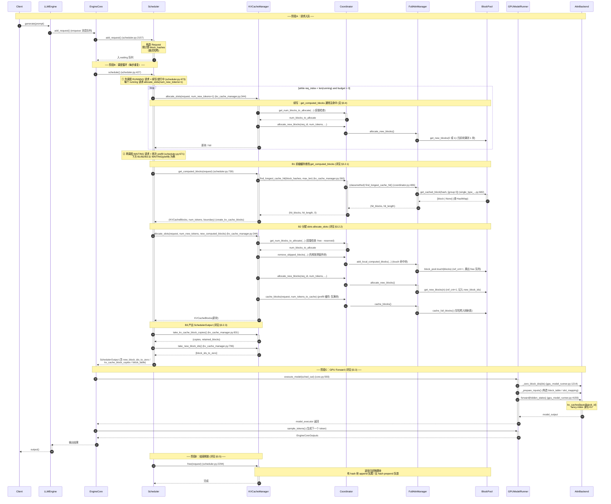
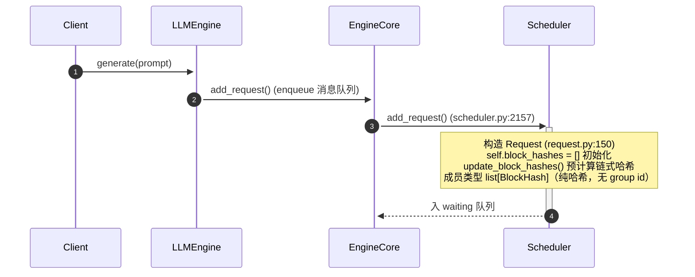
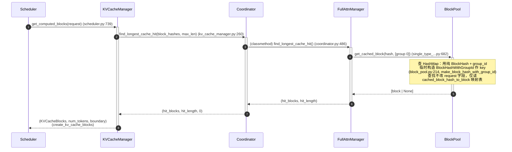
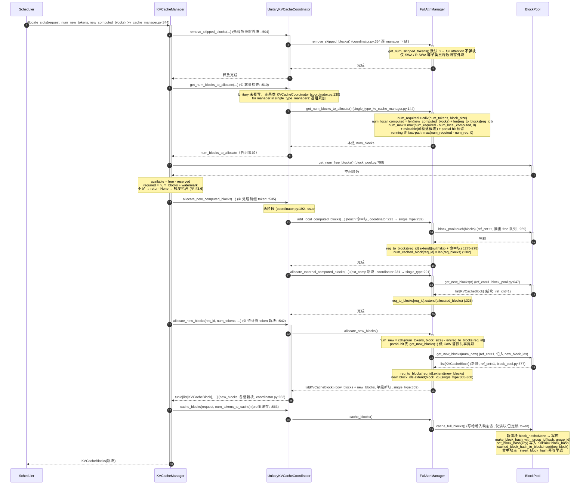
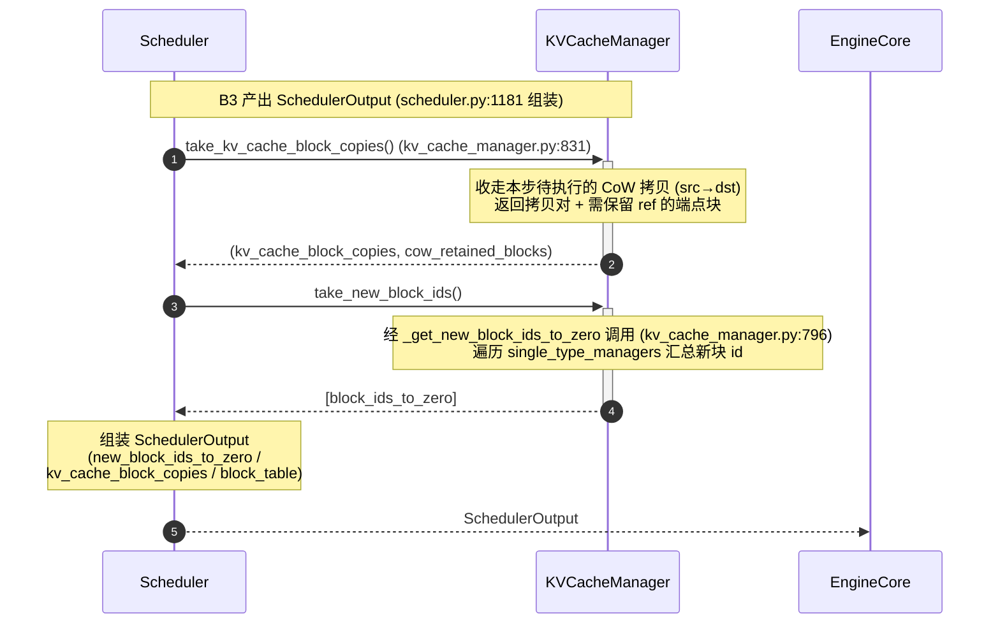
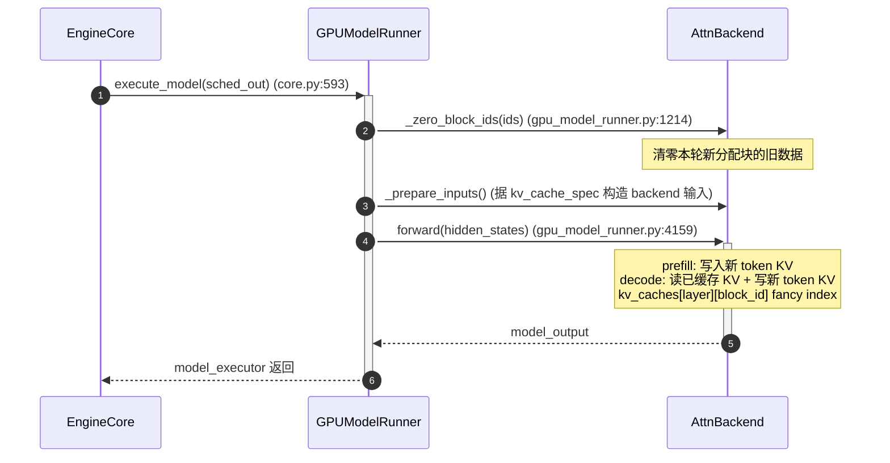
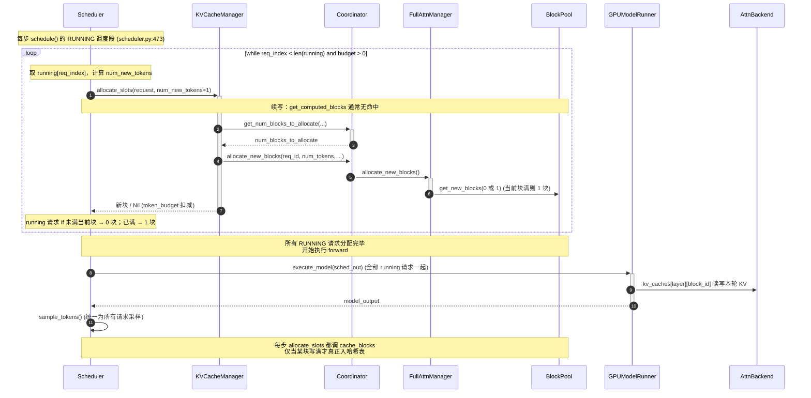
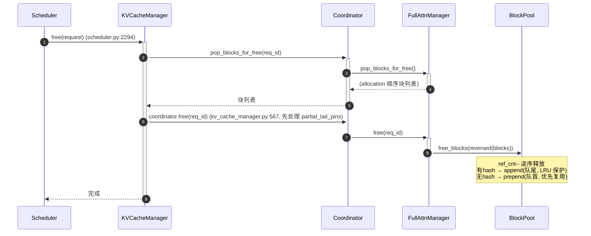
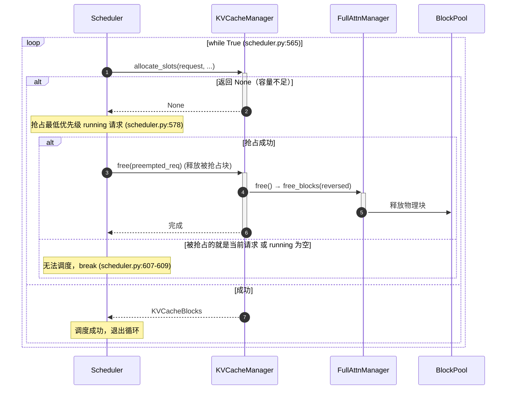

# 一条请求的 KV Cache 端到端时序图（Mermaid）

> 主线：纯 Full Attention 模型（Llama/Qwen/Mistral），单 KV cache group。
> 用 **Mermaid sequenceDiagram** 串起一条请求从进入 Scheduler 到最终释放的关键阶段，每个箭头标注真实源码调用点。
> 概念细节见 [`0_kv_cache_management_arch.md`](./0_kv_cache_management_arch.md) 及 1~5 子文档。

---

## 1. 总览时序图

一份**完整请求**的端到端时序。`schedule→execute_model→sample_tokens`（core.py:581）每步循环依次执行，这里以"首轮 prefill + 一次 decode + 结束释放"为代表。

**关键预读**：`schedule()` 每步**① 先调度 RUNNING 请求（续写 / 进行中的 prefill，scheduler.py:473，绿色 loop），② 再调度 WAITING 请求（首次 prefill，scheduler.py:671）**。总览下方的 B1/B2/B3 以 WAITING 请求的首次调度（prefill）为例展开。



> `schedule→execute_model→sample_tokens` 在 `EngineCore.step()`（core.py:581）中每步执行一次。decode 阶段每轮只做一次 `allocate_slots(1 token)` + forward，命中块查找通常为空（续写场景）。

**角色职责总览**（对应上方时序图的 10 个参与者，概括其在完整生命周期中的职责）：

| 角色 | 端到端职责 | 主要阶段 |
|---|---|---|
| **Client** | 发起 `generate(prompt)`，最后接收 `output()` | A 发起 / 收结果 |
| **LLMEngine** | `add_request` 把请求入队消息队列 | A |
| **EngineCore** | 转发 `add_request`；每步驱动 `schedule→execute_model→sample_tokens` 循环（core.py:581） | A / B / C 驱动 |
| **Scheduler** | 调度总控：请求入 waiting、`schedule()` 先 running 后 waiting（:473/:671）、组装 SchedulerOutput、`free` | B / D / E / F |
| **KVCacheManager** | KV 编排入口：`get_computed_blocks` / `allocate_slots` / `take_new_block_ids` / `take_kv_cache_block_copies` / `free` | B / D / E |
| **Coordinator** | 按 KV cache group 派发：容量检查、分配新块、touch、缓存、释放 | B / D / E |
| **FullAttnManager** | 单组实现：最长前缀查找、分配、touch、缓存、释放 | B / D / E |
| **BlockPool** | 物理块池：哈希表查询/写入、`get_new_blocks`、`touch`、`free_blocks` | B / D / E |
| **GPUModelRunner** | 执行模型：`_zero_block_ids`、`_prepare_inputs`、`forward` | C / D |
| **AttnBackend** | kernel 层：读写在 `kv_caches[layer][block_id]` | C / D |

---

## 2. 贯穿本文件的示例请求

> 为了让每个阶段的讲解更具体，下文各阶段**共用同一个请求示例**。约定 `block_size = 16`（vLLM 常见默认值，每个逻辑块存 16 个 token 的 K/V）。

```
请求 R：
  prompt     = "请用中文解释一下数据库索引，并举例说明 B+ 树索引与哈希索引的区别……"（70 个 token）
  max_tokens = 32   # 最多生成 32 个输出 token（与 prompt 长度独立的输出上限）
  block_size = 16
```

> **说明**：`max_tokens` 是**输出** token 上限，与输入 prompt 长度相互独立，所以 "70 输入 / 32 输出" 并不矛盾。选 `32` 是为了让 decode 输出恰好跨 2 个新块，便于演示分块。

沿 timeline 的宏观路径：**入队（WAITING）→ 首次调度 prefill（算完 70 token，→ RUNNING）→ 每步 decode 续写 1 token（至 32 个输出，跨 2 个新块）→ 结束释放**。

> **编号约定**：下文 block_table 用 **0-based 下标**（`block 0~4`），描述"第几块"用 **1-based**（`第 5 块` = 下标 4）。两者只在读起来时不同，指同一物理块。

> 先给出请求 R 的**完整生命周期**（含 block_table 演变），建立整体直觉；§3 各阶段再对照细节展开。

```
入队(WAITING) → prefill 首次调度
  ├─ get_computed_blocks: 4 hash 查表，命中前 2 块 → hit_length=32
  ├─ allocate_slots:  touch 2 命中块 + get_new_blocks(3) → block_table = [命中, 命中, 新, 新, 新]
  ├─ cache_blocks:  缓存满块 block 0~3（命中块 0,1 已在 B2 经 touch 复用，哈希早已存在，此步幂等空操作；真正首次写入哈希表的是新满块 2,3）；未满 block 4 不入
  ├─ execute_model: 一次 forward 写 70 token KV 到 5 块
  └─ sample → 第 1 个输出 token → 状态变为 RUNNING

decode 续写 32 步（每步 1 个输出 token）
  ├─ 第 1~10 步：往第 5 块逐 slot 填（0 块分配）；第 10 步写满 → cache_blocks 入哈希表
  ├─ 第 11 步：申请第 6 块
  ├─ 第 11~26 步：填第 6 块；第 26 步写满 → cache_blocks 入哈希表
  ├─ 第 27 步：申请第 7 块
  └─ 第 27~32 步：填第 7 块前 6 个 slot → 输出完成（未满，不入表）

释放
  └─ free 逆序：第 7→6→5→4→3 块，命中块 0/1 仅减计数
     → 有哈希块 append 队尾（LRU 保护），无哈希块 prepend 队首
```

> **核心结论：新块同样会被缓存，且与命中无关。** prefill 新分配的满块、decode 逐步填满的新块，行为完全一致——`allocate_slots`（kv_cache_manager.py:344）内部总是调用 `coordinator.cache_blocks(request, num_tokens_to_cache)`（[kv_cache_manager.py:563](file:///c:/Users/LEGION/Desktop/github/gch-vllm/vllm/vllm/v1/core/kv_cache_manager.py#L559-L565)），再下钻到 `cache_full_blocks`（block_pool.py:225）。只要某块写满（`num_tokens // block_size` 增大），它就被哈希入前缀缓存映射表；未满的尾块不缓存，等填满的当步再入表。上例 prefill 的**新满块 2、3** 与 decode 阶段填满入表的**第 5、6 块** 都据此入表。

---

## 3. 按阶段详细讲解

### 3.1 阶段 A：请求入队



**Request 的字段变化（阶段 A 只产生"纯哈希"）**：入队时 `self.block_hashes: list[BlockHash] = []`（request.py:199），构造流程里的 `update_block_hashes()`（request.py:257-260）调用 `request_block_hasher`（链式哈希器）预计算并填充。成员类型是**纯 `BlockHash`（不含 group id）**。`BlockHashWithGroupId` 要到阶段 B、块真正"查/写"前缀缓存映射表时，才由 BlockPool 用 `make_block_hash_with_group_id(hash, group_id)` 临时构造（见 §3.2.1 / §3.2.2）。

**结合请求 R**：70 个 prompt token 在入队时即被预计算为链式哈希串。除数取整 `70 // 16 = 4`，只有前 4 个**满块**生成 hash（未满的第 5 块只装 6 token，无 hash，见 B2 后说明）。这些 hash 存于 R 的 `block_hashes`，供后续 prefill 阶段做前缀缓存查找。

**逐层职责拆解**（对应上方时序图的 4 个参与者，输入 → 处理 → 输出）：

| 层 / 方法 | 输入 | 处理 | 输出 | 一句话职责 |
|---|---|---|---|---|
| **Client** | `prompt` | 发起 `generate(prompt)` | 等待 `output()` | 请求源头 |
| **LLMEngine**<br>`add_request` | `prompt` | 把请求放入 enqueue 消息队列 | 排队成功 | 入队 |
| **EngineCore**<br>`add_request` | enqueue 消息 | 转发给 Scheduler | 到达 Scheduler | 路由 |
| **Scheduler**<br>`add_request` `scheduler.py:2157` | `prompt` | 构造 Request（`self.block_hashes = []` 初始化，request.py:150/199）；`update_block_hashes()` 预计算链式哈希（request.py:257-260） | 入 waiting 队列 | 构造请求并预计算纯 `BlockHash` |

---

### 3.2 阶段 B：调度（WAITING 首次 prefill）

`schedule()` 每步**先遍历所有 RUNNING 请求（续写 / 进行中的 prefill chunk，见 §3.4），再遍历 WAITING 请求（新 prefill）**。本节展开 WAITING 首次调度的三个子步骤。

> **调度顺序 nuance**：当前调度器**没有独立的 prefill/decode 全局阶段**（scheduler.py:430 "no decoding phase nor prefill phase"），而是用一个共享的 `token_budget` 按"先 running、后 waiting"的遍历顺序逐请求填充。因此：
> - **功能上 = 续写/进行中优先**：RUNNING 循环（:473）先占用预算，WAITING 循环（:671）只在预算有剩余时才轮到，新请求被放在最后。
> - **running ≠ 全是 decode**：`is_prefill_chunk`（:1288）为真的请求（chunked prefill 中间片）也在 running 里，同样优先于新 waiting 请求。
> - 唯一与 prefill 相关的开关是 `defer_prefills`（:467），那是 **DP 数据并行 prefill 负载均衡**（错拍时暂缓 prefill 计算），并非"prefill 优先调度"。
> - PD 混部（prefill-decode 分离）由 KV 传输实现，本库**没有独立 PD-disagg Scheduler**：每个 P/D 实例都跑同一个统一 `Scheduler`，故上述 running 优先顺序在每个实例内部均成立。

#### 3.2.1 B1 前缀缓存查找 `get_computed_blocks`



**字段变化（B1 只"临时构造 key"，不改任何字段）**：本次查找入参是 `request.block_hashes`（`list[BlockHash]`，纯哈希）。下钻到 `BlockPool.get_cached_block`（block_pool.py:200）后，对每个 group 调 `make_block_hash_with_group_id(block_hash, group_id)`（:214）**临时构造** `BlockHashWithGroupId`，作为 `cached_block_hash_to_block.get_one_block(key)`（:217）的查询 key。注意这只是查询用的临时 key，**不回写** `request.block_hashes`——请求自身的哈希列表始终保持纯 `BlockHash`。

**逐层职责拆解**（自上而下，对应上方时序图的 5 个参与者，输入 → 处理 → 输出）：

| 层 / 方法 | 输入 | 处理 | 输出 | 一句话职责 |
|---|---|---|---|---|
| **Scheduler**<br>`scheduler.py:739` | `request` | 只调用 `get_computed_blocks`，不关心内部 | `(KVCacheBlocks, num_new_computed_tokens, shared_prefix_boundary)` | 发起者：只问结果，后续 `allocate_slots` 凭 `num_new_computed_tokens` 少算 prefill |
| **KVCacheManager**<br>`get_computed_blocks` `kv_cache_manager.py:229` | `request.block_hashes`（纯 `BlockHash` 列表）、`num_tokens` | 开关判断（prefix cache 关 / 跳过 KV 读则返回空 `(empty,0,0)`，:250）；定 `max_cache_hit_length = num_tokens - 1`（:259）；把入参交给 coordinator，收结果后 `create_kv_cache_blocks` 包装（:294） | `KVCacheBlocks`（或空）、`num_new_computed_tokens`、`boundary` | 编排入口：做开关判断 + 翻译入参 + 包装结果 |
| **UnitaryKVCacheCoordinator**<br>`find_longest_cache_hit` `coordinator.py:486` | `block_hashes`、`max_length`、`group_id=[0]`、`block_pool`、`kv_cache_spec` | 单 group 直通 `single_type_managers[0]`（:491），把查表所需上下文下传 | `(hit_blocks, hit_length, 0)`（末项恒 0，:502） | 分发层：决定"查哪个 KV group"，单 group 直通第 0 组 |
| **FullAttnManager**<br>`find_longest_cache_hit`（classmethod）`single_type_kv_cache_manager.py:682` | `block_hashes`、`group_ids`、`block_pool`、`kv_cache_spec` | `resolve_block_hashes` 处理块大小（:705）；逐块 `get_cached_block`，遇 miss 即 break（:733-738）；`hit_length = len(computed_blocks[0]) * block_size`（:739）；EAGLE 少算一块 + 对齐裁剪（:768-776） | `computed_blocks`、`hit_length` | 算法核心：遍历哈希串逐块问 BlockPool，攒出"可复用块 + 复用 token 数" |
| **BlockPool**<br>`get_cached_block` `block_pool.py:200` | `block_hash`（纯）、`group_id` | `make_block_hash_with_group_id` 临时构造 key（:214）→ `cached_block_hash_to_block.get_one_block(key)`（:217）；任一 group miss 整块返回 None | `KVCacheBlock` / `None` | 原子原语：把"纯 BlockHash + group_id"变成映射表 key，真正查 HashMap |

> 整条链的简化记忆：**Scheduler 只问结果 → KVCacheManager 做开关判断并翻译入参 → Coordinator 选组 → FullAttnManager 逐块比对攒结果 → BlockPool 真正查 HashMap**。每一层都只做一件事，把上层的"意图"逐步下沉为"一次哈希表查询"。

**要点**：
- `max_cache_hit_length = request.num_tokens - 1`（kv_cache_manager.py:259）：全命中时最后 token 的 logits 仍需重算
- 链式哈希从左到右逐块比对，遇 miss 即 break（`single_type_...py:682`）
- 返回的块是"已满块"（full blocks），未满的尾块不参与
- **未满尾块不算 hash**：链式哈希只在满块边界生成（`kv_cache_utils.py:728` "We only hash full blocks"）；`cache_blocks` 用 `num_tokens // block_size` 只缓存满块（`single_type_...py:446`）。因此示例中 R 的第 5 块（只装 6 token）在 prefill 时**不入哈希表**，要等 decode 续写把它填满后才被缓存入表。

**结合请求 R**：R 的 4 个 hash（对应前 4 个满块）从左到右逐块查 HashMap。假设前 2 块命中（**仅标记为可复用，此时不改 `ref_cnt`**），则 `hit_length = 32`，剩余 `70 - 32 = 38` 个 token（第 3~5 块）需重新计算。真正的 `ref_cnt++` 要等后续 B2 的 `touch`（`block_pool.touch`，见 §3.2.2）时才发生。未满的第 5 块无 hash，不参与本次查找（它需等 decode 填满后再入表）。

#### 3.2.2 B2 分配 slots `allocate_slots`



**字段变化（B2 是 `BlockHash` → `BlockHashWithGroupId` 的关键落库点）**：`cache_full_blocks`（block_pool.py:225）遍历新满块，对每块调 `make_block_hash_with_group_id(block_hash, kv_cache_group_id)`（:281）构造 `BlockHashWithGroupId`，交给 `_insert_block_hash`（:607）。对该块若 `block.block_hash is None`（新满块），则 `block.set_block_hash(block_hash_with_group_id, num_tokens=...)`（:223）把 `BlockHashWithGroupId` 存入 KVBlock 的 `block_hash` 字段（该字段类型即 `BlockHashWithGroupId | None`，kv_cache_utils.py:127），再 `cached_block_hash_to_block.insert(key, block)`（:627）写入映射表。命中块哈希已存在，走 `_insert_block_hash` 的幂等早退（:613）。—— 阶段 A / B1 始终是纯 `BlockHash`，到 B2 才真正"升级并落库"为 `BlockHashWithGroupId`。

**要点（与源码顺序严格一致）**：`allocate_slots` 依次执行 5 步（编号对应上方时序图）。

- **步骤 0｜释放滑窗外块** `remove_skipped_blocks`（kv_cache_manager.py:504）
  - 在容量检查**之前**调用，先释放被滑窗跳过的块，减少驱逐（下钻：coordinator.py:354 → single_type:622）
  - full attention 下 `get_num_skipped_tokens()` 恒 0，**实际不弹块**；仅 SWA / R-SWA 等子类生效

- **步骤 ①｜容量检查** `get_num_blocks_to_allocate`（kv_cache_manager.py:510）
  - **下钻链**：KM → `UnitaryKVCacheCoordinator`（未覆写，走基类 coordinator.py:130）→ 逐组 `FullAttentionManager`（single_type:144）累加
  - **FullAttentionManager 算式**（纯计算，不碰物理块）：
    `num_new_blocks = max(cdiv(num_tokens, block_size) - num_local_computed, 0)`
    其中 `num_local_computed = len(new_computed_blocks) + len(req_to_blocks[req_id])`；另加 evictable 候选块与 partial-hit 预留；running 请求走 fast-path `max(num_required - num_req, 0)`
  - **容量比较（KM 侧）**：`available = block_pool.get_num_free_blocks() - reserved_blocks`（block_pool.py:799）；`required = num_blocks_to_allocate + watermark`；`required > available` → `return None` → 触发**抢占**（scheduler.py:578）

- **步骤 ②｜处理前缀 token** `allocate_new_computed_blocks`（kv_cache_manager.py:535，coordinator.py:192）
  - **两阶段**（issue #33775）：先逐组 `add_local_computed_blocks`（touch 命中块，single_type:232），再逐组 `allocate_external_computed_blocks`（ext_comp 新块，single_type:291）
  - 放在容量检查**之后**：避免 touch 后回滚；两阶段避免 ext_comp 的 `get_new_blocks` 驱逐尚未 touch 的命中块

- **步骤 ③｜分配待计算块** `allocate_new_blocks`（kv_cache_manager.py:542，coordinator.py:238 → single_type:330）
  - `new_blocks = coordinator.allocate_new_blocks(req_id, num_tokens, ...)`，为待计算的 `new + lookahead` token 分新块

- **步骤 ④｜缓存满块** `cache_blocks`（kv_cache_manager.py:563，coordinator.py:273 → single_type:427）
  - `num_tokens_to_cache = min(total_computed + num_new, request.num_tokens)`，**只缓存已定稿 token**（排除可能被拒的 draft token）
  - 新块 id 记入 `new_block_ids`，等待 drain 给 Worker 清零

**结合请求 R**：容量检查算出当前可分配块数足够后，`allocate_new_computed_blocks` 先 `touch` B1 命中的前 2 块（`block_pool.touch`，ref_cnt 1→2，并从 free 队列摘出），再为剩余 38 个 token 计算待分配数量。38 个 token 按 16 切块需 3 块（16+16+6），`get_new_blocks(3)` 得到新 id，使 R 的 block_table 变为 `[命中块0, 命中块1, 新块2, 新块3, 新块4]`（5 项）。随后 `cache_blocks` 遍历满块 block 0~3：命中块 0/1 的哈希本就在映射表（由最初缓存它们的请求写入），`_insert_block_hash` 对同哈希早退（幂等空操作）；真正**新写入哈希表的是新满块 2、3**；未满的第 5 块（6 token）不入表。

**逐层职责拆解**（对应上方时序图的 5 个参与者，输入 → 处理 → 输出）:

| 层 / 方法 | 输入 | 处理 | 输出 | 一句话职责 |
|---|---|---|---|---|
| **Scheduler**<br>`allocate_slots` | `request, num_new_tokens, new_computed_blocks` | 发起分配，拿 KVCacheBlocks 组装 block_table | `KVCacheBlocks` | 发起者 |
| **KVCacheManager**<br>`allocate_slots` `kv_cache_manager.py:344` | `request, num_new_tokens, new_computed_blocks` | 编排时序：① `remove_skipped_blocks` 释放滑窗外块 → ② `get_num_blocks_to_allocate` 容量检查 → ③ `allocate_new_computed_blocks`（touch 命中块 + 分配 ext_comp）→ ④ `allocate_new_blocks` 分配待计算块 → ⑤ `cache_blocks` 缓存满块 | `KVCacheBlocks(新块)` | 编排总体顺序 |
| **UnitaryKVCacheCoordinator**<br>`kv_cache_coordinator.py:130/192/238/273/336` | `req_id, num_tokens, request` | 纯 Full Attention 单组场景；这些方法多在基类 `KVCacheCoordinator` 实现，`for manager in single_type_managers` 逐组派发：`get_num_blocks_to_allocate`（:130）/ `remove_skipped_blocks`（:336）/ `allocate_new_computed_blocks`（两阶段，:192）/ `allocate_new_blocks`（:238）/ `cache_blocks`（:273） | 各组累加 `num_blocks` / 新块 / 缓存结果 | 按 KV group 派发 |
| **FullAttnManager**<br>`single_type:144/232/291/330/427` | 命中块 / 新块 / token 数 | `get_num_blocks_to_allocate`（内部算式算出本组新块数，:144）/ `add_local_computed_blocks`（touch 命中块，:232）/ `allocate_external_computed_blocks`（ext_comp 新块，:291）/ `allocate_new_blocks`（:330）/ `cache_blocks`（:427） | 命中块 / 新块 / 缓存 / 本组块数 | 单组实现 |
| **BlockPool**<br>`block_pool.py:702/647/225` | 块 / token | `touch`（ref_cnt++ 摘出 free 队列，:702）/ `get_new_blocks`（ref_cnt=1，记入 new_block_ids，:647）/ `cache_full_blocks`（写哈希入映射表，:225） | 物理块 | 物理块池 |

> B2 的时序实质：**先释放（remove_skipped）→ 再容量检查（get_num_blocks_to_allocate）→ 再复用/touch 命中块 + 分 ext_comp（两阶段 allocate_new_computed_blocks）→ 再分配待计算块（allocate_new_blocks）→ 最后缓存（cache_full_blocks）**。四层（KVCacheManager → UnitaryKVCacheCoordinator → FullAttnManager → BlockPool）只是把同一动作逐级下放：Coordinator 负责"选组并逐组派发"，Manager 负责"算本组该分多少 / 真正分配"，最底层 BlockPool 才触碰物理块与哈希表。注意**容量检查阶段只有 KM 直连 BlockPool 的 `get_num_free_blocks` 查空闲数**，真正的 `get_num_blocks_to_allocate` 下钻到 FullAttnManager 只做纯计算、不碰物理块。

#### 3.2.3 B3 产出 SchedulerOutput



**关键点**：
- `take_new_block_ids()` 负责收走本步**新分配**的块 id（`new_block_ids_to_zero`），供 Worker 针对新块清零；`Scheduler` 里套在 `_get_new_block_ids_to_zero()`（scheduler.py:1233）里调用，无清零需求时返回 `None`。
- `take_kv_cache_block_copies()` 负责收走**待执行的 CoW 拷贝**（`_pending_cow_copies`，如 speculative / 共享前缀场景需要"复制后再写"），返回 `(拷贝对, 保留块)`；有拷贝时 `Scheduler` 先 `_free_cow_retained_blocks` 安排延迟释放（scheduler.py:1162）。
- 两项数据连同 `req_to_blocks`（block_table）一起装入 `SchedulerOutput`（scheduler.py:1181），随后传给 Worker 执行。

**逐层职责拆解**（对应上方时序图的 3 个参与者，输入 → 处理 → 输出）：

| 层 / 方法 | 输入 | 处理 | 输出 | 一句话职责 |
|---|---|---|---|---|
| **Scheduler**<br>`scheduler.py:1181` | B1/B2 结果 | 调 `take_kv_cache_block_copies`、`take_new_block_ids`，连同 `req_to_blocks`（block_table）组装 `SchedulerOutput` | `SchedulerOutput` | 组装调度输出给 Worker |
| **KVCacheManager**<br>`take_kv_cache_block_copies` `kv_cache_manager.py:831` | 本步待执行状态 | 收走待执行的 CoW 拷贝（src→dst），返回拷贝对 + 需保留 ref 的端点块 | `(kv_cache_block_copies, cow_retained_blocks)` | 收走 CoW 拷贝 |
| **KVCacheManager**<br>`take_new_block_ids` `kv_cache_manager.py:796` | 本步新分配状态 | 经 `_get_new_block_ids_to_zero` 遍历 `single_type_managers` 汇总新块 id | `[block_ids_to_zero]` | 收走新块 id |
| **EngineCore** | `SchedulerOutput` | 传给 Worker 执行 | — | 消费输出 |

---

### 3.3 阶段 C：GPU Forward + 新块缓存（Worker 侧）



**要点**：
- `_zero_block_ids` 只清零**本轮新分配**的块（`new_block_ids_to_zero`），避免读到上一请求残留的旧 KV
- `block_table`（即 `req_to_blocks` 的 `block_id` 列表）作为 fancy index，让 kernel 从 `kv_caches[layer][block_id]` 的第 0 维 gather 对应行
- 同一 `block_id` 在所有层对应同一逻辑 block，全套层共用一份 `block_table`

**结合请求 R**：本轮 R 的 3 个新块 id 先被 `_zero_block_ids` 清零；接着一次 forward 算出 70 个 token 的 K/V，写入 block_table 的 5 个块（其中命中块 0/1 是复用，不重复计算）。R 的 `slot_mapping` 记录了每个 token 落到哪个 block 的哪个 slot。

**逐层职责拆解**（对应上方时序图的 3 个参与者，输入 → 处理 → 输出）：

| 层 / 方法 | 输入 | 处理 | 输出 | 一句话职责 |
|---|---|---|---|---|
| **EngineCore**<br>`execute_model` `core.py:593` | `SchedulerOutput` | 发起 GPU 执行 | 交给 runner | 发起 |
| **GPUModelRunner**<br>`gpu_model_runner.py:1214/4159` | `sched_out` | `_zero_block_ids` 清零新块（:1214）；`_prepare_inputs` 构造 block_table / slot_mapping；调 `forward`（:4159） | `model_output` | 预处理 + 编排 forward |
| **AttnBackend**<br>`forward` `gpu_model_runner.py:4159` | `hidden_states`, block_table | 在 `kv_caches[layer][block_id]` 做 fancy index，prefill 写新 KV / decode 读旧 + 写新 | `model_output` | kernel 读写 KV |

---

### 3.4 阶段 D：decode 续写（RUNNING 请求遍历）

`schedule()` 每步先**遍历所有 RUNNING 请求**做 decode 续写（`allocate_slots(1 token)`），执行 forward 后统一 sample。外层循环是"请求维度的遍历"，内层每次只 append 1 个 token。



**关键点**：
- **外层是请求遍历**（`while req_index < len(running)`，scheduler.py:473），每步调度**所有** RUNNING 请求，而非单请求
- 每个请求每轮只 append 1 个 token；当前块未满不分配新块（0 块），写满才分配 1 块
- 所有 RUNNING 请求分配完成后，才**一次性** `execute_model` + `sample_tokens`（共享同一份 hidden_states batch）
- **新满块同样入缓存**：decode 每步的 `allocate_slots` 与 prefill 一样调用 `cache_blocks`，一旦某块被填满（当步）即被哈希入表，变为可命中的前缀缓存条目；未满块不缓存

**结合请求 R**：prefill 后 R 的 block_table 第 5 块只装了 6 个 token（slot 6~15 空）。decode 第 1~9 步每步 append 1 token，都填进第 5 块（0 块分配，仍不满故不入表）；**第 10 步**填满第 5 块，当步 `cache_blocks` 将其哈希入表；第 11 步起 `get_new_blocks(1)` 申请第 6 块，第 11~26 步填满（第 26 步入表），第 27 步申请第 7 块。最终 32 个输出 token 的分布：第 5 块填 10 个（累计 10）、第 6 块填满 16 个（累计 26）、第 7 块填 6 个（累计 32），即**跨 2 个新块**（第 6、7 块），且它们填满后**同样被缓存**。

**逐层职责拆解**（对应上方时序图的 7 个参与者，输入 → 处理 → 输出）：

| 层 / 方法 | 输入 | 处理 | 输出 | 一句话职责 |
|---|---|---|---|---|
| **Scheduler**<br>`scheduler.py:473` | `running` 队列, `token_budget` | 外层 `while req_index < len(running)` 逐请求 `allocate_slots(1 token)`；全部分配完统一 `execute_model` + `sample_tokens` | 调度结果 | 请求遍历 + 统一执行 |
| **KVCacheManager**<br>`allocate_slots` `kv_cache_manager.py:344` | `request, num_new_tokens=1` | 编排续写分配（通常无前缀命中） | 新块 / Nil | 分配续写槽位 |
| **Coordinator**<br>`coordinator.py:130/238` | `req_id, num_tokens` | `get_num_blocks_to_allocate` 容量检查（:130）/ `allocate_new_blocks` 分配（:238） | `num_blocks` / 新块 | 派发 |
| **FullAttnManager / BlockPool**<br>`single_type:330` / `block_pool.py:647` | 当前块状态 | 当前块未满 → `get_new_blocks(0)`；写满 → `get_new_blocks(1)` | 新块（0 或 1） | 单组分配 |
| **GPUModelRunner**<br>`execute_model` | 全部 running 请求 | 一次 forward 读写本轮 KV | `model_output` | 执行 |
| **AttnBackend** | `kv_caches` | 读旧 KV + 写新 token KV | — | kernel 读写 |
| **Scheduler**<br>`sample_tokens` | `model_output` | 统一为所有请求采样 | 下一 token | 采样 |

---

### 3.5 阶段 E：请求结束 → 释放



**要点**：
- `free` 内部先处理 `_partial_tail_pins`（kv_cache_manager.py:575），再 `coordinator.free`
- **逆序释放**（`reversed(ordered_blocks)`）：尾块先归还，利用 free 队列 LIFO 特性，让最近用的块最先被重新分配，提高续写命中
- `ref_cnt > 0` 的共享块仅减计数不回收；`ref_cnt == 0` 才真正进 free 队列
- 有哈希块 → `append`（队尾，LRU 保护前缀缓存）；无哈希块 → `prepend`（队首，优先复用）

**结合请求 R**：R 生成满 32 个输出（或命中 EOS）后结束。free 逆序释放 block_table 的各块：尾块（第 7 块）先归还。其中命中块 0/1 因 `ref_cnt` 仍 >0（被其他共享请求持有）只减计数不回收；其余有哈希的块 append 到 free 队列队尾（保护前缀缓存），方便后续请求复用。

**逐层职责拆解**（对应上方时序图的 5 个参与者，输入 → 处理 → 输出）：

| 层 / 方法 | 输入 | 处理 | 输出 | 一句话职责 |
|---|---|---|---|---|
| **Scheduler**<br>`free` `scheduler.py:2294` | 完成请求 | 发起释放 | — | 发起 |
| **KVCacheManager**<br>`free` `kv_cache_manager.py:567` | `request` | 先处理 `partial_tail_pins`（:575）；`coordinator.pop_blocks_for_free` 取块列表 + `coordinator.free` | 块列表 | 编排释放 |
| **Coordinator**<br>`coordinator.py:300/290` | `req_id` | `pop_blocks_for_free`（取分配顺序块，:300）/ `free`（派发，:290） | 块列表 | 派发 |
| **FullAttnManager**<br>`single_type:500/519` | `req_id` | `pop_blocks_for_free`（:500）/ `free` → `free_blocks(reversed)` | — | 单组 |
| **BlockPool**<br>`free_blocks` `block_pool.py:719` | `ordered_blocks` | `ref_cnt--` 逆序释放；有 hash → `append`（队尾，LRU 保护）；无 hash → `prepend`（队首，优先复用） | — | 物理归还 |

---

### 3.6 阶段 F：抢占（可选，容量不足时）

`allocate_slots` 返回 `None` 时会反复抢占直到成功或无可抢占（scheduler.py:565 的 `while True`）：



**要点**：抢占优先级依据 `self.policy`（`SchedulingPolicy.PRIORITY` 时取 `priority` + `arrival_time` 最小）。被抢占请求的块被释放，腾出空间后再重试 `allocate_slots`。

**结合请求 R**：设 R 首次调度时，free 空闲块不足以容纳其 3 个新块（B2 容量检查失败）。于是 Scheduler 抢占 running 中优先级最低的请求 X，释放 X 的块；腾出的空间足以容纳后，再重试 `allocate_slots(R)` 成功，R 进入 RUNNING 而 X 被暂停（block_table 保留，后续可恢复）。

**逐层职责拆解**（对应上方时序图的 4 个参与者，输入 → 处理 → 输出）：

| 层 / 方法 | 输入 | 处理 | 输出 | 一句话职责 |
|---|---|---|---|---|
| **Scheduler**<br>`scheduler.py:565/578` | `request` | `while True`（:565）重试 `allocate_slots`；返回 `None` → 抢占最低优先级 running 请求（:578）；被抢占者即自身或 running 空 → `break`（:607-609） | 成功 / break | 抢占循环 |
| **KVCacheManager**<br>`allocate_slots` `kv_cache_manager.py:344` | `request` | 容量不足返回 `None` | `None` | 触发抢占 |
| **FullAttnManager**<br>`single_type:519` | 被抢占请求 | `free` 派发释放 | — | 释放腾空间 |
| **BlockPool**<br>`free_blocks` `block_pool.py:719` | 被抢占块 | `free_blocks(reversed)` 释放物理块回 free 队列 | — | 物理归还腾空间 |

---

## 4. 小结：prefill 与 decode 的统一

> 阶段 B（WAITING 首次 prefill）与阶段 D（RUNNING decode 续写）本质是**同一套动作**的不同规模：`allocate_slots` 分配块 → forward 写 KV → 满块 `cache_blocks` 入哈希。差异仅在量级。

| 维度 | prefill（WAITING 首次调度） | decode（RUNNING 续写） |
|---|---|---|
| 处理 token 数 | 一次整个 prompt（示例 70 个） | 每步 1 个 |
| 前缀查找 | 是（`get_computed_blocks`） | 否 |
| 分配块数 | 一次多块（示例 3 新块） | 0 或 1 块 |
| 状态机 | `WAITING → RUNNING` | 保持 `RUNNING` 直到完成 |

状态机全路径：`WAITING →(首次调度) RUNNING →(持续 decode) → 完成 → 释放`，与 §3.1/§3.5 无缝衔接。