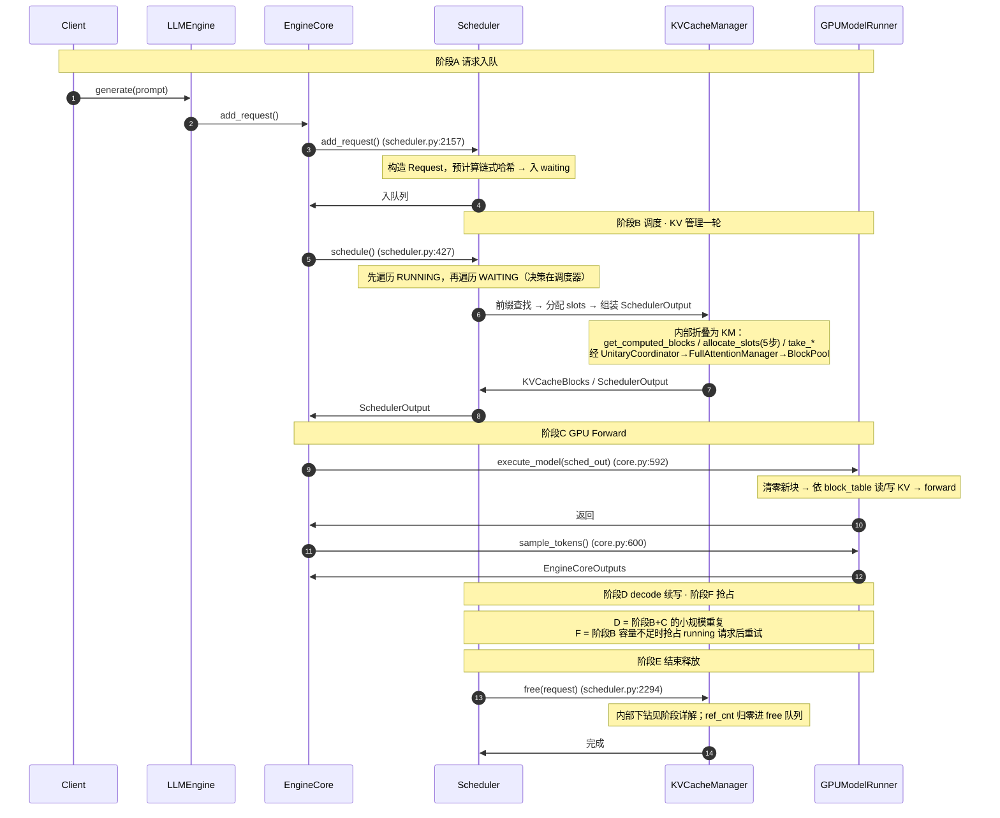
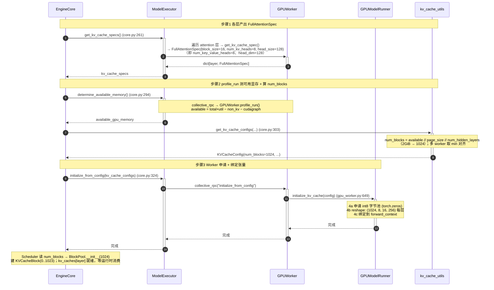
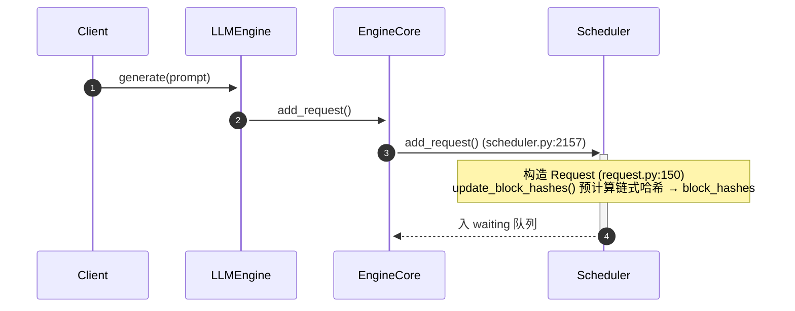
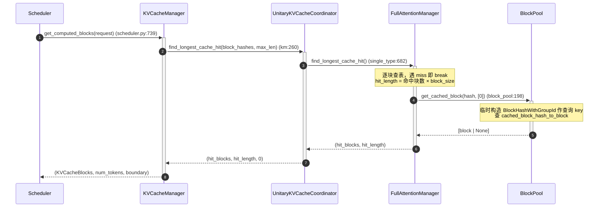
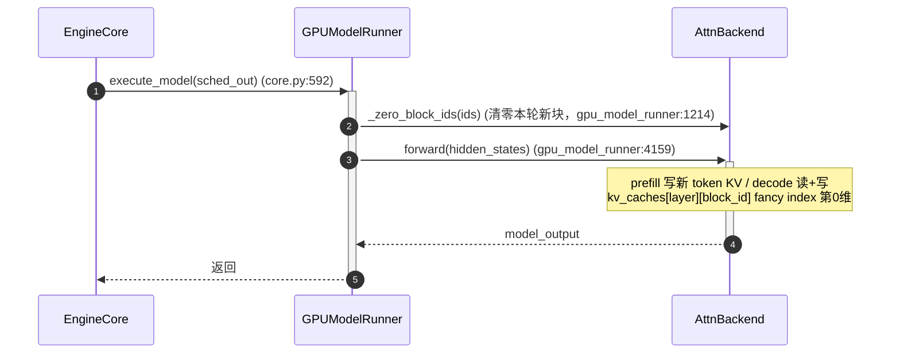
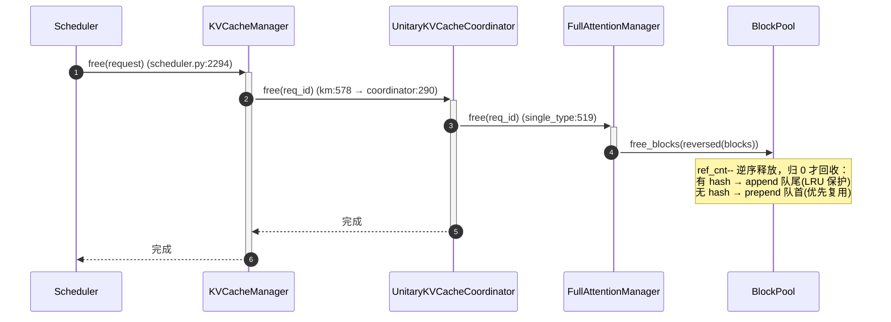
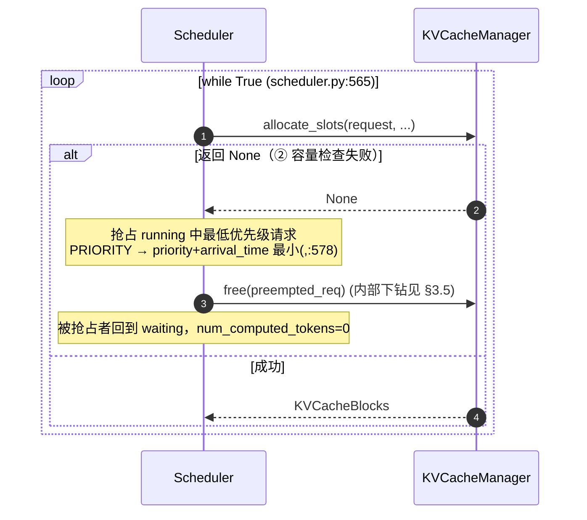

# 一条请求的 KV Cache 端到端时序（Llama-3-8B 视角）

> 主线：**纯 Full Attention 模型 Llama-3-8B**，单 KV cache group。用 Mermaid 时序图串起一条请求从进入 Scheduler 到最终释放的全过程，每个箭头标注真实源码调用点。
>
> **本套三篇总览的分工**：本文讲"流"（请求怎么一步步走）；[`0_kv_cache_management_arch.md`](./0_kv_cache_management_arch.md) 讲"层"（五层静态架构）；[`0_kvcache_of_attention.md`](./0_kvcache_of_attention.md) 讲"形状"（KV cache 字节布局）。基础数据结构见 [`0_kvcache_management_of_type.md`](./0_kvcache_management_of_type.md)。

---

## 0. 一条请求走过五个类（先认脸）

Llama-3-8B 是纯 Full Attention，KV 管理只经过 **五个类**，正好对应五层架构。全文只讲这五个类，不再用"第X层"。

| 类（文件） | 在流程中扮演什么 | 一句话职责 |
|---|---|---|
| `KVCacheManager`（`kv_cache_manager.py`） | 顶层编排入口，Scheduler 唯一对话方 | 对外暴露 `get_computed_blocks` / `allocate_slots` / `take_*` / `free` |
| `UnitaryKVCacheCoordinator`（`kv_cache_coordinator.py`） | 单组协调器，原样透传到下层 | 把 KVCacheManager 的每次调用下放给唯一管理器 |
| `FullAttentionManager`（`single_type_kv_cache_manager.py`） | 单组实现，真正的前缀/分配逻辑 | 最长前缀查找、算块数、touch、分配、缓存、释放 |
| `BlockPool`（`block_pool.py`） | 逻辑块池，KV 数据的"房主" | 哈希表查/写、`get_new_blocks`、`touch`、`free_blocks` |
| `GPUModelRunner`（`gpu_model_runner.py`） | 物理层，持有真实 K/V 张量 | 申请 `kv_caches[layer]`、`_zero_block_ids`、`forward`、`sample_tokens` |

> **调用链**：`KVCacheManager → UnitaryKVCacheCoordinator → FullAttentionManager → BlockPool`（KV 编排）；`GPUModelRunner` 独立持有物理张量，与逻辑块通过 `block_id` 相接。

---

## 1. 总览：一张图看完请求的一生

`EngineCore.step()`（core.py:580）每步驱动 `schedule → execute_model → sample_tokens`。下图只画**骨架**——阶段边界与主干调用点；`KVCacheManager` 内部的协调/分配细节折叠起来，在第3章各阶段展开。

**一条请求的端到端过程（编号速览）**，以示例 R（70/32 token）为准：

1. **入队**：Client `generate(prompt)` → `EngineCore.add_request()` → `Scheduler.add_request()`（scheduler.py:2157）构造 `Request` 并**预计算链式哈希**，放入 **WAITING** 队列。
2. **首次调度（prefill）**：调度循环到来，`schedule()`（scheduler.py:427）从 WAITING 取出请求，打算一次性算完整段 prompt（70 token）。
3. **前缀缓存查找**：`KVCacheManager.get_computed_blocks()` 沿 `KVCacheManager → UnitaryKVCacheCoordinator → FullAttentionManager → BlockPool` 下钻，4 个满块哈希查表，**命中前 2 块**，`hit_length = 32`。
4. **分配物理块**：`allocate_slots()`（KM 内部 5 步）**touch** 2 个命中块（`ref_cnt++`），并为剩余 38 token 申请 3 个新块 → `block_table = [命中0, 命中1, 新2, 新3, 新4]`，新块 id 登记为零清。
5. **组装输出**：Scheduler 组 `SchedulerOutput`，带上 3 个需清零的新块 id 与 CoW 拷贝清单。
6. **GPU Forward 写 KV**：`GPUModelRunner.execute_model()` 清零新块 → attention 后端依 `block_table` 把 70 token 的 K/V 写入 `kv_caches[layer][block_id]` → `sample_tokens()` 产出第 1 个输出 token，请求进入 **RUNNING**。
7. **decode 续写**：此后每步在 RUNNING 遍历中 append 1 个输出 token、再走一遍同套 `allocate_slots`（当前块未满分 0 块、填满才再申请 1 块），直到 32 个输出 token 全部生成。
8. **释放**：请求结束，`Scheduler` 调 `KVCacheManager.free()`，沿协调链下钻到 `BlockPool.free_blocks()` **逆序释放**——`ref_cnt` 归零的块回收进 free 队列，有哈希的 append 队尾（保护缓存）、无哈希的 prepend 队首（优先复用）。

> 总览图把上述 8 步压缩为主干调用；每一步在 `allocate_slots` 内部的完整下钻与源码行号，见下文第 3 章对应小节（prefill §3.2、decode §3.4、释放 §3.5、抢占 §3.6）。



---

## 2. Llama-3-8B 的 KV 尺度与示例请求

下文所有阶段共用同一个请求示例，模型参数固定为 Llama-3-8B。

**模型 KV 尺度（Llama-3-8B config / vLLM `FullAttentionSpec`）**：

| 参数（Llama-3-8B config） | 值 | 含义 / 对应 vLLM `FullAttentionSpec` 字段 |
|---|---|---|
| `num_hidden_layers` | 32 | 层数；每层各有一份 KV 张量，但**共享同一套 block_id** |
| `num_attention_heads` | 32 | 查询头数（GQA） |
| `num_key_value_heads`（=`num_kv_heads`） | 8 | KV 头数；`32/8 = 4` 个查询头共享 1 个 KV 头 |
| `head_dim`（=`head_size`） | 128 | 每个 head 的维度 |
| `hidden_size` | 4096 | 隐层宽度 `= num_attention_heads × head_dim` |
| `block_size` | 16 | 一个逻辑块容纳的 token 数 |
| `dtype` | fp16（2 字节/元素） | KV 缓存精度 |

一个page的物理大小：

```text
page_size_bytes = 2 × block_size × num_key_value_heads × head_dim × 2B
                = 2 × 16 × 8 × 128 × 2 = 65,536 B = 64 KiB
```

对应每层张量 `kv_caches[layer]` 的 shape：**`(num_blocks, 8, 16, 256)`**（最后 256 = 2×head_dim，K、V 拼接）。假设给 KV cache 划分 2 GiB，则 `num_blocks = 2 GiB ÷ 64 KiB ÷ 32 层 = 1024`——`GPUModelRunner` 每层申请 `(1024, 8, 16, 256)` 的 int8→view 张量，`BlockPool` 同时建 `KVCacheBlock(0..1023)`。

**示例请求 R**：

```
prompt     = "请用中文解释一下数据库索引，并举例说明 B+ 树索引与哈希索引的区别……"（70 个 token）
max_tokens = 32
block_size = 16
```

宏观路径：**入队（WAITING）→ 首次调度 prefill（算完 70 token，→ RUNNING）→ 每步 decode 续写 1 token（至 32 个输出）→ 结束释放**。

```
入队(WAITING) → prefill 首次调度
  ├─ get_computed_blocks: 70//16=4 个满块 hash 查表，命中前 2 块 → hit_length=32
  ├─ allocate_slots:  touch 2 命中块 + get_new_blocks(3) → block_table = [命中,命中,新,新,新]
  ├─ cache_blocks:   新满块 2、3 入哈希表；未满块 4 不入
  ├─ execute_model: 一次 forward 写 70 token KV 到 5 块
  └─ sample → 第 1 个输出 token → 状态变 RUNNING

decode 续写 32 步（每步 1 输出 token）
  ├─ 第 1~10 步：填第 5 块（0 块分配）；第 10 步填满 → 入哈希表
  ├─ 第 11~26 步：申请第 6 块并填满 → 入哈希表
  ├─ 第 27~32 步：申请第 7 块，填 6 个 slot → 输出完成（未满，不入表）

释放
  └─ free 逆序归还：第 7→6→5→4→3 块；命中块 0/1 仅减计数
     有哈希块 append 队尾（保护缓存），无哈希块 prepend 队首（优先复用）
```

> **核心结论：新块同样会被缓存**（与命中无关）。prefill 新分配的满块、decode 逐步填满的新块，行为一致——`allocate_slots` 内部总是调 `cache_full_blocks`，只要某块写满就哈希入前缀缓存表；未满的尾块等写满的当步入表。

---

## 3. 分阶段详解

### 3.0 阶段 0：物理显存初始化（启动期一次）

> 启动期**一次性**执行（`EngineCore._initialize_kv_caches`，core.py:254），产出两样供运行时消费：
> 1. `num_blocks`（1024）→ `BlockPool.__init__` 建 `KVCacheBlock(0..1023)`
> 2. `kv_caches[layer]` 物理张量 → `GPUModelRunner` 申请，§3.3 按 `block_id` 读写



**要点**：物理申请只在启动期做一次；运行时 `KVCacheManager` 的"分配/释放"只操作 `block_id` 整数 + `ref_cnt`，**零显存搬运**。`block_id` 即物理张量第 0 维行号，两步由这位桥接。

### 3.1 阶段 A：请求入队



**要点**：
- 入队即预计算：70 token → `70//16=4` 个满块有 hash；未满的第 5 块无 hash
- `request.block_hashes` 存的是**纯 `BlockHash`**，group id 在 B1 查表 / B2 落库时才临时拼上

### 3.2 阶段 B：调度（WAITING 首次 prefill）

`schedule()`（scheduler.py:427）每步**先遍历 RUNNING（:473）再遍历 WAITING（:671）**。KV 编排链固定为 `KVCacheManager → UnitaryKVCacheCoordinator → FullAttentionManager → BlockPool`，下面三个子步骤都走这条链。

#### 3.2.1 B1 前缀缓存查找 `get_computed_blocks`



**要点**：本次**只读不写**——临时构造查询 key，不改 `ref_cnt`。链式哈希从左到右遇 miss 即 break，命中的是已满块。示例 R 命中前 2 块 → `hit_length=32`，剩 `70−32=38` token 需重算；真正的 `ref_cnt++` 在 B2 的 touch。

#### 3.2.2 B2 分配 slots `allocate_slots`（内部 5 步）

```mermaid
sequenceDiagram
    autonumber
    participant S as Scheduler
    participant KM as KVCacheManager
    participant CO as UnitaryKVCacheCoordinator
    participant FM as FullAttentionManager
    participant BP as BlockPool
    S->>+KM: allocate_slots(request, ...)   (km:344)
    KM->>CO: remove_skipped_blocks()   (① 释放滑窗外块；full attention 恒不弹)
    KM->>CO: get_num_blocks_to_allocate()   (② 容量检查)
    Note over KM: available = free − reserved；不足 → return None → 抢占(§3.6)
    KM->>CO: allocate_new_computed_blocks()   (③ touch 命中块)
    CO->>FM: add_local_computed_blocks()   (touch: ref_cnt++, 摘出 free 队列, block_pool:702)
    KM->>CO: allocate_new_blocks()   (④ 待计算 token 新块)
    FM->>BP: get_new_blocks(num_new)   (ref_cnt=1, block_pool:647)
    KM->>CO: cache_blocks()   (⑤ 缓存满块)
    FM->>BP: cache_full_blocks()   (哈希入映射表, block_pool:225)
    CO-->>-KM: 完成
    KM-->>-S: KVCacheBlocks(新块)
```

**要点（5 步全走）**：
- ①②：full attention 下"释放滑窗块"恒为空操作；容量检查用 `free − reserved`，不足则 `None` → 抢占
- ③：`touch` 命中块 `ref_cnt` 1→2，并摘出 free 队列
- ④：剩余 38 token 切 `16+16+6` → `get_new_blocks(3)`；block_table 变 `[命中0,命中1,新2,新3,新4]`
- ⑤：命中块 0/1 哈希已存在（幂等早退）；真正入表的是新满块 2、3；未满块 4 不入

#### 3.2.3 B3 组装 SchedulerOutput

分配完物理块后，Scheduler 还需打包两件"后处理指令"给 Worker 在 forward 前执行：**清零新块**（`new_block_ids_to_zero`，清残留数据）与 **CoW 拷贝**（部分命中请求需把共享块 KV 拷到私有块）。R 是首次 prefill（无 partial hit），`kv_cache_block_copies` 为空，3 个新块 id（2/3/4）进 `new_block_ids_to_zero`。

### 3.3 阶段 C：GPU Forward（GPUModelRunner 侧）



**要点**：attention 后端拿着每个请求的 `block_table`（一串 `block_id`）作索引，从 `kv_caches[layer][block_id]` 第 0 维 gather 对应行；同一 `block_id` 在 32 层对应同一逻辑块，全套层共用一份 block_table。示例 R：3 个新块先清零，一次 forward 写 70 token 的 K/V 到 5 块，命中块 0/1 复用不重算。

### 3.4 阶段 D：decode 续写（RUNNING 请求遍历）

`schedule()` 每步**先遍历所有 RUNNING 请求**（:473），每请求 append 1 token，全部处理完后一次性 `execute_model + sample_tokens`。与 prefill 走**同一套** `allocate_slots`（内部 5 步），差异仅在量级：通常无前缀命中（③跳过），当前块未满则 0 块、写满则 1 块。

示例 R：prefill 后第 5 块只装 6 token。decode 第 1~9 步填第 5 块（0 分配），**第 10 步填满入表**；第 11 步申请第 6 块、第 26 步入表；第 27 步申请第 7 块、填 6 个 slot 后完成（未满不入表）。**新满块同样入缓存**——这是前缀缓存持续增长的方式。

### 3.5 阶段 E：请求结束 → 释放



**要点**：**逆序释放**（`reversed`）让最近用的块最先被复用；`ref_cnt>0` 的共享块仅减计数不回收。示例 R：第 7 块先归还；命中块 0/1 因仍被其他请求共享只减计数；有哈希的块 append 队尾，方便后续前缀复用。

### 3.6 阶段 F：抢占（容量不足时）

`allocate_slots` 返回 `None` 时反复抢占直到成功或无可抢占（scheduler.py:565 的 `while True`）：



**要点**：抢占者被放回 waiting 且 `num_computed_tokens=0`（:1260），块已释放，重调度需重新 prefill。示例 R：设其 3 个新块放不下 → 抢占优先级最低的 X 并释放其块 → 腾出空间后重试成功，R 进入 RUNNING，X 暂停待重调度。

---

## 4. 小结：prefill 与 decode 的统一

> 阶段 B（首次 prefill）与阶段 D（decode 续写）本质是**同一套动作**的不同规模：`allocate_slots` 分配块 → forward 写 KV → 满块 `cache_blocks` 入哈希。差异仅在量级。

| 维度 | prefill（WAITING 首次） | decode（RUNNING 续写） |
|---|---|---|
| 处理 token 数 | 一次整个 prompt（70 个） | 每步 1 个 |
| 前缀查找 | 是（`get_computed_blocks`） | 否（续写无新命中） |
| 分配块数 | 一次多块（3 新块） | 0 或 1 块 |
| 内部 5 步 | ①~⑤ 全走（③ touch 命中块） | ①③ 空操作，②④⑤ 照走 |
| 状态机 | `WAITING → RUNNING` | 保持 `RUNNING` 直到完成 |

状态机全路径：`WAITING →(首次调度) RUNNING →(持续 decode) → 完成 → 释放`，与 §3.1 / §3.5 无缝衔接。