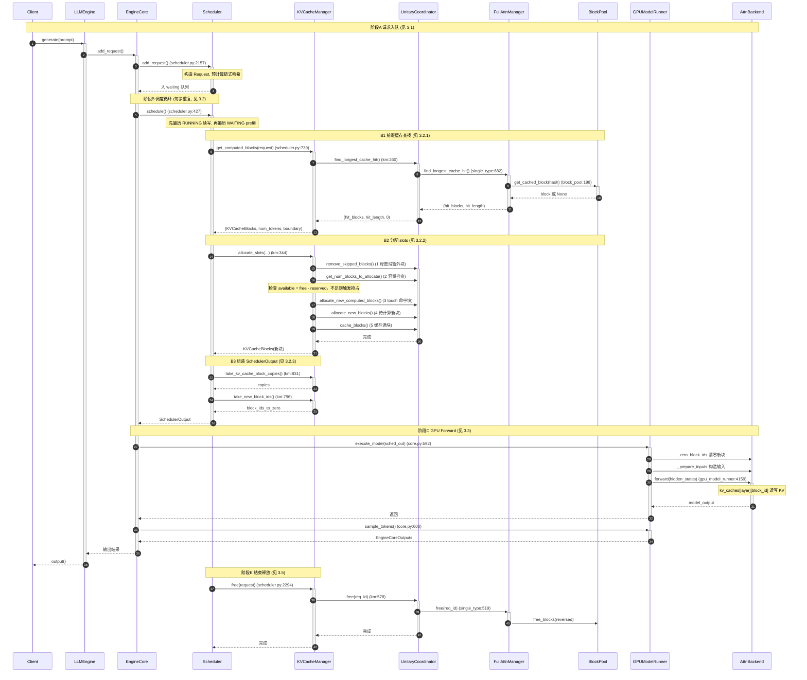
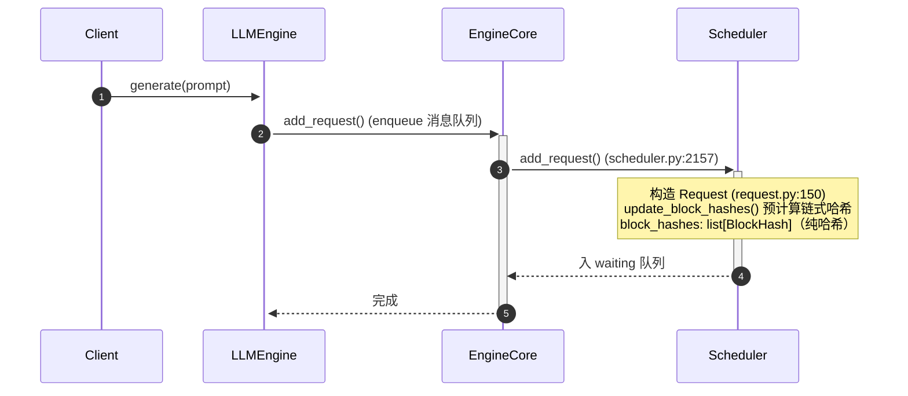
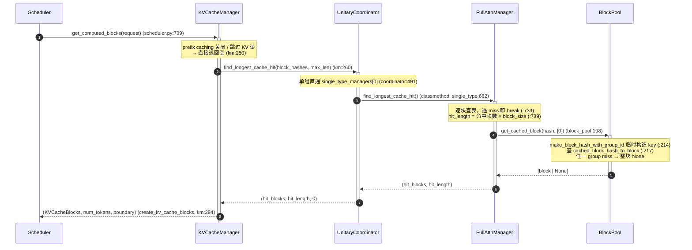
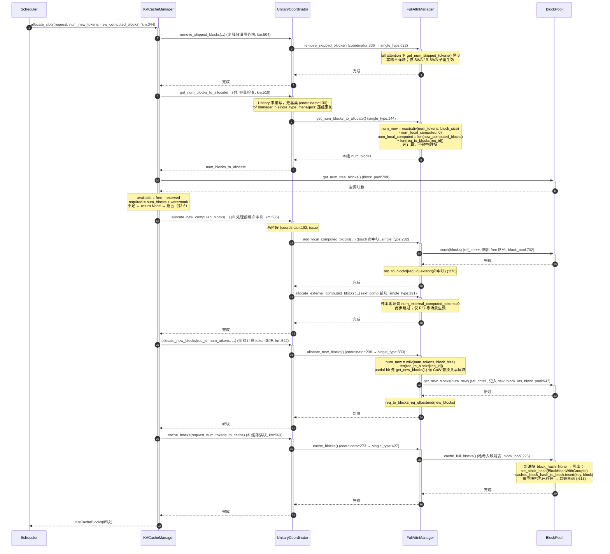
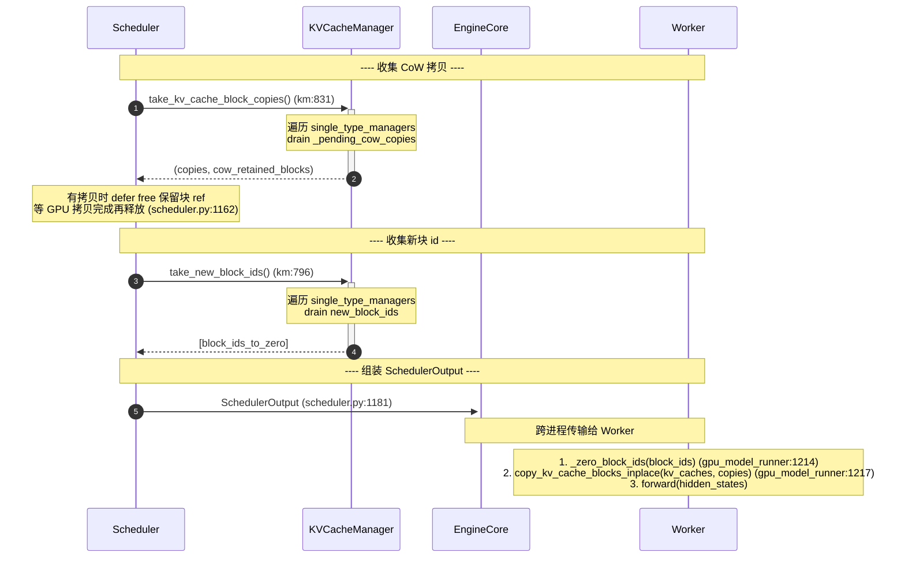
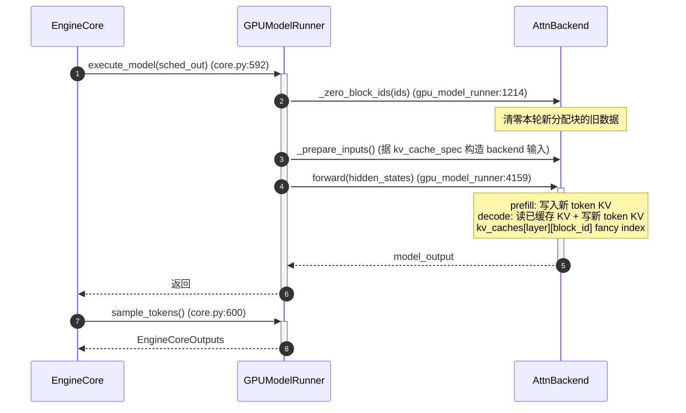
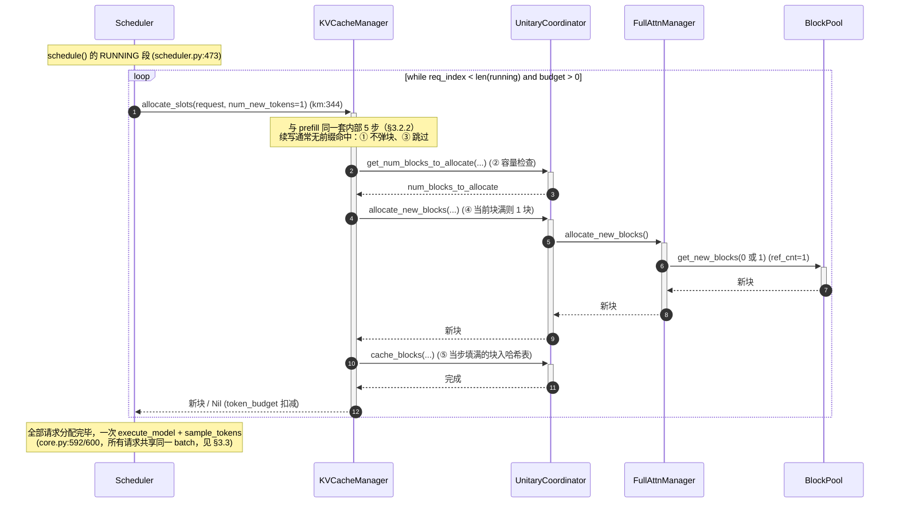
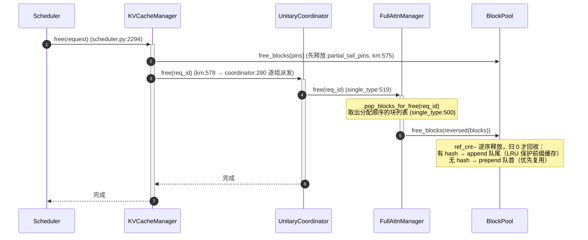

# 一条请求的 KV Cache 端到端时序

> 主线：纯 Full Attention 模型（Llama / Qwen / Mistral），单 KV cache group。
> 用 Mermaid 时序图串起一条请求从进入 Scheduler 到最终释放的全过程，每个箭头标注真实源码调用点。
> 概念细节见 [`0_kv_cache_management_arch.md`](./0_kv_cache_management_arch.md) 及 1~5 子文档。

**统一缩写**（下文所有时序图与行号均用此约定）：

| 缩写 | 全称 |
|---|---|
| `km` | `kv_cache_manager.py` |
| `coordinator` | `kv_cache_coordinator.py` |
| `single_type` | `single_type_kv_cache_manager.py` |
| `UnitaryCoordinator` | `UnitaryKVCacheCoordinator`（纯 Full Attention 单组场景的专用协调器） |
| `FullAttnManager` | `FullAttentionManager`（单组 Full Attention 管理器） |

**阅读顺序（由浅入深）**：§1 一张图看完请求一生 → §2 贯穿全文的示例请求 R → §3 逐阶段拆开细讲 → §4 prefill 与 decode 的统一。

---

## 1. 总览：一张图看完请求的一生

`EngineCore.step()`（core.py:580）每步执行 `schedule → execute_model → sample_tokens`。下面以"首轮 prefill + 结束释放"为代表，展示完整链路；decode 续写见 §3.4，抢占见 §3.6。



**角色职责总览**（对应上图 10 个参与者）：

| 角色 | 端到端职责 | 主要阶段 |
|---|---|---|
| **Client** | 发起 `generate(prompt)`，接收 `output()` | A / 收结果 |
| **LLMEngine** | `add_request` 把请求放入消息队列 | A |
| **EngineCore** | 每步驱动 `schedule → execute_model → sample_tokens`（core.py:580） | B / C |
| **Scheduler** | 调度总控：入 waiting、先 running 后 waiting、组装 SchedulerOutput、free | B / E / F |
| **KVCacheManager** | KV 编排入口：`get_computed_blocks` / `allocate_slots` / `take_*` / `free` | B / E |
| **UnitaryCoordinator** | 单组派发：把 KM 的每个动作下放给唯一的 FullAttnManager | B / E |
| **FullAttnManager** | 单组实现：最长前缀查找、算块数、touch、分配、缓存、释放 | B / E |
| **BlockPool** | 物理块池：哈希表查/写、`get_new_blocks`、`touch`、`free_blocks` | B / E |
| **GPUModelRunner** | `_zero_block_ids`、`_prepare_inputs`、`forward`、`sample_tokens` | C |
| **AttnBackend** | kernel 层：读写在 `kv_caches[layer][block_id]` | C |

---

## 2. 贯穿全文的示例请求 R

下文各阶段共用同一个请求示例，约定 `block_size = 16`（每个逻辑块存 16 个 token 的 K/V）。

```
请求 R：
  prompt     = "请用中文解释一下数据库索引，并举例说明 B+ 树索引与哈希索引的区别……"（70 个 token）
  max_tokens = 32   # 输出 token 上限，与 prompt 长度独立
  block_size = 16
```

宏观路径：**入队（WAITING）→ 首次调度 prefill（算完 70 token，→ RUNNING）→ 每步 decode 续写 1 token（至 32 个输出）→ 结束释放**。

```
入队(WAITING) → prefill 首次调度
  ├─ get_computed_blocks: 4 个满块 hash 查表，命中前 2 块 → hit_length=32
  ├─ allocate_slots:  touch 2 命中块 + get_new_blocks(3) → block_table = [命中, 命中, 新, 新, 新]
  ├─ cache_blocks:  命中块 0/1 哈希早已存在（幂等空操作）；真正首次入表的是新满块 2、3；未满 block 4 不入
  ├─ execute_model: 一次 forward 写 70 token KV 到 5 块
  └─ sample → 第 1 个输出 token → 状态变为 RUNNING

decode 续写 32 步（每步 1 个输出 token）
  ├─ 第 1~10 步：填第 5 块（0 块分配）；第 10 步写满 → cache_blocks 入表
  ├─ 第 11 步：申请第 6 块；第 11~26 步填满（第 26 步入表）
  ├─ 第 27 步：申请第 7 块；第 27~32 步填前 6 个 slot → 输出完成（未满，不入表）

释放
  └─ free 逆序归还：第 7→6→5→4→3 块；命中块 0/1 仅减计数
     有哈希块 append 队尾（LRU 保护），无哈希块 prepend 队首
```

> **核心结论：新块同样会被缓存，与命中无关。** prefill 新分配的满块、decode 逐步填满的新块，行为完全一致——`allocate_slots`（km:344）内部总是调 `coordinator.cache_blocks`（km:563）下钻到 `cache_full_blocks`（block_pool:225）。只要某块写满，它就被哈希入前缀缓存映射表；未满的尾块不缓存，等填满的当步再入表。

> **编号约定**：block_table 用 0-based 下标（`block 0~4`），"第几块"用 1-based（`第 5 块` = 下标 4）。

---

## 3. 分阶段详解

### 3.1 阶段 A：请求入队



**要点**：
- 入队即预计算：70 个 token 生成链式哈希，`70 // 16 = 4`，只有前 4 个**满块**有 hash（未满的第 5 块无 hash，见 §3.2.4）
- `block_hashes` 是**纯 `BlockHash`**（不含 group id），group id 要到 B1 查表 / B2 落库时才临时拼上（详见 §3.2.4）

**结合请求 R**：R 的 4 个满块 hash 在入队时算好，存于 `request.block_hashes`，供 prefill 阶段做前缀缓存查找。

---

### 3.2 阶段 B：调度（WAITING 首次 prefill）

`schedule()`（scheduler.py:427）每步**先遍历 RUNNING（:473），再遍历 WAITING（:671）**。本节展开 WAITING 首次调度的三个子步骤。

> **调度顺序要点**：没有独立的 prefill/decode 全局阶段，只有一个共享 `token_budget` 按"先 running、后 waiting"填充：
> - RUNNING 里也可能有 chunked prefill 中间片（`is_prefill_chunk`），同样优先于新 waiting
> - `defer_prefills`（:467）是 DP 负载均衡开关，不是"prefill 优先调度"
> - PD 分离由 KV 传输实现，P/D 实例跑同一个统一 `Scheduler`，上述顺序在每个实例内部均成立

#### 3.2.1 B1 前缀缓存查找 `get_computed_blocks`



**要点**：
- `max_cache_hit_length = request.num_tokens - 1`（km:259）：全命中时最后 token 的 logits 仍需重算
- 链式哈希从左到右逐块比对，遇 miss 即 break；命中的是**已满块**，未满尾块无 hash 不参与
- 本次查找**只读不写**：临时构造查询 key，不改 `ref_cnt`、不回写 `request.block_hashes`

**结合请求 R**：4 个 hash 逐块查表，假设前 2 块命中（仅标记可复用），`hit_length = 32`，剩余 `70 - 32 = 38` 个 token 需重新计算。真正的 `ref_cnt++` 要等 B2 的 `touch`。

#### 3.2.2 B2 分配 slots `allocate_slots`



**要点（与源码顺序严格一致）**：`allocate_slots` 依次执行 5 步。

- **① 释放滑窗外块** `remove_skipped_blocks`（km:504）
  - 在容量检查**之前**，先释放滑窗跳过的块，减少驱逐（下钻：coordinator:336 → single_type:622）
  - full attention 下恒不弹块；仅 SWA / R-SWA 子类生效

- **② 容量检查** `get_num_blocks_to_allocate`（km:510）
  - 下钻链：KM → UnitaryCoordinator（未覆写，走基类 coordinator:130）→ FullAttnManager（single_type:144）逐组累加
  - FM 算式（纯计算，不碰物理块）：`num_new = max(cdiv(num_tokens, block_size) - num_local_computed, 0)`，其中 `num_local_computed = len(new_computed_blocks) + len(req_to_blocks[req_id])`；另加 evictable 候选与 partial-hit 预留
  - 容量比较（KM 侧）：`available = get_num_free_blocks() - reserved`（block_pool:799）；`required = num_blocks + watermark`；`required > available` → `return None` → 抢占（scheduler.py:578）

- **③ 处理命中块** `allocate_new_computed_blocks`（km:535，coordinator:192）
  - 两阶段（issue #33775）：先逐组 `add_local_computed_blocks`（touch 命中块，single_type:232），再逐组 `allocate_external_computed_blocks`（ext_comp 新块，single_type:291）
  - 放在容量检查**之后**：避免 touch 后回滚；两阶段避免 ext_comp 的 `get_new_blocks` 驱逐尚未 touch 的命中块

- **④ 分配待计算块** `allocate_new_blocks`（km:542，coordinator:238 → single_type:330）
  - 为待计算 token 分新块；partial-hit 先 `get_new_blocks(1)` 做 CoW 替换共享尾块

- **⑤ 缓存满块** `cache_blocks`（km:563，coordinator:273 → single_type:427）
  - `num_tokens_to_cache = min(total_computed + num_new, request.num_tokens)`，只缓存**已定稿** token（排除可能被拒的 draft token）
  - 新块 id 记入 `new_block_ids`，等待 drain 给 Worker 清零

**结合请求 R**：容量检查通过后，③ `touch` B1 命中的前 2 块（ref_cnt 1→2，摘出 free 队列）；④ 剩余 38 token 按 16 切块需 3 块（16+16+6），`get_new_blocks(3)`，block_table 变为 `[命中0, 命中1, 新2, 新3, 新4]`；⑤ 命中块 0/1 幂等早退，真正入表的是新满块 2、3，未满的第 5 块不入表。

#### 3.2.3 B3 组装 SchedulerOutput

B2 分配完物理块后，Scheduler 还需要把两件"后处理"指令打包进 `SchedulerOutput`，传给 Worker 在 GPU forward 之前执行：

1. **清零新块**：`new_block_ids_to_zero` — 新分配的物理块 GPU 内存里可能有上一请求的残留数据，必须清零再写入
2. **CoW 拷贝**：`kv_cache_block_copies` — 部分命中前缀缓存的请求，需要把共享块的 KV 数据拷贝到私有块，避免写覆盖

> **为什么需要 CoW 拷贝？** 当请求 R 命中缓存块 0/1，但尾巴被截断（partial hit），B2 的 `allocate_new_blocks` 会分配一个"CoW 块"替掉原来的共享块位置（`_apply_cow`, single_type:405）。请求 R 的 block_table 已经指向新块，但新块 GPU 上是空的——必须把共享块里的 KV 数据拷贝过来，请求 R 才能在它上面继续写自己的 token。Worker 侧在 forward 前执行 `copy_kv_cache_blocks_inplace` 完成这个拷贝。



**SchedulerOutput 中与 KV Cache 直接相关的字段**（output.py:193）：

| 字段 | 类型 | 来源 | 含义 |
|------|------|------|------|
| `scheduled_new_reqs` | `list[NewRequestData]` | 首次调度请求 | 含 `block_ids`（block_table） |
| `scheduled_cached_reqs` | `CachedRequestData` | 续跑请求增量 | 含 `new_block_ids` |
| `new_block_ids_to_zero` | `list[int] \| None` | `km.take_new_block_ids()` → `_get_new_block_ids_to_zero()` | 本步新分配块 id，Worker 需清零 |
| `kv_cache_block_copies` | `list[KVCacheBlockCopy] \| None` | `km.take_kv_cache_block_copies()` | 本步待执行的 CoW 拷贝对 (src→dst) |

**`_get_new_block_ids_to_zero` 的过滤逻辑**（scheduler.py:1233）：
- 如果 `needs_kv_cache_zeroing` 为 False（如某些 kv_cache_config 配置），直接返回 None
- 如果有 `_skip_zero_block_ids`（异步 KV 加载的块，清零会竞争写入），从列表中排除
- 列表为空则返回 None

**`_free_cow_retained_blocks` 的延迟释放**（scheduler.py:2300）：
- CoW 拷贝的源块和目的块在拷贝期间都需要保留 ref（源块有 hit-ref，目的块有额外 ref_cnt）
- 如果启用 `defer_block_free`，释放推迟到 `processed_step_seq >= fence_seq`（GPU 拷贝确认完成）；否则立即释放
- 延迟释放的块逆序归还（`_drain_deferred_frees`, scheduler.py:2311），尾部块优先被 evict

**结合请求 R**：R 是首次 prefill（无 partial hit），所以 `kv_cache_block_copies` 为空；3 个新块 id（block 2/3/4）进入 `new_block_ids_to_zero`。Worker 收到后先清零这 3 个块，再执行 forward 写入 KV。

#### 3.2.4 附：`BlockHash` 的三级演变

A → B1 → B2 三个阶段中，哈希形态逐步"升级"，但 `request.block_hashes` 始终是纯 `BlockHash`：

| 阶段 | 动作 | 哈希形态 | 位置 |
|---|---|---|---|
| A 入队 | `update_block_hashes` 预计算链式哈希（request.py:257） | **纯 `BlockHash`** | `request.block_hashes`，只在此处生成 |
| B1 查表 | `make_block_hash_with_group_id(hash, group_id)` **临时构造**查询 key（block_pool:214） | `BlockHashWithGroupId`（临时） | 仅作 `get_one_block(key)` 的查询 key，用完即弃，不回写 |
| B2 落库 | `set_block_hash(key)` 存入块字段 + `insert(key, block)` 写映射表（block_pool:223/627） | `BlockHashWithGroupId`（持久） | `KVBlock.block_hash: BlockHashWithGroupId \| None`（kv_cache_utils:127）与 `cached_block_hash_to_block` 映射表 |

记忆口诀：**A 造纯哈希 → B1 拼临时 key 查 → B2 真正落库带 group id**。

---

### 3.3 阶段 C：GPU Forward（Worker 侧）



**要点**：
- `_zero_block_ids` 只清零**本轮新分配**的块，避免读到上一请求残留的旧 KV
- `block_table`（`req_to_blocks` 的 block_id 列表）作为 fancy index，让 kernel 从 `kv_caches[layer][block_id]` 第 0 维 gather 对应行；同一 block_id 在所有层对应同一逻辑块，全套层共用一份 block_table
- `sample_tokens` 由 **EngineCore** 调用（core.py:600，仅当 execute_model 未产出采样时）

**结合请求 R**：3 个新块先被清零；一次 forward 算出 70 个 token 的 K/V 写入 5 个块（命中块 0/1 复用不重算）；`slot_mapping` 记录每个 token 落到哪个 block 的哪个 slot。

---

### 3.4 阶段 D：decode 续写（RUNNING 请求遍历）

`schedule()` 每步**先遍历所有 RUNNING 请求**（scheduler.py:473），每个请求每轮 append 1 个 token；全部分配完后统一 forward + sample。



**要点**：
- 外层是**请求遍历**（`while req_index < len(running)`），每步调度**所有** RUNNING 请求，而非单请求
- 每个请求每轮只 append 1 个 token：当前块未满 → 0 块；写满 → 1 块
- 所有请求分配完成后才**一次性** `execute_model` + `sample_tokens`（共享同一份 batch）
- **新满块同样入缓存**：decode 每步的 `allocate_slots` 与 prefill 一样调 `cache_blocks`，某块当步填满即入哈希表，变为可命中的前缀缓存条目

**结合请求 R**：prefill 后第 5 块只装 6 token。decode 第 1~9 步填第 5 块（0 块分配）；**第 10 步**填满入表；第 11 步申请第 6 块，第 26 步填满入表；第 27 步申请第 7 块，填 6 个 slot 后 32 个输出完成（未满不入表）。32 个输出的分布：第 5 块 10 个、第 6 块 16 个、第 7 块 6 个，跨 2 个新块，填满的同样被缓存。

---

### 3.5 阶段 E：请求结束 → 释放



**要点**：
- `free`（km:567）内部：先释放 `_partial_tail_pins`（km:575），再 `coordinator.free`（km:578）逐组下放
- **逆序释放**（`reversed`）：尾块先归还，利用 free 队列 LIFO 特性，最近用的块最先被重新分配
- `ref_cnt > 0` 的共享块仅减计数不回收；归 0 才进 free 队列
- 有哈希块 append 队尾（保护前缀缓存），无哈希块 prepend 队首（优先复用）
- 另有一条 **defer 分支**：异步调度等在途场景下，Scheduler 改调 `pop_blocks_for_free`（scheduler.py:2296）只取记账不归还，等在途步完成后延迟 `free_blocks`

**结合请求 R**：R 生成满 32 个输出（或命中 EOS）后结束。逆序释放：第 7 块先归还；命中块 0/1 因 `ref_cnt` 仍 >0（被其他请求共享）只减计数；其余有哈希的块 append 到队尾，方便后续请求前缀复用。

---

### 3.6 阶段 F：抢占（容量不足时）

`allocate_slots` 返回 `None` 时反复抢占直到成功或无可抢占（scheduler.py:565 的 `while True`）：

```mermaid
sequenceDiagram
    autonumber
    participant S as Scheduler
    participant KM as KVCacheManager

    loop while True   (scheduler.py:565)
        S->>+KM: allocate_slots(request, ...)
        alt 返回 None（② 容量检查失败, km:525）
            KM-->>-S: None
            Note over S: 抢占 running 中最低优先级请求<br/>(PRIORITY 策略按 priority+arrival_time, :578)
            S->>+KM: free(preempted_req)<br/>(_preempt_request:1247 → _free_request_blocks:1256 → km.free:2294)
            Note over KM: 内部下钻见 §3.5
            KM-->>-S: 完成
            alt 被抢占的就是当前请求 或 running 为空
                Note over S: 无法调度，break   (:607-609)
            end
        else 成功
            KM-->>-S: KVCacheBlocks
            Note over S: 调度成功，退出循环
        end
    end
```

**要点**：
- 抢占者被放回 waiting 队列，`num_computed_tokens = 0`（:1260），块已释放，后续重新调度需重新 prefill
- 优先级策略：`SchedulingPolicy.PRIORITY` 时取 `priority + arrival_time` 最小的牺牲者（:578）；默认策略 pop running 尾部（:603）

**结合请求 R**：设 R 首次调度时空闲块不足以容纳其 3 个新块 → Scheduler 抢占 running 中优先级最低的 X 并释放其块 → 腾出空间后重试 `allocate_slots(R)` 成功，R 进入 RUNNING 而 X 暂停待重调度。

---

## 4. 小结：prefill 与 decode 的统一

> 阶段 B（首次 prefill）与阶段 D（decode 续写）本质是**同一套动作**的不同规模：`allocate_slots` 分配块 → forward 写 KV → 满块 `cache_blocks` 入哈希。差异仅在量级。

| 维度 | prefill（WAITING 首次调度） | decode（RUNNING 续写） |
|---|---|---|
| 处理 token 数 | 一次整个 prompt（示例 70 个） | 每步 1 个 |
| 前缀查找 | 是（`get_computed_blocks`） | 否（续写无新命中） |
| 分配块数 | 一次多块（示例 3 新块） | 0 或 1 块 |
| 内部 5 步 | ①~⑤ 全走（③ touch 命中块） | ①③ 空操作，②④⑤ 照走 |
| 状态机 | `WAITING → RUNNING` | 保持 `RUNNING` 直到完成 |

状态机全路径：`WAITING →(首次调度) RUNNING →(持续 decode) → 完成 → 释放`，与 §3.1 / §3.5 无缝衔接。
