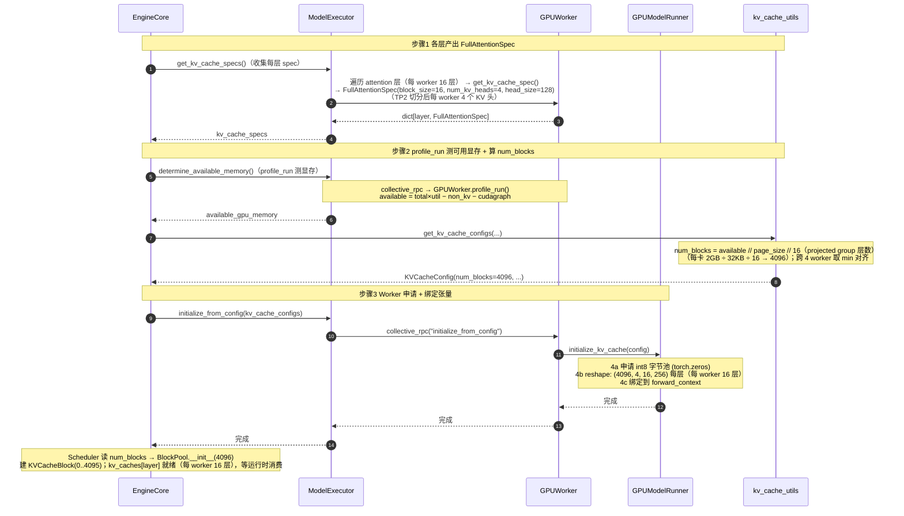
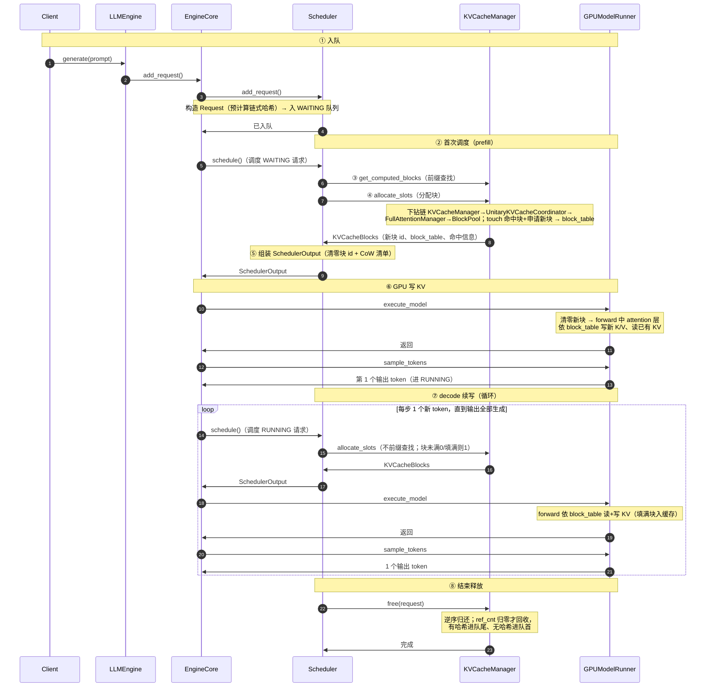
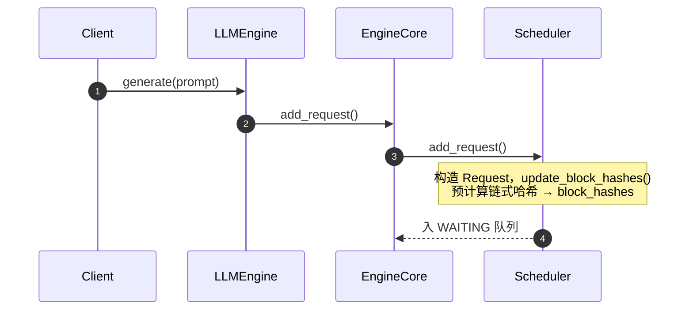
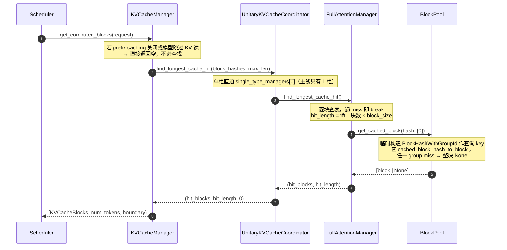
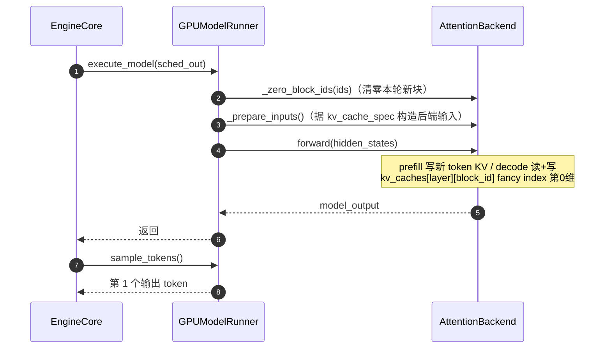
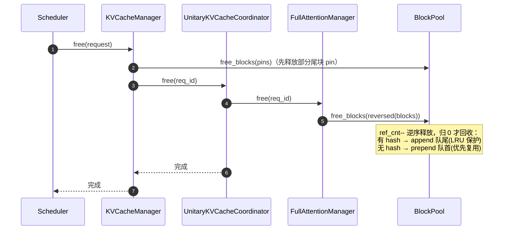
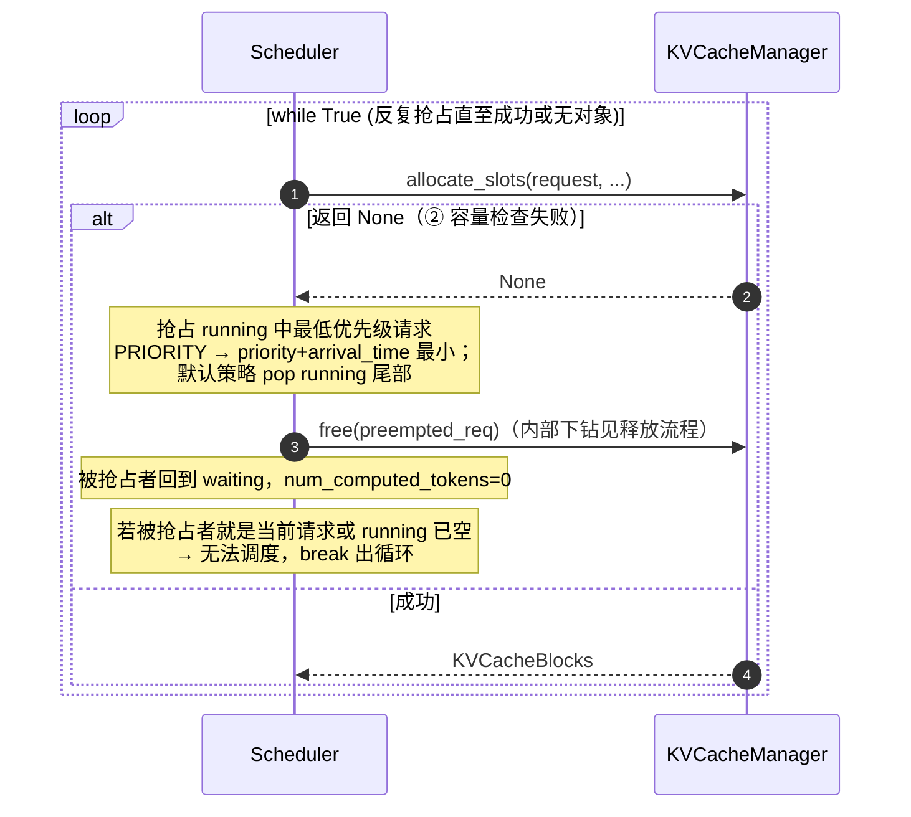

# 一条请求的KVCache管理端到端时序（Llama-3-8B pp2tp2 视角）

> 主线：**纯 Full Attention 模型 Llama-3-8B（pp2tp2，4卡环境）**，一个KVCacheGroupSpec，类型为FullAttentionSpec。用时序图串起一条请求从进入 Scheduler 到最终释放的全过程。
>
> **部署拓扑**：PP2 × TP2 = 4 卡，每个 worker 负责 16 层、4 个 KV 头（TP2 切分 8→4）。调度器视角下全模型仍为单 group（32 层），对 PP/TP 布局透明。

---

## 0. KV Cache 管理的核心组件

Llama-3-8B 为纯 Full Attention 模型，仅维护单个 KV cache group。其 KV Cache 管理体系由五个核心类构成，自上而下分为逻辑编排层与物理执行层：

| 层级 | 类（源文件） | 职责 |
|---|---|---|
| 编排入口 | `KVCacheManager`（`kv_cache_manager.py`） | Scheduler 的唯一对接方，对外暴露 `get_computed_blocks` / `allocate_slots` / `take_*` / `free`，协调多组 KV cache 的统一管理 |
| 组级协调 | `UnitaryKVCacheCoordinator`（`kv_cache_coordinator.py`） | 单组协调器，将 KVCacheManager 的调用原样透传至下层管理器（单组场景下为直通层） |
| 单组管理 | `FullAttentionManager`（`single_type_kv_cache_manager.py`） | 单个 attention 类型的 KV cache 管理实现：最长前缀查找、块数计算、touch、分配、缓存、释放 |
| 逻辑块池 | `BlockPool`（`block_pool.py`） | 逻辑块池（KV 数据持有方）：哈希表查/写、`get_new_blocks`、`touch`、`free_blocks` |
| 物理张量 | `GPUModelRunner`（`gpu_model_runner.py`） | 物理层，持有真实 K/V 张量：申请 `kv_caches[layer]`、`_zero_block_ids`、`forward`、`sample_tokens` |

> **调用链路**：`KVCacheManager → UnitaryKVCacheCoordinator → FullAttentionManager → BlockPool` 构成逻辑编排链，负责 `block_id` 的分配与回收；`GPUModelRunner` 独立持有物理张量，通过 `block_id` 与逻辑块建立映射——逻辑管理零拷贝、物理读写经 block_id 间接寻址。

---

## 1. Llama-3-8B（pp2tp2）的 KV Cache 配置与物理初始化

下文所有阶段共用同一个请求示例，模型参数固定为 Llama-3-8B，部署于 pp2tp2（4卡）环境。

Llama-3-8B 采用 GQA（Grouped Query Attention），其模型级 KV cache 参数如下：

| 参数 | 值 | 说明 |
|---|---|---|
| `num_hidden_layers` | 32 | 全模型层数；每层各持一份 KV 张量，但**共享同一套 block_id** |
| `num_attention_heads` | 32 | 查询头数 |
| `num_key_value_heads`（=`num_kv_heads`） | 8 | KV 头数；`32/8 = 4` 个查询头共享 1 个 KV 头 |
| `head_dim`（=`head_size`） | 128 | 每 head 维度 |
| `hidden_size` | 4096 | 隐层宽度 `= num_attention_heads × head_dim` |

**pp2tp2 部署切分**：

| 切分维度 | 全模型 | 每 worker | 说明 |
|----------|--------|-----------|------|
| PP2（按层切） | 32 层 | 16 层 | `get_layers_start_end_indices()` 按 `pp_rank` 切层范围 |
| TP2（按 KV 头切） | 8 KV 头 | 4 KV 头 | `get_num_kv_heads()` 除以 `tensor_parallel_size` |

vLLM侧 KV cache 配套参数：

| 参数 | 值 | 说明 |
|---|---|---|
| `block_size` | 16 | 每块容纳 token 数（page 粒度） |
| `dtype` | `fp16` | KV 元素精度（2 字节/元素） |

基于上述参数，**每 worker** 的 KV cache 物理规模可逐级推导（`num_kv_heads=4`、`num_layers` 取 projected group 的 16，即 PP2 切分后每 worker 实际层数）：

| 派生量 | 计算式 | 值 | 说明 |
|---|---|---|---|
| `page_size_bytes` | `2 × block_size × num_kv_heads × head_dim × 2B`<br>= `2 × 16 × 4 × 128 × 2` | 32,768 B<br>（32 KB） | 单层单块字节数（TP2 后 4 头），因子 2 为 K、V 各一份 |
| `num_blocks`（示例每卡可用显存 2GB） | `2 GB ÷ page_size ÷ num_layers`<br>= `2,147,483,648 ÷ 32,768 ÷ 16` | 4096 | 跨 worker `min` 对齐后的逻辑块总数，`BlockPool` 建立 `KVCacheBlock(0..4095)` |
| `kv_caches[layer]` | `(num_blocks, num_kv_heads, block_size, 2×head_dim)` | `(4096, 4, 16, 256)` | 每层 KV 张量形状（TP2 后 4 头），每 worker 16 个层张量 |

物理显存初始化启动期**一次性**执行 `EngineCore._initialize_kv_caches`（core.py:254），通过 profile_run 实测可用显存后算出 `num_blocks`，然后每 worker 一次性申请 16 个张量（大小 num_blocks × page_size_bytes）。产出两样供运行时消费：
1. `num_blocks`（4096，跨 worker 对齐）→ `BlockPool.__init__` 建 `KVCacheBlock(0..4095)`，`block_id`为0-4095，运行时 `KVCacheManager` 的"分配/释放"只操作 `block_id`  + `ref_cnt`
2. `kv_caches[layer]` 物理张量 → 每 worker 的 `GPUModelRunner` 申请 16 层，`block_id` 即物理张量第 0 维行号，运行时按 `block_id` 读写

该物理显存初始化时序图如下：




---

## 2. 示例请求

**示例请求 R**：

```
prompt     = "请用中文解释一下数据库索引，并举例说明 B+ 树索引与哈希索引的区别……"（70 个 token）
max_tokens = 32
block_size = 16
```

宏观路径：**入队（WAITING）→ 首次调度 prefill（算完 70 token，→ RUNNING）→ 每步 decode 续写 1 token（至 32 个输出）→ 结束释放**。

> **核心结论：新块同样会被缓存**（与命中无关）。prefill 新分配的满块、decode 逐步填满的新块，行为一致——`allocate_slots` 内部总是调 `cache_full_blocks`，只要某块写满就哈希入前缀缓存表；未满的尾块等写满的当步入表。

---

## 3. 端到端过程速览与总览时序图

`EngineCore.step()`（core.py:580）每步驱动 `schedule → execute_model → sample_tokens`。

**一条请求的端到端过程（编号速览）**（示例 R：prompt = 70 token / max_tokens = 32 token）：

```text
入队 → WAITING（①）
  ├─ 首次调度 prefill（②）
  │    ├─ get_computed_blocks（③）: 70//16=4 hash 查表，命中前 2 块 → hit_length=32
  │    ├─ allocate_slots（④）
  │    │    ├─ touch 2 命中 + get_new_blocks(3) → block_table=[命中,命中,新,新,新]
  │    │    └─ cache_blocks: 新满块 2,3 入哈希表；未满块 4 不入
  │    ├─ SchedulerOutput（⑤）: 附清零块 id 2/3/4 + CoW 清单
  │    └─ execute_model（⑥）: forward 写 70 token KV → sample → 第 1 token → RUNNING
  ├─ decode 续写 32 步（⑦，每步 1 token，不查前缀）
  │    ├─ 第 1~10 步: 填第 5 块(0 分配)；第 10 步满 → 入哈希表
  │    ├─ 第 11~26 步: 申第 6 块 → 填满 → 入哈希表
  │    └─ 第 27~32 步: 申第 7 块，填 6 slot → 完成(未满不入表)
  └─ 释放 free（⑧）: 逆序 7→6→5→4→3
       ├─ 命中块 0/1 仅减计数
       └─ 有哈希→append 队尾 · 无哈希→prepend 队首
```

**总览时序图**：



---

## 4. 分阶段详解

### 4.1 ① 入队



**要点**：
- 入队即预计算：70 token → `70 // 16 = 4` 个满块有 hash（链式哈希逐年累进），未满的第 5 块无 hash
- `request.block_hashes` 存的是**纯 `BlockHash`**（不含 group id），group id 到 ③ 前缀查找 / ④ 分配落库时才临时拼上

**结合请求 R**：R 的 4 个满块 hash 在入队时算好，存于 `request.block_hashes`，供 prefill 阶段做前缀缓存查找。

### 4.2 ② 首次调度（WAITING → prefill）

`schedule()`（scheduler.py:427）每步**先遍历 RUNNING（:473）再遍历 WAITING（:671）**。KV 编排链固定为 `KVCacheManager → UnitaryKVCacheCoordinator → FullAttentionManager → BlockPool`，下面三个子步骤都走这条链。

> **调度顺序要点**：没有独立的 prefill / decode 全局阶段，只有一个共享 `token_budget`，按"**先 running、后 waiting**"填充：
> - RUNNING 里也可能有 chunked prefill 的中间片（`is_prefill_chunk`），同样优先于新的 waiting 请求
> - `defer_prefills`（:467）是 DP 负载均衡开关，不等于"prefill 优先调度"
> - PD 分离由 KV 传输实现，P/D 实例跑同一个统一 `Scheduler`，上述"先 running、后 waiting"在每个实例内部都成立

#### 4.2.1 ③ 前缀缓存查找（get_computed_blocks）



**要点**：
- `max_cache_hit_length = request.num_tokens - 1`（KVCacheManager 内，km:259）：即使全命中，最后 1 个 token 的 logits 仍需重算，故最多命中 N−1
- 链式哈希从左到右**逐块比对，遇 miss 即 break**；命中的是**已满块**（未满尾块无 hash 不参与）
- 本次查找**只读不写**：临时构造查询 key（`BlockHashWithGroupId` 用完即弃），不改 `ref_cnt`、不回写 `request.block_hashes`；真正的 `ref_cnt++` 要等 ④ 的 touch

**结合请求 R**：4 个 hash 逐块查表，假设前 2 块命中（仅标记可复用），`hit_length = 32`，剩余 `70 − 32 = 38` token 需重新计算。

#### 4.2.2 ④ 分配物理块（allocate_slots · 内部 5 步）

```mermaid
%%{init: {"themeVariables": {"actorFontSize": "11px", "messageFontSize": "11px", "noteFontSize": "11px"}, "sequence": {"actorMargin": 40, "messageMargin": 16, "noteMargin": 8, "boxMargin": 8, "mirrorActors": true}}}%%
sequenceDiagram
    autonumber
    participant Scheduler
    participant KVCacheManager
    participant UnitaryKVCacheCoordinator
    participant FullAttentionManager
    participant BlockPool
    Note over Scheduler,BlockPool: allocate_slots 内部 5 步，与源码顺序严格一致
    Scheduler->>KVCacheManager: allocate_slots(request)
    KVCacheManager->>UnitaryKVCacheCoordinator: ① remove_skipped_blocks（释放滑窗外块）
    Note over FullAttentionManager: full attention 下 get_num_skipped_tokens 恒 0<br/>实际不弹块；仅 SWA / R-SWA 生效
    KVCacheManager->>UnitaryKVCacheCoordinator: ② get_num_blocks_to_allocate（容量检查）
    Note over FullAttentionManager: num_new = max(cdiv(num_tokens, block_size)<br/>　− num_local_computed, 0) 纯计算<br/>num_local_computed = 已算块数 + 已持块数
    KVCacheManager->>BlockPool: get_num_free_blocks()
    Note over KVCacheManager: available = free − reserved，required = num_blocks + watermark<br/>required &gt; available → return None → 抢占
    KVCacheManager->>UnitaryKVCacheCoordinator: ③ allocate_new_computed_blocks（touch 命中块）
    Note over UnitaryKVCacheCoordinator: 两阶段先 add_local 逐组 touch（ref_cnt++）<br/>再 allocate_external（主线无 ext_comp，跳过）
    KVCacheManager->>UnitaryKVCacheCoordinator: ④ allocate_new_blocks（待计算新块）
    UnitaryKVCacheCoordinator->>FullAttentionManager: allocate_new_blocks()
    FullAttentionManager->>BlockPool: get_new_blocks(num_new)
    Note over FullAttentionManager: partial-hit 先 get_new_blocks(1) 做 CoW 替换共享尾块
    KVCacheManager->>UnitaryKVCacheCoordinator: ⑤ cache_blocks（缓存满块）
    FullAttentionManager->>BlockPool: cache_full_blocks
    Note over BlockPool: 新满块 block_hash=None → 写库入哈希映射表<br/>命中块哈希已存在 → 幂等早退
    UnitaryKVCacheCoordinator-->>KVCacheManager: 完成
    KVCacheManager-->>Scheduler: KVCacheBlocks
```

**要点（与源码顺序严格一致）**：`allocate_slots` 依次执行 5 步。

- **① 释放滑窗外块** `remove_skipped_blocks`（km:504）：在容量检查**之前**先释放滑窗跳过的块，减少驱逐；full attention 下 `get_num_skipped_tokens` 恒 0，实际不弹块，仅 SWA / R-SWA 子类生效
- **② 容量检查** `get_num_blocks_to_allocate`（km:510，下钻 coordinator 基类 → single_type:144）：
  - FM 侧纯计算：`num_new = max(cdiv(num_tokens, block_size) − num_local_computed, 0)`，其中 `num_local_computed = len(new_computed_blocks) + len(req_to_blocks[req_id])`
  - KM 侧比较：`available = get_num_free_blocks() − reserved`（block_pool:799）vs `required = num_blocks + watermark`；`required > available` → `return None` → 抢占
- **③ 处理命中块** `allocate_new_computed_blocks`（km:535，coordinator 两阶段，issue #33775）：**先**逐组 `add_local_computed_blocks`（touch 命中块 `ref_cnt` 1→2，摘出 free 队列），**再**逐组 `allocate_external_computed_blocks`（主线 `num_external_computed_tokens=0`，跳过）；放在容量检查**之后**，避免 touch 后回滚
- **④ 分配待计算块** `allocate_new_blocks`（km:542 → single_type:330）：`num_new = cdiv(num_tokens, block_size) − len(req_to_blocks[req_id])`；partial-hit 先 `get_new_blocks(1)` 做 CoW 替换共享尾块
- **⑤ 缓存满块** `cache_blocks`（km:563 → single_type:427 → cache_full_blocks）：`num_tokens_to_cache = min(total_computed + num_new, request.num_tokens)`，只缓存**已定稿** token（排除可能被拒的 draft）；新块记入 `new_block_ids` 待 drain 清零

**结合请求 R**：容量检查通过后，③ touch 前缀查找命中的前 2 块（ref_cnt 1→2）；④ 剩余 38 token 按 16 切块需 3 块（16+16+6），`get_new_blocks(3)` → block_table 变 `[命中0, 命中1, 新2, 新3, 新4]`；⑤ 命中块 0/1 幂等早退，真正入表的是新满块 2、3，未满块 4 不入表。

#### 4.2.3 ⑤ 组装 SchedulerOutput

④ 分配完物理块后，Scheduler 还需把两件"后处理指令"打包进 `SchedulerOutput`，交给 Worker 在 GPU forward 之前执行：

1. **清零新块** `new_block_ids_to_zero`：新分配的物理块在 GPU 内存里可能残留上一请求的旧数据，必须先清零再写入
2. **CoW 拷贝** `kv_cache_block_copies`：部分命中前缀的请求，需把共享块的 KV 数据拷到私有块，避免写覆盖

> **为什么需要 CoW 拷贝？** 当请求命中缓存块 0/1 但尾巴被截断（partial hit），④ 的分配块会额外分配一个"CoW 块"替掉原共享块位置。请求的 block_table 已指向新块，但新块 GPU 上是空的——必须把共享块里的 KV 拷贝过来，它才能在块上继续写自己的 token。Worker 侧在 forward 前执行 `copy_kv_cache_blocks_inplace` 完成拷贝。

**SchedulerOutput 中与 KV Cache 直接相关的字段**（output.py:193）：

| 字段 | 类型 | 来源 | 含义 |
|---|---|---|---|
| `scheduled_new_reqs` | `list[NewRequestData]` | 首次调度请求 | 含 `block_ids`（block_table） |
| `scheduled_cached_reqs` | `list[CachedRequestData]` | 续跑请求增量 | 含 `new_block_ids` |
| `new_block_ids_to_zero` | `list[int] \| None` | `take_new_block_ids()` | 本步新分配块 id，Worker 需清零 |
| `kv_cache_block_copies` | `list[KVCacheBlockCopy] \| None` | `take_kv_cache_block_copies()` | 本步待执行的 CoW 拷贝对 `src→dst` |

**清零过滤与延迟释放（Scheduler 侧）**：
- `_get_new_block_ids_to_zero` 过滤（scheduler.py:1233）：`needs_kv_cache_zeroing` 为 False → 直接 None；或有 `_skip_zero_block_ids`（异步 KV 加载的块，清零会竞争写入）→ 排除；列表为空 → None
- CoW 源块与目的块拷贝期间都要保留 ref（源块有 hit-ref、目的块额外 `ref_cnt`）；启用 `defer_block_free` 时释放推迟到 `processed_step_seq >= fence_seq`（GPU 拷贝确认完成），否则立即释放；延迟释放的块逆序归还（`_drain_deferred_frees`, scheduler.py:2311）

**结合请求 R**：R 是首次 prefill（无 partial hit），`kv_cache_block_copies` 为空；3 个新块 id（2/3/4）进 `new_block_ids_to_zero`。Worker 收到后先清零这 3 个块，再执行 forward 写入 KV。

#### 4.2.4 附：BlockHash 的三级演变

① 入队 → ③ 前缀查找 → ④ 分配落库，三个阶段中哈希形态逐步"升级"，但 `request.block_hashes` 始终是纯 `BlockHash`：

| 阶段 | 动作 | 哈希形态 | 位置 |
|---|---|---|---|
| ① 入队 | `update_block_hashes` 预计算链式哈希（request.py:257） | **纯 `BlockHash`** | `request.block_hashes`，只在此处生成 |
| ③ 查表 | `make_block_hash_with_group_id(hash, group_id)` **临时构造**查询 key | `BlockHashWithGroupId`（临时） | 仅作 `get_one_block(key)` 的查询 key，用完即弃，不回写 |
| ④ 落库 | `set_block_hash(key)` 存入块字段 + `insert(key, block)` 写映射表 | `BlockHashWithGroupId`（持久） | `KVCacheBlock.block_hash` 与 `cached_block_hash_to_block` 映射表 |

记忆口诀：**① 造纯哈希 → ③ 拼临时 key 查 → ④ 真正落库带 group id**。

### 4.3 ⑥ GPU 写 KV（GPUModelRunner forward）



**要点**：
- `_zero_block_ids` 只清零**本轮新分配**的块，避免读到上一请求残留的旧 KV
- `block_table`（`req_to_blocks` 的 block_id 列表）作 fancy index，kernel 从 `kv_caches[layer][block_id]` 第 0 维 gather 对应行；同一 `block_id` 在全模型 32 层（每 worker 16 层）对应同一逻辑块，全套层共用一份 block_table
- `sample_tokens` 由 **EngineCore** 调用（core.py:600），仅在 `execute_model` 未产出采样时补跑

**结合请求 R**：3 个新块先清零；一次 forward 写 70 token 的 K/V 到 5 块（命中块 0/1 复用不重算）；`slot_mapping` 记录每个 token 落到哪个块的哪个 slot。

### 4.4 ⑦ decode 续写（RUNNING）

`schedule()` 每步**先遍历所有 RUNNING 请求**（:473，外层是 `while req_index < len(running) and budget > 0` 的请求遍历，而非单请求），每请求 append 1 token，全部处理完后**一次性** `execute_model + sample_tokens`（多请求共享同一 batch）。与 prefill 走**同一套** `allocate_slots`（内部 5 步），差异仅在量级：通常无前缀命中（③跳过），当前块未满则 0 块、写满则 1 块。

```mermaid
%%{init: {"themeVariables": {"actorFontSize": "11px", "messageFontSize": "11px", "noteFontSize": "11px"}, "sequence": {"actorMargin": 40, "messageMargin": 16, "noteMargin": 8, "boxMargin": 8, "mirrorActors": true}}}%%
sequenceDiagram
    autonumber
    participant EngineCore
    participant Scheduler
    participant KVCacheManager
    participant UnitaryKVCacheCoordinator
    participant FullAttentionManager
    participant BlockPool
    loop 调度 RUNNING（:473）：while req_index &lt; len(running) and budget &gt; 0
        EngineCore->>Scheduler: schedule()（调度 RUNNING 请求）
        Scheduler->>KVCacheManager: ④ allocate_slots(request, num_new_tokens=1)
        Note over KVCacheManager: 与 prefill 同一套内部 5 步；续写无前缀命中<br/>① 不弹块、③ 跳过，②④⑤ 照走
        KVCacheManager->>UnitaryKVCacheCoordinator: ② get_num_blocks_to_allocate（容量检查）
        KVCacheManager->>UnitaryKVCacheCoordinator: ④ allocate_new_blocks（当前块满则 1 块）
        UnitaryKVCacheCoordinator->>FullAttentionManager: allocate_new_blocks()
        FullAttentionManager->>BlockPool: get_new_blocks(0 或 1)
        KVCacheManager->>UnitaryKVCacheCoordinator: ⑤ cache_blocks（当步填满的块入哈希）
        FullAttentionManager->>BlockPool: cache_full_blocks
        UnitaryKVCacheCoordinator-->>KVCacheManager: 完成
        KVCacheManager-->>Scheduler: KVCacheBlocks（token_budget 扣减）
    end
    EngineCore->>GPUModelRunner: execute_model（全部请求一次 forward）
    EngineCore->>GPUModelRunner: sample_tokens
```

**要点**：
- 外层是请求遍历：每步调度**所有** RUNNING 请求（`while req_index < len(running)`），而非单请求
- 每请求每轮只 append 1 token：当前块未满 → 0 块；写满 → 1 块
- 所有请求分配完成后才一次性 `execute_model` + `sample_tokens`（共享同一 batch）
- **新满块同样入缓存**：decode 每步的 `allocate_slots` 与 prefill 一样调 `cache_blocks`，某块当步填满即入哈希表，变为可命中的前缀缓存条目

**结合请求 R**：prefill 后第 5 块只装 6 token。decode 第 1~9 步填第 5 块（0 分配），**第 10 步填满入表**；第 11 步申请第 6 块、第 26 步入表；第 27 步申请第 7 块、填 6 个 slot 后完成（未满不入表）。32 个输出分布：第 5 块 10 个、第 6 块 16 个、第 7 块 6 个，跨 2 个新块，填满的同样被缓存——这是前缀缓存持续增长的方式。

### 4.5 ⑧ 请求结束 → 释放



**要点**：
- `free`（km:567）内部顺序：**先**释放 `_partial_tail_pins`（km:575，部分尾块 pin），**再** `coordinator.free`（km:578）逐组下放
- FullAttentionManager 侧先 `pop_blocks_for_free(req_id)` 取出按分配顺序的块列表（single_type:500），再 `free_blocks(reversed(blocks))`
- **逆序释放**（`reversed`）：尾块先归还，利用 free 队列特性让最近用的块最先被重新分配
- `ref_cnt > 0` 的共享块仅减计数不回收；归 0 才进 free 队列
- 有哈希块 append 队尾（保护前缀缓存），无哈希块 prepend 队首（优先复用）
- 另有一条 **defer 分支**：异步调度等在途场景下，Scheduler 改调 `pop_blocks_for_free`（scheduler.py:2296）只取记账不归还，等在途步完成后延迟 `free_blocks`

**结合请求 R**：R 生成满 32 个输出（或命中 EOS）后结束。逆序释放：第 7 块先归还；命中块 0/1 因 `ref_cnt` 仍 >0（被其他请求共享）只减计数；其余有哈希的块 append 到队尾，方便后续请求前缀复用。

### 4.6 扩展：抢占（容量不足时）

`allocate_slots` 返回 `None` 时反复抢占直到成功或无可抢占（scheduler.py:565 的 `while True`）：



**要点**：
- 抢占者被放回 waiting 且 `num_computed_tokens=0`（:1260），块已释放，重调度需重新 prefill
- 优先级策略：`SchedulingPolicy.PRIORITY` 时取 `priority + arrival_time` 最小的牺牲者（:578）；否则默认 pop running 尾部（:603）
- 若被抢占者恰是当前请求、或 running 已空，则无法调度，直接 `break`（:607-609）

**结合请求 R**：设 R 首次调度时空闲块不足以容纳其 3 个新块 → Scheduler 抢占 running 中优先级最低的 X 并释放其块 → 腾出空间后重试成功，R 进入 RUNNING，X 暂停待重调度。

---

## 5. 小结：prefill 与 decode 的统一

> ② 首次 prefill 与 ⑦ decode 续写共用同一套 **`allocate_slots` 分配块 → forward 写 KV → 满块 `cache_blocks` 入哈希** 骨架，只是规模不同。**唯一的阶段差异**在前置：前缀查找 `get_computed_blocks` 是 prefill 独有的（首次带着整段 prompt 查可复用前缀），decode 跳过它（续写的是全新 token，无前缀可查）。

| 维度 | prefill（WAITING 首次） | decode（RUNNING 续写） |
|---|---|---|
| 处理 token 数 | 一次整个 prompt（70 个） | 每步 1 个 |
| 前缀查找 | 是（`get_computed_blocks`） | 否（续写无新命中） |
| 分配块数 | 一次多块（3 新块） | 0 或 1 块 |
| 内部 5 步 | ①~⑤ 全走（③ touch 命中块） | ①③ 空操作，②④⑤ 照走 |
| 状态机 | `WAITING → RUNNING` | 保持 `RUNNING` 直到完成 |

状态机全路径：`WAITING →(首次调度) RUNNING →(持续 decode) → 完成 → 释放`，与入队、释放两节无缝衔接。
