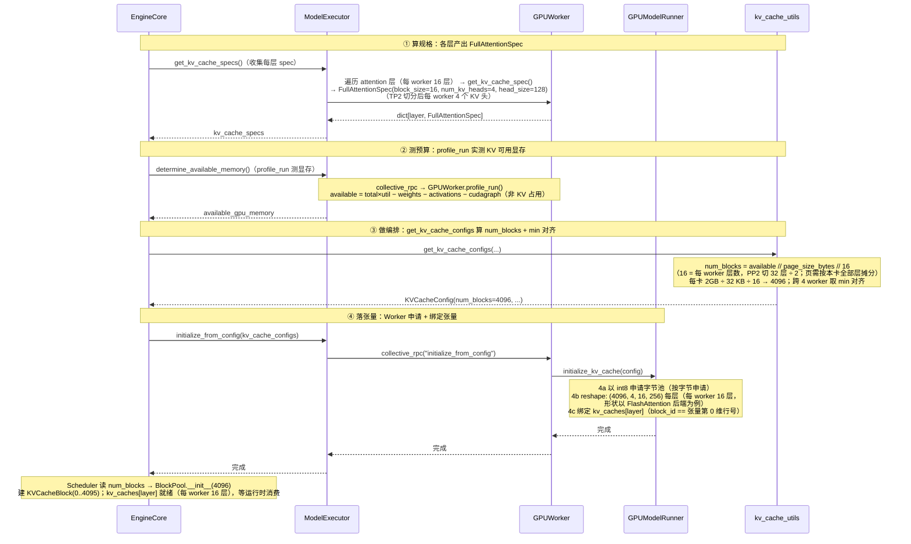

# vLLM V1 物理显存层（Full Attention 主线）

> 源文件：`vllm/vllm/v1/kv_cache_interface.py`、`vllm/vllm/v1/core/kv_cache_utils.py`、`vllm/vllm/v1/engine/core.py`、`vllm/vllm/v1/worker/gpu_worker.py`、`vllm/vllm/v1/worker/gpu_model_runner.py`、`vllm/vllm/v1/worker/utils.py`
>
> 主线：纯 Full Attention 模型 Llama-3-8B（pp2tp2，4卡环境），每 worker 16 层 / 4 KV 头。

**章节顺序**：§1 物理显存申请流程总览 → §2 初始化流程详解（算规格 → 测预算 → 做编排 → 落张量）→ §3 PP/TP 物理分布 → §4 关键公式速查 → §5 物理-逻辑桥接（`block_id == 张量行号`）→ §6 设计要点小结。

---

## 1. 物理显存申请流程总览

物理显存层的核心职责是：将每层 KV cache 的抽象规格说明书（`KVCacheSpec`）物化为**真正驻留在 NPU/GPU 设备上的 `torch.Tensor`**——先经容量规划算出块总数 `num_blocks`，再按其申请 int8 字节池、零拷贝 reshape 为后端逻辑 shape。
此后物理层与逻辑层（`BlockPool`）之间没有任何对象引用：同一份 `KVCacheConfig` 保证两侧 `num_blocks` 容量对齐，靠"`block_id` 即物理行号"的编号约定，逻辑链凭整数 `block_id` 直接索引物理行——这正是上层零拷贝调度的物理基座。

### 1.1 初始化流水线

从 `EngineCore._initialize_kv_caches()`（core.py:248）起步，物理显存初始化沿**四阶段单向管线**推进，将 KV cache 抽象规格逐级物化为设备张量：

```
模型层配置 ──①──▶ KVCacheSpec ──②──▶ available_memory ──③──▶ KVCacheConfig ──④──▶ kv_caches[layer]
                 (每层规格)             (显存预算)              (编排结果)              (物理张量)
```

前三步（①②③）统属**规格推导**——产出 `KVCacheConfig`（含 `num_blocks`、分组方案、张量尺寸），此时尚未触及设备显存；第四步（④）完成**物理分配**（int8 字节池申请 → reshape 为后端逻辑 shape）与**桥接绑定**（`block_id ↔ 张量行号`），并触发编译预热。

| 阶段 | 职责 | 入口调用 | 输入 → 产出 |
|------|----------|----------|-------------|
| ① 算规格 | 遍历全模型 Attention 层，采集 `FullAttentionSpec`，推导单页字节量 `page_size_bytes`；同类层合并为 `KVCacheGroupSpec` | `GPUModelRunner.get_kv_cache_spec()` | `vllm_config` → `dict[layer, FullAttentionSpec]` |
| ② 测预算 | profile dummy forward，量出 KV cache 可用显存（总显存 × 利用率 − 权重 − 激活 − CUDAGraph 预留） | `GPUModelRunner.profile_run()` | 设备显存快照 → `available_memory: int` |
| ③ 做编排 | 合并全 worker spec → 分组 → 导出 `num_blocks`（`available // page_size // num_layers`）→ 预算校验 → 跨 worker `min(num_blocks)` 对齐 | `get_kv_cache_configs()` | specs + budget → `KVCacheConfig` |
| ④ 落张量 | `torch.int8` 字节池申请 → `view + permute` 零拷贝 reshape → bind 绑定 `block_id == block_dim 维索引` → `_dummy_run` 编译 + CUDAGraph capture | `GPUModelRunner.initialize_kv_cache()` | `KVCacheConfig` → `kv_caches[layer]: Tensor` |

> **零拷贝调度的物理基础**：物理张量就绪后，上层 `BlockPool` 只持有 `block_id`，所有调度决策（分配/释放/共享/驱逐）均不触碰物理显存——调度层与物理层完全解耦，`block_id` 是唯一的交互接口。

### 1.2 交付物与消费方

| 交付物 | 消费方 | 用途 |
|--------|--------|------|
| `num_blocks` | `BlockPool` | 即逻辑层初始化创建的 `KVCacheBlock` 数：`BlockPool` 据此建出 `KVCacheBlock(0 .. num_blocks-1)`（块 0 开池即留作 `null_block` 占位，实际可分配 `num_blocks-1`） |
| `kv_caches[layer_name]` | Attention 算子 + ModelRunner | Llama-3-8B 每层一张`(num_blocks, num_kv_heads, block_size, 2*head_size)`的物理张量：forward 时算子以 `block_table` 为 fancy index 沿 `block_dim` 轴 gather 物理行，读旧 K/V、写本步新 K/V；ModelRunner 侧引用用于清零本轮新块 |
| `KVCacheConfig` | Worker（物理侧）+ BlockPool（逻辑侧） | 引擎下发两侧的衔接配置：Worker 遍历 `kv_cache_tensors`，按 `size` 申请字节池、按 `shared_by` 绑定到层；BlockPool 凭 `num_blocks` 建 `KVCacheBlock`|

---

## 2. 初始化流程详解

物理显存初始化启动期**一次性**执行 `EngineCore._initialize_kv_caches`（core.py:248），通过 profile_run 实测可用显存后算出 `num_blocks`，然后每 worker 一次性申请 16 个张量（大小 num_blocks × page_size_bytes）。产出两样供运行时消费：
1. `num_blocks`（4096，跨 worker 对齐）→ `BlockPool.__init__` 建 `KVCacheBlock(0..4095)`，`block_id` 为 0-4095，运行时 `KVCacheManager` 的分配/释放只操作 `block_id` 和 `ref_cnt`
2. `kv_caches[layer]` 物理张量 → 每 worker 的 `GPUModelRunner` 申请 16 层，`block_id` 即物理张量第 0 维行号，运行时按 `block_id` 读写

该物理显存初始化时序图如下：



### 2.0 调用链总览

以纯 Full Attention 模型（Llama-3-8B pp2tp2，每 worker 16 层 / 4 KV 头，合并后全模型 32 层**单 group**）为例。

```text
EngineCore._initialize_kv_caches()                        # engine/core.py:248  启动期唯一入口
│
├─ ※  register_all_kvcache_specs(vllm_config)            # FullAttentionSpec ↔ FullAttentionManager 注册表
│
├─ √ ① §2.1 算规格  model_executor.get_kv_cache_specs()
│     ├─ RPC 到 worker.get_kv_cache_spec() → GPUModelRunner.get_kv_cache_spec() 
│     └─ 返回 -> list[dict[str, KVCacheSpec]]，每个worker上每层Attention KV cache类型，dict[layer name, FullAttentionSpec]
│
├─ ※  扫描 spec.non_causal                                # 非因果层，关闭 chunked prefill / 前缀缓存
│
├─ √ ② §2.2 测预算  model_executor.determine_available_memory()
│     ├─ RPC 到 worker.determine_available_memory() → GPUModelRunner.profile_run()
│     └─ 返回每个worker的 available_kv_cache_memory_bytes 字节数-> list[int]
│
├─ √ ③ §2.3 做编排  get_kv_cache_configs(...)
│     ├─ 合并各worker的spec → 生成 global groups（32层）→ _project 到每 worker 的 projected groups（16层）
│     ├─ 基于 projected groups 算 num_blocks → 对齐 min num_blocks
│     └─ 返回 -> list[KVCacheConfig]，每个worker上的KVCacheConfig（统一num_blocks）
│
└─ √ ④ §2.4 落张量  model_executor.initialize_from_config(...)
      ├─ RPC 到各worker.initialize_from_config() → GPUModelRunner.initialize_kv_cache()
      │     ├─ 4a _allocate_kv_cache_tensors  以 torch.int8 申请字节池
      │     ├─ 4b _reshape_kv_cache_tensors   view+permute 成后端逻辑 shape
      │     └─ 4c bind_kv_cache               block_id == 物理张量行号
      └─ 4d RPC 到各worker.compile_or_warm_up_model() → GPUModelRunner._dummy_run()
            └─ 编译 + CUDAGraph capture
```

**※ 前置 · 注册 spec ↔ manager 映射**

进入正题前，`EngineCore` 进程内先执行 `register_all_kvcache_specs(vllm_config)`，把 `FullAttentionSpec` 注册到 `FullAttentionManager`：

```python
# single_type_kv_cache_manager.py:1881
def register_all_kvcache_specs(vllm_config):
    """Built-in spec registration"""
    KVCacheSpecRegistry.register(
        FullAttentionSpec,
        FullAttentionManager,
        uniform_type_base_spec=FullAttentionSpec,
    )
```

> 这是一张"spec 类型 → 管理类"的查表：§2.3 分组完成后，按 `KVCacheGroupSpec.kv_cache_spec` 的类型查表实例化对应 manager；FullAttention 主线只用到 `FullAttentionManager`。

### 2.1 第 1 步 · 算规格：各层产出 KVCacheSpec

**调用链**：`EngineCore` → `ModelExecutor.get_kv_cache_specs()`（core.py:255）→ RPC 到各 worker → `GPUWorker.get_kv_cache_spec()`（gpu_worker.py:633）→ **`GPUModelRunner.get_kv_cache_spec()`（gpu_model_runner.py:7782）**。

```python
# gpu_model_runner.py:7782 GPUModelRunner 实例方法（用 self）
def get_kv_cache_spec(self) -> dict[str, KVCacheSpec]:
    kv_cache_spec: dict[str, KVCacheSpec] = {}
    layer_type = cast(type[Any], AttentionLayerBase)
    attn_layers = get_layers_from_vllm_config(self.vllm_config, layer_type)
    for layer_name, attn_module in attn_layers.items():
        if isinstance(attn_module, Attention) and (
            kv_tgt_layer := attn_module.kv_sharing_target_layer_name
        ):
            self.shared_kv_cache_layers[layer_name] = kv_tgt_layer  # kv_sharing 复用目标层 KV，跳过
            continue
        if spec := attn_module.get_kv_cache_spec(self.vllm_config):  # 跳过无 KV 的 encoder-only
            if isinstance(spec, AttentionSpec):
                backend = attn_module.get_attn_backend()
                with set_current_vllm_config(self.vllm_config):
                    indexes = backend.indexes_kv_by_block_stride()
                spec = replace(spec, indexes_kv_by_block_stride=indexes)
            kv_cache_spec[layer_name] = spec
    return kv_cache_spec
```

纯 Full Attention 模型产出 `FullAttentionSpec`（`kv_cache_interface.py`）

**※ 边注 · 扫描 `non_causal`**——specs 收集齐后，EngineCore 检查是否有层标记 `non_causal=True`（如 Prefix LM attention）：

```python
# core.py:263
if any(getattr(spec, "non_causal", False)
       for worker_specs in kv_cache_specs
       for spec in worker_specs.values()):
    vllm_config.scheduler_config.enable_chunked_prefill = False  # 非因果层：关闭 chunked prefill
    vllm_config.cache_config.enable_prefix_caching = False       # 前缀缓存一并关闭
```

> 非因果层与 chunked prefill / 前缀缓存依赖的"因果注意力"假设冲突，会破坏 prefill 正确性；纯 Full Attention 全因果，此分支不触发。

### 2.2 第 2 步 · 测预算：profile 量出可用显存

**调用链**：`EngineCore` → `ModelExecutor.determine_available_memory()`（core.py:291）→ RPC 到各 worker → `GPUWorker.determine_available_memory()`（gpu_worker.py:459）→ **内部 `self.model_runner.profile_run()`**（dummy forward 量峰值）→ 写回 `self.available_kv_cache_memory_bytes`（gpu_worker.py:542）→ 返回每个 worker 的 `available_memory` 字节数 `list[int]`。

**核心公式**：

```
requested_memory = total_memory × gpu_memory_utilization        (request_memory, utils.py:393)

available_kv_cache_memory = requested_memory
                           − non_kv_cache_memory                (权重 + 激活 + 其他)
                           − cudagraph_memory_estimate          (CUDA graph 预留)
```

**执行过程**：`request_memory()`（校验 `free ≥ requested`）→ `memory_profiling()`（记录前后显存快照）→ `model_runner.profile_run()`（dummy forward 量峰值）→ `profile_cudagraph_memory()`（若启用 CUDA graph）→ 返回 `available`。

> 若显式设置 `cache_config.kv_cache_memory_bytes`，则跳过自动 profile，直接使用用户指定字节数。

### 2.3 第 3 步 · 做编排：合并 / 分组 / num_blocks / 对齐

**调用链**：`EngineCore` → `get_kv_cache_configs()`（kv_cache_utils.py:2073），顶层入口，依次五步（PP 下含投影）：

**① 合并全 worker spec**

```python
# kv_cache_utils.py:2111（节选）
merged_kv_cache_specs: dict[str, KVCacheSpec] = {}
for kv_cache_spec_one_worker in kv_cache_specs:
    for layer_name, layer_spec in kv_cache_spec_one_worker.items():
        merged_kv_cache_specs[layer_name] = layer_spec  # 跨 worker 合并
```

> 不同 PP stage 层名不同，合并天然不覆盖；同 PP stage 的不同 TP rank 提交同层 spec，断言检查必须等值（原因：TP 切分后 `num_kv_heads` 相同 → spec 字段全等，详见 §3）。

**② 分组 `get_kv_cache_groups()`**—— 纯 FullAttention 走 `is_kv_cache_spec_uniform()` → `_get_kv_cache_groups_uniform_spec()` → 全模型**单 group**。

```python
# kv_cache_utils.py:912
def is_kv_cache_spec_uniform(kv_cache_spec) -> bool:
    if not kv_cache_spec:
        return True  # encoder-only 模型
    try:
        kv_cache_spec_values = list(kv_cache_spec.values())
        _ = kv_cache_spec_values[0].merge(kv_cache_spec_values)  # 尝试合并
    except AssertionError:
        return False
    return True
```

> `merge()` 检查所有层 spec 字段（block_size / num_kv_heads / head_size / dtype 等）是否一致；**FullAttentionSpec 带不带 sliding window 视为同一类型**。

**③ 投影到各 worker：按 projected groups 计算 num_blocks**

`num_blocks` 是 **per-worker 容量**——每个 worker 只物化本 rank 负责的层（PP 切层；TP 切头已折进各 worker spec 的 `page_size_bytes`），可用显存必须按 worker 实际承载的层数折算，不能以全局合并层数为除数。`get_kv_cache_configs()` 先执行 `_project_kv_cache_groups_to_worker()`，把 global groups（32 层）投影为各 worker 的 **projected groups**（16 层），再传入 `get_kv_cache_config_from_groups()`（kv_cache_utils.py:1340，单组 `FullAttentionSpec` 走通用 else 路径）：

```python
# kv_cache_utils.py:1399-1416（节选）
group_size = max(len(group.layer_names) for group in kv_cache_groups)  # = 16（projected 后每 worker 层数）
num_blocks = available_memory // page_size // group_size
# group_size = projected group 的层数（pp2tp2 下每 worker 16，不是合并的 32）
# page_size = get_uniform_page_size() = FullAttentionSpec.page_size_bytes（单层每页字节，TP2 后 = 32KB）
# 生成 group_size 个张量（每 worker 16 个），每个 size = page_size × num_blocks，shared_by 为单层
```

**对照 · UniformType 单组路径**（同类型异页大小，不除层数）：

```python
# kv_cache_utils.py:1372-1383（节选）
num_blocks = available_memory // kv_cache_groups[0].kv_cache_spec.page_size_bytes
# 每层张量 size = per_layer_specs[layer].page_size_bytes × num_blocks（按各层实际页大小分配）
```

**④ 校验 `_check_enough_kv_cache_memory()`**

```python
# kv_cache_utils.py:751（节选）
needed_memory = get_needed_memory()  # max_model_len 下需要的 KV cache
if needed_memory > available_memory:
    estimated_max_len = estimate_max_model_len(available_memory)
    raise ValueError(...)  # 建议调大 util 或调小 max_model_len
```

**⑤ 多 worker 对齐**——集中式调度下，同一请求的 `block_table` 由所有 worker 共用：PP 各 stage 按段索引本 rank 的层，TP 各 rank 只读写本 rank 的 KV 头子集，因此 `block_id` 必须在任意 rank 上都对应有效物理行。对齐策略：取各 worker `num_blocks` 的最小值作为全局统一值（以 KV 预算最小的 worker 为基准），确保任一 `block_id` 在所有 worker 上均有效：

```python
# kv_cache_utils.py:2191（节选）
min_num_blocks = min(cfg.num_blocks for cfg in kv_cache_configs)
for kv_cache_config in kv_cache_configs:
    num_blocks_old = kv_cache_config.num_blocks
    kv_cache_config.num_blocks = min_num_blocks
    for tensor in kv_cache_config.kv_cache_tensors:   # 等比例缩小 tensor，避免浪费
        tensor.size = tensor.size // num_blocks_old * min_num_blocks
        # page_size_bytes * num_blocks_old -> page_size_bytes * min_num_blocks
```

**产出数据结构**

```python
# kv_cache_interface.py:952（节选）
@dataclass
class KVCacheConfig:
    num_blocks: int                        # 对齐后的 block 总数
    kv_cache_tensors: list[KVCacheTensor]  # 每层如何初始化
    kv_cache_groups: list[KVCacheGroupSpec]  # 分组信息

@dataclass
class KVCacheTensor:
    size: int              # 字节大小
    shared_by: list[str]   # 哪些层共享（packed layout 下多个）
    offset: int = 0        # packed 下的字节偏移
    block_stride: int = 0  # packed 下每块字节数（0 = 非 packed）

@dataclass
class KVCacheGroupSpec:
    layer_names: list[str]       # 该组包含哪些层
    kv_cache_spec: KVCacheSpec   # 该组的 spec
```

### 2.4 第 4 步 · 落张量：申请 int8 池 / reshape / 绑定 + 编译预热

**调用链**：`EngineCore` → `ModelExecutor.initialize_from_config()`（core.py:329 / abstract.py:118）——内部**连续两个 RPC**：

1. `collective_rpc("initialize_from_config")` → `GPUWorker.initialize_from_config()`（gpu_worker.py:649）→ `GPUModelRunner.initialize_kv_cache()`（gpu_model_runner.py:7606），完成 4a/4b/4c 落张量；
2. `collective_rpc("compile_or_warm_up_model")` → `GPUWorker.compile_or_warm_up_model()`（gpu_worker.py:678），完成 4d 编译预热。

这一步**每卡并行各自执行**：`collective_rpc` 广播 `list[KVCacheConfig]`，各卡按 `global_rank` 取本 rank 的配置（worker_base.py:321-325）；`GPUWorker.initialize_from_config()`（gpu_worker.py:649）先把对齐后的 `num_blocks` 写回本卡 `cache_config.num_gpu_blocks`（供 warmup RPC 读取），再委托本卡 `model_runner.initialize_kv_cache()`（gpu_model_runner.py:7606）完成三件事：

**4a. 分配 int8 字节池 `_allocate_kv_cache_tensors()`**

```python
# gpu_model_runner.py:7286（节选）
for kv_cache_tensor in kv_cache_config.kv_cache_tensors:
    if kv_cache_tensor.block_stride > 0:
        ...
    else:
        # 普通 layout：每层单独一个 int8 缓冲区，大小 page_size_bytes × num_blocks
        tensor = torch.zeros(kv_cache_tensor.size,
                             dtype=torch.int8, device=self.device)
    for layer_name in kv_cache_tensor.shared_by:
        kv_cache_raw_tensors[layer_name] = tensor
```

> **为什么用 int8？** 与 dtype 解耦——先按字节量申请，后续 reshape 时再 `view(dtype)` 转换，同一分配逻辑适用于 fp16 / bf16 / fp8 等所有 dtype。

**4b. reshape 为后端逻辑 shape `_reshape_kv_cache_tensors()`**

```python
# gpu_model_runner.py:7346（节选）
# 获取后端期望的逻辑 shape
kv_cache_shape = attn_backend.get_kv_cache_shape(
    kernel_num_blocks, shape_block_size,
    kv_cache_spec.num_kv_heads, kv_cache_spec.head_size, ...)
# int8 → dtype → permute（零拷贝 view）
kv_caches[layer_name] = _reshape_attention_kv_cache(
    raw_tensor, kv_cache_spec, kv_cache_shape, ...)
```

`_reshape_attention_kv_cache()` 有三种路径（attn_utils.py:212）：

| 场景 | 条件 | 方式 |
|------|------|------|
| **packed layout** | `packing is not None` | `view(-1, block_stride)[:, offset:offset+page_bytes].view(dtype).view(shape)` |
| **有 padding** | `page_size_padded is not None` | `torch.as_strided()` 跳过物理页间 padding |
| **普通** | 默认 | `raw.view(dtype).view(shape)` 连续 view |

最终 `permute(*inv_order)` 把物理布局转成逻辑布局。

> **两种 reshape 目标形状**（详见 §5 表格）：① K/V packed in content dim（FlashAttn/FlashInfer/CPU），`block_dim=0`；② K/V as separate dim（ROCm），`block_dim=1`。

**block_dim 探测**——不同后端 `num_blocks` 所在轴不同（dim 0 或 dim 1），通过向 `get_kv_cache_shape` 传哨兵值 `_S=1234567` 再 `shape.index(_S)` 定位：

```python
# backend.py:100（节选）
@classmethod
def get_kv_cache_block_dim(cls, block_size, num_kv_heads, head_size, ...):
    _S = 1234567
    shape = cls.get_kv_cache_shape(_S, block_size, num_kv_heads, head_size, ...)
    return shape.index(_S)  # 0 或 1
```

**4c. 绑定 `bind_kv_cache()`**

```python
# utils.py:450（节选）
def bind_kv_cache(kv_caches, forward_context, runner_kv_caches, num_attn_module=1):
    # 1. 按层号排序，填入 ModelRunner.kv_caches
    for layer_index in sorted(index2name.keys()):
        for layer_name in index2name[layer_index]:
            runner_kv_caches.append(kv_caches[layer_name])
    # 2. 每层 attention 绑定自己的 KV cache
    for layer_name, kv_cache in kv_caches.items():
        forward_context[layer_name].bind_kv_cache(kv_cache)
```

绑定后，forward 时 attention layer 从 `forward_context` 取自己的 KV cache；ModelRunner 侧 `self.kv_caches` 用于清零等调度操作。

**4d. 编译与预热 `compile_or_warm_up_model()`**

KV 张量就绪后，`ModelExecutor.initialize_from_config()` 发起第二个 RPC，让各 worker 编译并预热执行路径：

```python
# gpu_worker.py:678
def compile_or_warm_up_model(self) -> CompilationTimes:
    for size in sorted(warmup_sizes, reverse=True):
        self.model_runner._dummy_run(size, skip_eplb=True, remove_lora=False)  # 各 batch size 各跑一次 dummy forward
    kernel_warmup(self)                                     # 调优推理内核
    if not self.model_config.enforce_eager:
        cuda_graph_memory_bytes = self.model_runner.capture_model()  # CUDAGraph capture
```

`_dummy_run()`（gpu_model_runner.py:5817）用 `num_tokens` 个 dummy token 跑一次真实前向，触发 torch.compile 编译与内核 warmup。至此物理层全部就绪，可进入第 2 层 `BlockPool` 建块。


## 3. Llama-3-8B PP / TP 下 KV cache 的物理分布

- **PP 按层切分**：`model.py:1409-1420` `get_layers_start_end_indices()` 按 `pp_rank` 切层范围，`get_kv_cache_spec()` 只返回本 worker 负责的层。
- **TP 按 KV 头切分**：`model.py:1386-1395` `get_num_kv_heads()` 除以 `tensor_parallel_size`，同一 PP stage 的不同 TP rank 存同层但不同头子集。

**关键推论**：同一 PP stage 的不同 TP rank `num_kv_heads` 相同（都是切分后的值）→ `FullAttentionSpec` 相等 → §2.3 合并断言通过。但 **spec 相等 ≠ 物理相同**：每个 TP rank 独立分配自己的 `1/tensor_parallel_size` 份 KV 张量；调度器只管 `block_id`，对 TP 内部头分布透明。

**主线部署 · PP2 × TP2 = 4 卡**（Llama-3-8B：32 层，GQA 8 个 KV 头，全模型单 group）

4 个 worker 的职责划分：

| worker | PP rank | TP rank | 负责层 | 每层 KV 头数（8 ÷ TP2） |
|--------|---------|---------|--------|--------------------------|
| W0 | 0 | 0 | L0–L15（16 层） | 4 |
| W1 | 0 | 1 | L0–L15（16 层） | 4 |
| W2 | 1 | 0 | L16–L31（16 层） | 4 |
| W3 | 1 | 1 | L16–L31（16 层） | 4 |

沿着 §2 流程走一遍（主线数字贯穿：TP2 后 `page_size=32KB`，各卡 KV 可用 2GiB → `num_blocks=4096`）：

- **※ 前置**：`register_all_kvcache_specs` 注册 spec↔manager 映射；扫描 `non_causal`——纯 Full Attention 全因果，不触发。
- **① 算规格**：每个 worker 各产出 16 个 `FullAttentionSpec`，`num_kv_heads=4`（TP 已切）。
- **② 测预算**：各卡 `profile_run` 实测 KV 可用显存 = 总显存 × 利用率 − 权重 − 激活 − CUDAGraph 预留（主线如 2GiB）。
- **③ 做编排·合并**：`merged_kv_cache_specs` 合并出 32 个层名不同的 spec——W0/W1 层名同为 `layers.0`~`layers.15` 且字段全等 → 合并断言通过；W2/W3 同理。PP0 与 PP1 层名不同，合并结果天然分层、互不覆盖。
- **③ 做编排·分组**：32 层 `FullAttentionSpec` 字段一致 → `is_kv_cache_spec_uniform=True` → 全模型 1 个 group（32 层）。
- **③ 做编排·投影**：`_project_kv_cache_groups_to_worker()` 把 global group（32 层）投影到每 worker 实际层 → projected group（16 层）。
- **③ 做编排·num_blocks + 对齐**：每卡基于 projected group（16 层）独立算 `num_blocks = 2GiB // 32KB // 16 = 4096`，再取 4 个 worker 的 `min_num_blocks` 统一（§2.3⑤）。
- **④ 落张量**：每卡遍历 16 个 `KVCacheTensor`（各 32KB × 4096 = 128MiB，合计 2GiB）→ int8 字节池申请 → view+permute 成后端逻辑 shape → bind 到各 attention 层；随后第二个 RPC 完成编译预热（4d）。

**物理分布（关键）**：4 张卡各存 16 层 KV 物理张量；同一 PP stage 的两个 TP rank 存**同层、不同 KV 头子集**（各 4 头，占各自卡 `1/2` 头维）。同一请求的 KV 被切成多段：`block_table` 跨 PP 按阶段分段索引，跨 TP 各 rank 只读自己的头子集。调度器仍只认 `block_id`，对 PP/TP 布局完全透明。

---

## 4. 关键公式汇总（速查）

沿管线顺序排列，主线示例贯穿（Llama-3-8B pp2tp2：block_size=16、num_kv_heads=4、head_size=128、bf16）。

| 公式 | 含义 | 主线示例 | 出处 |
|------|------|----------|------|
| `page_size_bytes = block_size × num_kv_heads × head_size × dtype_size × 2` | 一层一块（一页）的字节数；系数 2 对应 K/V 两份 | `16 × 4 × 128 × 2 × 2 = 32KB`（TP2 后） | §2.1 |
| `available = total × util − weights − activations − cudagraph` | 单卡 KV 显存预算（profile_run 实测） | 如 `2GiB` | §2.2 |
| `num_blocks = available // page_size // group_size` | per-worker 容量：除数是 **projected 后每 worker 层数**，非全局合并层数 | `2GiB // 32KB // 16 = 4096` | §2.3③ |
| `KVCacheTensor.size = page_size_bytes × num_blocks` | 每层一张张量的字节数（主线 `shared_by` 单层） | `32KB × 4096 = 128MiB` | §2.3③ |
| `min(num_blocks)` + 等比缩 `KVCacheTensor.size` | 多 worker 对齐：以 KV 预算最小的 worker 为基准，统一 `block_id` 空间 | 4 卡统一为最小值 | §2.3⑤ |

---

## 5. 物理-逻辑桥接：`block_id == 张量行号`

桥接不依赖任何对象引用，由**两端约定**共同保证：逻辑侧 `BlockPool.__init__` 一次性建出 `num_blocks` 个 `KVCacheBlock`，`block_id` 取序号 `0 .. n-1`；物理侧 reshape 后 `block_dim` 轴大小恰为同一 `num_blocks`（同一份 `KVCacheConfig` 定容量，§2.3）。两侧在 `block_dim` 轴上"位置等同"——`block_id` 即张量行号，fancy index 直接取行，无查表、无拷贝。唯一需要区分的是**不同后端 `block_dim` 所在轴不同**：

| 形式 | layout | 逻辑 shape | `block_dim` | 索引方式 |
|---|---|---|---|---|
| 形式 A（主线） | K/V packed in content dim（FlashAttn / FlashInfer / CPU） | `(num_blocks, num_kv_heads, block_size, 2*head_size)` | 0 | `kv_caches[layer][block_ids]` |
| 形式 B | K/V as separate dim（ROCm） | `(2, num_blocks, block_size, num_kv_heads, head_size)` | 1 | `kv_caches[layer][:, block_ids]` |

`block_dim` 无需硬编码：`AttentionBackend.get_kv_cache_block_dim()`（backend.py:100-117）向 `get_kv_cache_shape` 传哨兵值 `_S=1234567`，再 `shape.index(_S)` 运行时探测（返回 0 或 1）。

forward 伪代码（以形式 A 为例，`block_ids` 即该请求的 `block_table`）：

```python
# GPU forward 前，Worker 已通过 get_block_ids() 拿到该请求的 block_id 列表
block_ids = get_block_ids(request_id)             # 形如 [1, 7, 512, ...]，来自 req_to_blocks
kv = kv_caches[layer][block_ids]                  # 形式A：dim0 fancy indexing
# kv = kv_caches[layer][:, block_ids]             # 形式B：dim1 索引，保留 dim0 的 K/V
```

> `block_table`（即 `block_ids`）不是 `Request` 的字段，而是 `FullAttentionManager.req_to_blocks[request_id]` 里的块号列表。`null_block`（`block_id=0`）在 `BlockPool.__init__` 立即摘走作占位，实际可分配数为 `num_blocks-1`。

---

## 6. 设计要点小结

1. **规格先行**：所有显存计算源自 spec 的 `page_size_bytes`；同 PP stage 的 TP rank spec 必须等值——这是跨 rank 合并断言成立的根基（§2.1/§3）。
2. **四步流水线、每卡并行**：`spec → profile → 编排 → 落张量`，collective RPC 广播、各卡只处理本 rank 的配置；张量就绪后逻辑层 `BlockPool` 才建块（§2.4）。
3. **单 group 是 FullAttention 核心特征**：`is_kv_cache_spec_uniform=true`，全模型 1 个 KV group（§2.3②）。
4. **容量是 per-worker 的**：`num_blocks = available // page_size // group_size`，除数是 projected 后每 worker 层数，不是全局合并层数（§2.3③）。
5. **min 对齐**：以 KV 预算最小的 worker 为基准统一 `num_blocks`，并等比缩 `KVCacheTensor.size`，保证任一 `block_id` 在所有 rank 上都对应有效物理行（§2.3⑤）。
6. **int8 字节池 + 零拷贝 reshape**：按字节申请与 dtype 解耦，`view + permute` 成后端逻辑 shape；`block_dim` 用哨兵值运行时探测（§2.4/§5）。
7. **`block_id == 行号` 桥接、物理-逻辑分离**：逻辑块与物理行"位置等同"，调度决策零显存拷贝，只落在引用计数与空闲队列上，对 PP/TP 布局完全透明（§3/§5）。

---

## 扩展：其他注意力类型

- **四种 group 划分**（`_get_kv_cache_groups_*`）：`uniform_spec`（主线：所有层 spec 可 merge，全模型 1 组，kv_cache_utils.py:1022）/ `uniform_type`（按 KV 类型分组，同类型各层合成 `UniformTypeKVCacheSpecs`、保留各自页大小，:1039）/ `uniform_page_size`（跨类型对齐到统一页大小，:1140）/ `uniform_groups`（MLA 主组 + 层元组切分，:1649）。
- **num_blocks 三条配置路径**（`get_kv_cache_config_from_groups`，kv_cache_utils.py:1340）：① 单组 `UniformTypeKVCacheSpecs`（同类型异页大小）——不除层数，每层张量按自身页大小定尺寸；② packed 打包（`_use_packed_kv_cache_config`，:1287，DeepSeek V4 默认、其他多 group 可用 `--enable-cross-layers` 选择加入）——多 group 打进共享张量，按 `offset/block_stride` 切片；③ 通用路径（主线）——除以 projected 层数，组内第 i 层共享第 i 张张量，层数不足的组补 padding 槽位。
- **三种 block_size**：纯 FullAttention 下 `scheduler_block_size = hash_block_size = block_size`；混合模型由 `resolve_kv_cache_block_sizes()`（kv_cache_utils.py:626）经 LCM/GCD 统一。
- **Mamba/混合布局协调**：`_update_hybrid_attention_mamba_layout()`（gpu_model_runner.py:7489）把 `block_dim==1` 的层 `as_strided_` 成 `block_dim==0`，纯 FullAttention 不触发。