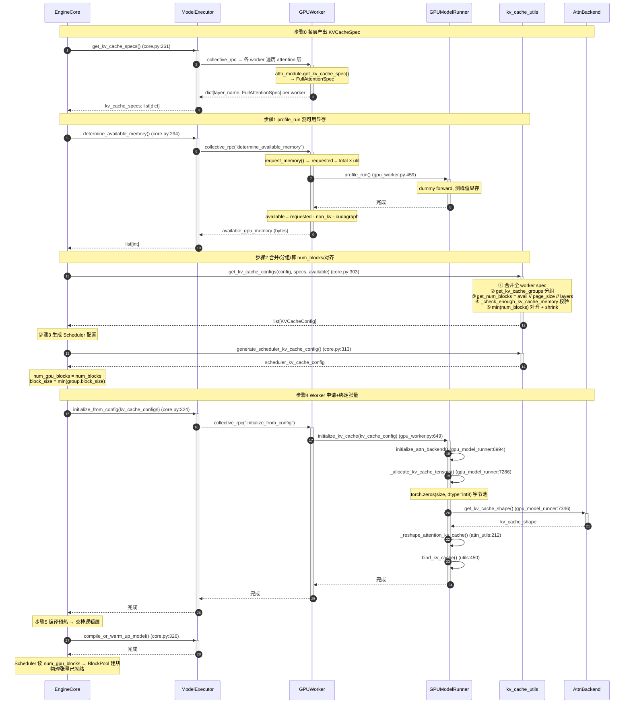

# vLLM V1 物理显存层（Full Attention 主线）

> 五层架构第 1 层（最底）｜[总览](./0_kv_cache_management_arch.md) ｜上层 ➔ [`2_block_pool.md`](./2_block_pool.md)
>
> 源文件：`vllm/vllm/v1/kv_cache_interface.py`、`vllm/vllm/v1/core/kv_cache_utils.py`、`vllm/vllm/v1/engine/core.py`、`vllm/vllm/v1/worker/gpu_worker.py`、`vllm/vllm/v1/worker/gpu_model_runner.py`、`vllm/vllm/v1/worker/gpu/attn_utils.py`、`vllm/vllm/v1/worker/utils.py`
>
> 主线：纯 Full Attention 单 group 模型（Llama / Qwen / Mistral）。SWA、Mamba、混合模型仅文末简提。
>
> **与端到端时序的关系**：本文所有方法都在**启动期一次性执行**（`EngineCore._initialize_kv_caches`），不属于 [`0_end_to_end_sequence.md`](./0_end_to_end_sequence.md) 的 B/E 每步时序。端到端时序文档的 [§3.0](./0_end_to_end_sequence.md#30-阶段-0物理显存初始化启动期前传) 给出了物理显存初始化的概览时序图，本文 §三 则展开每一步的详细推导与源码调用链。物理层只产出两样东西供时序路径消费：
> 1. **`num_blocks`** → 第 2 层 `BlockPool` 据此建块（时序里被分配/释放/驱逐）；
> 2. **`kv_caches[layer]` 物理张量** → 时序 §3.3 GPU forward 按 `block_id` 读写。
>
> 一句话：物理层是时序的"前传"，把显存规划好，运行时不再碰它。

---

## 一、是什么

物理显存层把"每层 KV cache 的规格说明书（`KVCacheSpec`）"转换成一块**真正驻留在 GPU 上的 `torch.Tensor`**。只做三件事：

1. 依据模型配置算每层 `KVCacheSpec`，合并兼容层为 group；
2. 申请 GPU 原始字节缓冲，reshape 成注意力算子期望的逻辑形状；
3. 把物理张量绑定到每层 attention，建立 **`block_id == 张量第 0 维行号`** 的桥接。

物理张量就绪后，上层 `BlockPool` 只持有 `block_id` 整数，所有调度决策（分配/释放/共享/驱逐）都不碰显存——这是 vLLM 零拷贝调度的物理基础。

**与 `KVCacheSpec` 体系的分工**：KV 缓存"存储格式"（spec 字段、`real_page_size_bytes` 量化、group 合并）的完整推导在 [`0_kvcache_of_attention.md`](./0_kvcache_of_attention.md) 第二部分 §2.4~§2.8，本节只引用其结论，不重复。

---

## 二、产出物

| 产出物 | 消费方 | 用途 |
|--------|--------|------|
| `kv_caches[layer_name]` 物理张量 | Attention 算子 | forward 时按 `block_table` 索引读写 K/V |
| `num_blocks` 整数 | `BlockPool`（第 2 层） | 决定逻辑块总数，创建 `KVCacheBlock(0..N-1)` |
| `KVCacheConfig` | Scheduler / Worker | 同步 group 划分、`block_size` 等元数据 |

---

## 三、初始化五步流程（启动期一次完成）

`EngineCore._initialize_kv_caches()`（`engine/core.py:254`）是物理显存层的唯一入口，启动期一次性执行完毕。

### 3.1 总览时序图



### 3.2 步骤0：各层产出 KVCacheSpec

**调用链**：`EngineCore` → `ModelExecutor.get_kv_cache_specs()`（core.py:261）→ 各 worker `get_kv_cache_spec()`（attn_utils.py:62）。

```python
# attn_utils.py:62
def get_kv_cache_spec(vllm_config: VllmConfig) -> dict[str, KVCacheSpec]:
    kv_cache_spec: dict[str, KVCacheSpec] = {}
    attn_layers = get_layers_from_vllm_config(vllm_config, AttentionLayerBase)
    for layer_name, attn_module in attn_layers.items():
        if getattr(attn_module, "kv_sharing_target_layer_name", None):
            continue  # 复用其他层的 KV cache，跳过
        if spec := attn_module.get_kv_cache_spec(vllm_config):
            kv_cache_spec[layer_name] = spec
    return kv_cache_spec
```

纯 Full Attention 模型产出 `FullAttentionSpec`（`kv_cache_interface.py`），核心字段：

| 字段 | 含义 |
|------|------|
| `block_size` | 逻辑块大小（token 数/块），如 16 |
| `num_kv_heads` | KV 头数（TP 下已切分） |
| `head_size` | 每头维度 |
| `dtype` | KV 数据类型，如 `torch.float16` |
| `page_size_bytes` | 一页（一块一层）的字节数 = `block_size × num_kv_heads × head_size × dtype_size × 2`（K+V） |

> **PP 影响**：`get_kv_cache_spec()` 只返回本 PP stage 负责的层（`get_layers_start_end_indices`，model.py:1409）。
> **TP 影响**：`num_kv_heads` 已按 `tensor_parallel_size` 切分（`get_num_kv_heads`，model.py:1386），同 PP stage 的 TP rank spec 等值。

### 3.3 步骤1：profile_run 测可用显存

**调用链**：`EngineCore` → `ModelExecutor.determine_available_memory()`（core.py:294）→ `GPUWorker.determine_available_memory()`（gpu_worker.py:459）。

**核心公式**（gpu_worker.py:459）：

```
requested_memory = total_memory × gpu_memory_utilization          (request_memory, utils.py:393)

available_kv_cache_memory = requested_memory
                           − non_kv_cache_memory                  (权重 + 激活 + 其他)
                           − cudagraph_memory_estimate            (CUDA graph 预留)
```

**执行过程**：

1. `request_memory()`：`requested = ceil(total × gpu_memory_utilization)`，校验 `free ≥ requested`
2. `memory_profiling()` 上下文记录前后显存快照
3. `model_runner.profile_run()`：执行一次 dummy forward，测量峰值显存
4. `profile_cudagraph_memory()`：如果启用 CUDA graph，额外估算其显存
5. 最终 `available = requested − non_kv − cudagraph`，返回 bytes

> 如果显式设置了 `cache_config.kv_cache_memory_bytes`，则跳过自动 profile，直接使用用户指定的字节数。

### 3.4 步骤2：合并 / 分组 / 算 num_blocks / 对齐

**调用链**：`EngineCore` → `get_kv_cache_configs()`（kv_cache_utils.py:2073）。

该函数是配置编排的顶层入口，内部依次执行五步：

#### ① 合并全 worker spec

```python
# kv_cache_utils.py:2111
merged_kv_cache_specs: dict[str, KVCacheSpec] = {}
for kv_cache_spec_one_worker in kv_cache_specs:
    for layer_name, layer_spec in kv_cache_spec_one_worker.items():
        merged_kv_cache_specs[layer_name] = layer_spec  # 跨 worker 合并
```

不同 PP stage 的层名不同；同 PP stage 的 TP rank spec 必须等值（断言检查）。

#### ② 分组 `get_kv_cache_groups()`（kv_cache_utils.py:1760）

按 spec 类型分组，纯 Full Attention 走 `is_kv_cache_spec_uniform()` → `_get_kv_cache_groups_uniform_spec()` → 全模型**单 group**。

```python
# kv_cache_utils.py:912
def is_kv_cache_spec_uniform(kv_cache_spec) -> bool:
    if not kv_cache_spec:
        return True  # encoder-only 模型
    try:
        kv_cache_spec_values = list(kv_cache_spec.values())
        _ = kv_cache_spec_values[0].merge(kv_cache_spec_values)  # 尝试合并
    except AssertionError:
        return False
    return True
```

`merge()` 检查所有层的 spec 字段是否一致（block_size / num_kv_heads / head_size / dtype 等）。FullAttentionSpec 带不带 sliding window 视为同一类型。

#### ③ 计算 num_blocks

纯 Full Attention 单 group 场景走 `get_kv_cache_config_from_groups()` 的快捷路径（kv_cache_utils.py:1363）：

```python
# 单 group + UniformTypeKVCacheSpecs 快捷路径
num_blocks = available_memory // kv_cache_groups[0].kv_cache_spec.page_size_bytes
```

即**不再除以 num_layers**——因为单 group 下 `page_size_bytes` 已是单层的字节数，`num_blocks` 直接 = 可放多少块。

通用多 group 路径走 `get_num_blocks()`（kv_cache_utils.py:993）：

```python
num_blocks = available_memory // page_size // num_layers
# num_layers = group_size = 该 group 包含的层数
# 含义：group 内所有层共享同一 block_id 空间，每层各分一份
```

#### ④ 校验 `_check_enough_kv_cache_memory()`（kv_cache_utils.py:751）

```python
needed_memory = get_needed_memory()  # max_model_len 下需要的 KV cache
if needed_memory > available_memory:
    estimated_max_len = estimate_max_model_len(available_memory)
    raise ValueError(...)  # 显存不足，建议调大 util 或调小 max_model_len
```

如果用户未指定 `max_model_len`（`original_max_model_len == -1`），先走 `_auto_fit_max_model_len()`（kv_cache_utils.py:1967）二分搜索最大可容纳序列长度。

#### ⑤ 多 worker 对齐

```python
# kv_cache_utils.py:2191
min_num_blocks = min(cfg.num_blocks for cfg in kv_cache_configs)
for kv_cache_config in kv_cache_configs:
    num_blocks_old = kv_cache_config.num_blocks
    kv_cache_config.num_blocks = min_num_blocks
    # 等比例缩小 tensor size，避免浪费
    for tensor in kv_cache_config.kv_cache_tensors:
        tensor.size = tensor.size // num_blocks_old * min_num_blocks
```

集中式调度器要求所有 worker 共享同一 `block_id` 空间，取最小值保证最"穷"的 worker 也能容纳。

#### 产出数据结构

```python
# kv_cache_interface.py:952
@dataclass
class KVCacheConfig:
    num_blocks: int                  # 对齐后的 block 总数
    kv_cache_tensors: list[KVCacheTensor]  # 每层如何初始化
    kv_cache_groups: list[KVCacheGroupSpec]  # 分组信息

@dataclass
class KVCacheTensor:
    size: int               # 字节大小
    shared_by: list[str]    # 哪些层共享（packed layout 下多个）
    offset: int = 0         # packed 下的字节偏移
    block_stride: int = 0   # packed 下每块字节数（0 = 非 packed）

@dataclass
class KVCacheGroupSpec:
    layer_names: list[str]       # 该组包含哪些层
    kv_cache_spec: KVCacheSpec   # 该组的 spec
```

### 3.5 步骤3：Worker 申请 + 绑定张量

**调用链**：`EngineCore` → `ModelExecutor.initialize_from_config()`（core.py:324）→ `GPUWorker.initialize_from_config()`（gpu_worker.py:649）→ `GPUModelRunner.initialize_kv_cache()`（gpu_model_runner.py:7606）。

`initialize_from_config()` 先把 `num_blocks` 写回本地 config，再委托 `model_runner.initialize_kv_cache()` 完成三件事：

#### 3a. 分配 int8 字节池 `_allocate_kv_cache_tensors()`（gpu_model_runner.py:7286）

```python
for kv_cache_tensor in kv_cache_config.kv_cache_tensors:
    if kv_cache_tensor.block_stride > 0:
        # packed layout：整个 group 共用一个 backing tensor
        if packed_backing is None:
            packed_backing = torch.zeros(kv_cache_tensor.size,
                                         dtype=torch.int8, device=self.device)
        tensor = packed_backing
    else:
        # 普通 layout：每层单独一个 int8 缓冲区
        tensor = torch.zeros(kv_cache_tensor.size,
                             dtype=torch.int8, device=self.device)
    for layer_name in kv_cache_tensor.shared_by:
        kv_cache_raw_tensors[layer_name] = tensor
```

**为什么用 int8？** 与 dtype 解耦——先按字节量申请，后续 reshape 时再 `view(dtype)` 转换。这样同一个分配逻辑适用于 fp16 / bf16 / fp8 等所有 dtype。

#### 3b. reshape 为后端逻辑 shape `_reshape_kv_cache_tensors()`（gpu_model_runner.py:7346）

对每个 attention 层，从后端获取目标 shape，再通过 `_reshape_attention_kv_cache()`（attn_utils.py:212）完成零拷贝转换：

```python
# 获取后端期望的逻辑 shape
kv_cache_shape = attn_backend.get_kv_cache_shape(
    kernel_num_blocks, shape_block_size,
    kv_cache_spec.num_kv_heads, kv_cache_spec.head_size, ...
)
# int8 → dtype → permute（零拷贝 view）
kv_caches[layer_name] = _reshape_attention_kv_cache(
    raw_tensor, kv_cache_spec, kv_cache_shape, ...)
```

`_reshape_attention_kv_cache()` 有三种路径（attn_utils.py:212）：

| 场景 | 条件 | 方式 |
|------|------|------|
| **packed layout** | `packing is not None` | `view(-1, block_stride)[:, offset:offset+page_bytes].view(dtype).view(shape)` |
| **有 padding** | `page_size_padded is not None` | `torch.as_strided()` 跳过物理页间 padding |
| **普通** | 默认 | `raw.view(dtype).view(shape)` 连续 view |

最终 `permute(*inv_order)` 把物理布局转成逻辑布局。

**block_dim 探测**（backend.py:100）：不同后端 `num_blocks` 所在轴不同（dim 0 或 dim 1），通过向 `get_kv_cache_shape` 传哨兵值 `_S=1234567`，再 `shape.index(_S)` 定位：

```python
@classmethod
def get_kv_cache_block_dim(cls, block_size, num_kv_heads, head_size, ...):
    _S = 1234567
    shape = cls.get_kv_cache_shape(_S, block_size, num_kv_heads, head_size, ...)
    return shape.index(_S)  # 0 或 1
```

#### 3c. 绑定 `bind_kv_cache()`（utils.py:450）

```python
def bind_kv_cache(kv_caches, forward_context, runner_kv_caches, num_attn_module=1):
    # 1. 按层号排序，填入 ModelRunner.kv_caches
    for layer_index in sorted(index2name.keys()):
        for layer_name in index2name[layer_index]:
            runner_kv_caches.append(kv_caches[layer_name])
    # 2. 每层 attention 绑定自己的 KV cache
    for layer_name, kv_cache in kv_caches.items():
        forward_context[layer_name].bind_kv_cache(kv_cache)
```

绑定后，forward 时 attention layer 从 `forward_context` 取自己的 KV cache；ModelRunner 侧 `self.kv_caches` 用于清零、CoW 拷贝等调度操作。

### 3.6 步骤4：交棒逻辑层

`EngineCore._initialize_kv_caches()` 最后：

1. `compile_or_warm_up_model()`（core.py:326）：编译/预热模型
2. 返回 `scheduler_kv_cache_config` 给 Scheduler 初始化

Scheduler 读取 `cache_config.num_gpu_blocks`，初始化 `BlockPool`（[`2_block_pool.md`](./2_block_pool.md)）：
- 建 `KVCacheBlock(0..num_blocks-1)`，`block_id == 下标`
- `null_block`（block_id=0）立即摘走作占位
- 空闲队列初始化为 `[block 1, block 2, ..., block N-1]`

物理张量 `kv_caches[layer]` 已就绪，等运行时 forward 按 `block_table` 索引读写。

---

## 四、方法一览（§三详细流程的快速索引）

### 4.1 配置编排（`kv_cache_utils.py`）

| 方法 | 源码 | 作用 |
|---|---|---|
| `get_kv_cache_configs` | `:2073` | 顶层编排：合并各 worker spec → 分组 → 算 `num_blocks` → 全 worker 对齐 |
| `get_kv_cache_groups` | `:1760` | 按 spec 类型分组；纯 FullAttention 命中 `is_kv_cache_spec_uniform` → 单 group |
| `get_num_blocks` | `:993` | `num_blocks = available_memory // page_size // num_layers`（除层数：同 group 共享逻辑块空间） |
| `_auto_fit_max_model_len` | `:1967` | 用户未指定 `max_model_len` 时二分搜索最长可容纳序列 |
| `_check_enough_kv_cache_memory` | `:751` | 校验峰值显存需求 ≤ 可用显存，不足则报错并给估算长度 |
| `generate_scheduler_kv_cache_config` | `:1834` | 拷贝一份给 Scheduler，回写 `cache_config.num_gpu_blocks` 等 |

### 4.2 Worker 侧申请与绑定

| 方法 | 源码 | 作用 |
|---|---|---|
| `determine_available_memory` | `gpu_worker.py:459` | profile 出可用 KV 显存预算（总显存 × 利用率 − 权重 − 激活 − cudagraph） |
| `initialize_from_config` | `gpu_worker.py:649` | 同步 `num_gpu_blocks`、申请 + 绑定 KV 张量 |
| `_allocate_kv_cache_tensors` | `gpu_model_runner.py:7286` | 先以 `torch.zeros(int8)` 申请字节池，与 dtype 解耦 |
| `_reshape_kv_cache_tensors` | `gpu_model_runner.py:7346` | 字节池 `view + permute` 重塑为后端逻辑 shape |
| `_reshape_attention_kv_cache` | `attn_utils.py:212` | 核心 reshape：shape 是逻辑的、stride 是物理的（HND/NHD） |
| `bind_kv_cache` | `worker/utils.py:450` | 同时挂入 `ModelRunner.kv_caches` 与 `forward_context[layer]` |

> **关键概念——两种 reshape 目标形状**：① K/V packed in content dim（FlashAttn/FlashInfer/CPU），逻辑 shape `(num_blocks, num_kv_heads, block_size, 2*head_size)`；② K/V as separate dim（ROCm），`(2, num_blocks, block_size, num_kv_heads, head_size)`。详见本文 §六 表格与 [`0_kvcache_of_attention.md`](./0_kvcache_of_attention.md)（各 attention 的 KV cache 字节布局）。

---

## 五、PP / TP 下 KV cache 的物理分布（背景，纯 Full Attention 也成立）

- **PP 按层切分**：`model.py:1409-1420` `get_layers_start_end_indices()` 按 `pp_rank` 切层范围，`get_kv_cache_spec()`（`attn_utils.py:62`）只返回本 worker 负责的层。
- **TP 按 KV 头切分**：`model.py:1386-1395` `get_num_kv_heads()` 除以 `tensor_parallel_size`，同一 PP stage 的不同 TP rank 存同层但不同头子集。

**关键推论**：同一 PP stage 的不同 TP rank `num_kv_heads` 相同（都是切分后的值）→ `FullAttentionSpec` 相等 → 步骤 2 合并断言通过。但 spec 相等 ≠ 物理相同：每个 TP rank 独立分配自己的 `1/tensor_parallel_size` 份 KV 张量，调度器只管 `block_id`，对 TP 内部头分布透明。

---

## 六、物理-逻辑桥接：`block_id == 张量行号`

物理张量就绪后，`BlockPool` 只持 `block_id`，通过"位置等同"自然索引，无需查表。唯一要区分的是**不同后端的 `block_dim` 所在轴不同**：

| layout | 逻辑 shape | `block_dim` | 索引方式 |
|---|---|---|---|
| K/V packed in content dim | `(num_blocks, num_kv_heads, block_size, 2*head_size)` | 0 | `kv_caches[layer][block_id]` |
| K/V as separate dim | `(2, num_blocks, block_size, num_kv_heads, head_size)` | 1 | `kv_caches[layer][:, block_id]` |

`block_dim` 由 `AttentionBackend.get_kv_cache_block_dim()`（`backend.py:100-117`）运行时探测：向 `get_kv_cache_shape` 传哨兵 `_S=1234567`，再 `shape.index(_S)` 定位 `num_blocks` 所在维。

桥接成立依赖两件事：逻辑侧 `BlockPool.__init__` 一次性建 `blocks = [KVCacheBlock(i) ...]`（`block_id==i`）；物理侧 reshape 后 `block_dim` 轴大小就是 `num_blocks`。

forward 伪代码（以形式 A 为例）：

```python
# GPU forward 前，Worker 已通过 get_block_ids() 拿到该请求的 block_id 列表
block_ids = get_block_ids(request_id)             # 形如 [0, 7, 512, ...]，来自 req_to_blocks
kv = kv_caches[layer][block_ids]                  # 形式A：dim0 fancy indexing
# kv = kv_caches[layer][:, block_ids]             # 形式B：dim1 索引，保留 dim0 的 K/V
```

> `block_table`（即 `block_ids`）不是 `Request` 的字段，而是 `FullAttentionManager.req_to_blocks[request_id]` 里的块号列表（见 [`3_single_type_kv_cache_manager.md`](./3_single_type_kv_cache_manager.md)）。`null_block`（`block_id=0`）在 `BlockPool.__init__` 立即摘走作占位，实际可分配数为 `num_blocks-1`。

---

## 七、设计要点小结

1. **规格先行**：所有显存计算源自 spec 的 `page_size_bytes`；同 PP stage 的 TP rank spec 必须等值。
2. **五步流水线**：`spec → profile → get_kv_cache_configs → allocate/reshape/bind → BlockPool`。
3. **单 group 是 FullAttention 核心特征**：`is_kv_cache_spec_uniform=true`，全模型一个 KV group。
4. **`num_blocks = available // page_size // num_layers`**：除层数因同 group 多层共享逻辑块空间。
5. **`min(num_blocks)` 对齐**：集中式调度要求全 worker 共享同一 block table，取最小值并按比例 shrink `KVCacheTensor.size`。
6. **int8 字节池 + reshape**：先 `torch.int8` 申请与 dtype 解耦，再 `view + permute` 成后端逻辑 shape。
7. **物理-逻辑分离**：调度器决策零显存拷贝，全部落在引用计数与空闲队列上。

---

## 扩展：其他注意力类型（极简）

- **KVCacheSpec 子类速查** 见 [`0_kvcache_of_attention.md`](./0_kvcache_of_attention.md) 第二部分 §2.4~§2.8。
- **四种 group 划分**：uniform spec（主线，1 组）/ uniform type / DeepseekV4 packed / uniform page_size，核心区别在"除不除层数、如何除"。
- **三种 block_size**：纯 FullAttention 下 `scheduler_block_size = hash_block_size = block_size`；混合模型由 `resolve_kv_cache_block_sizes()`（`kv_cache_utils.py:626`）经 LCM/GCD 统一，见 [`2_block_pool.md`](./2_block_pool.md) 扩展 E3。
- **Mamba/混合布局协调**：`_update_hybrid_attention_mamba_layout()`（`gpu_model_runner.py:7489`）把 `block_dim==1` 的层 `as_strided_` 成 `block_dim==0`，纯 FullAttention 不触发。