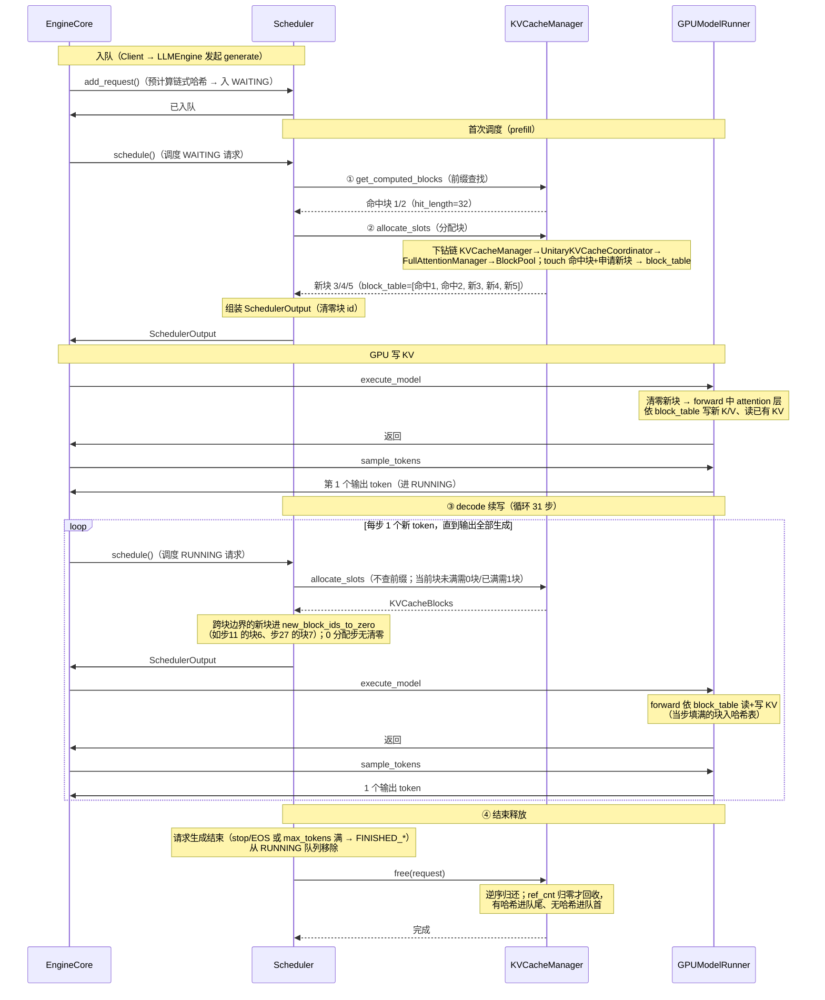
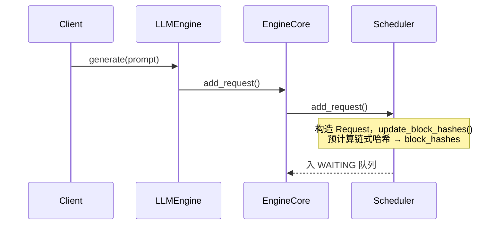
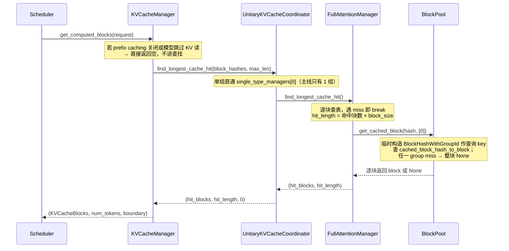
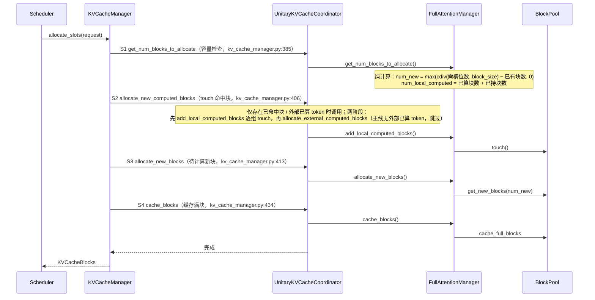
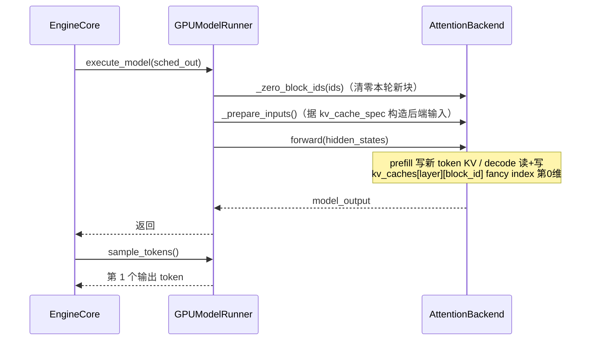
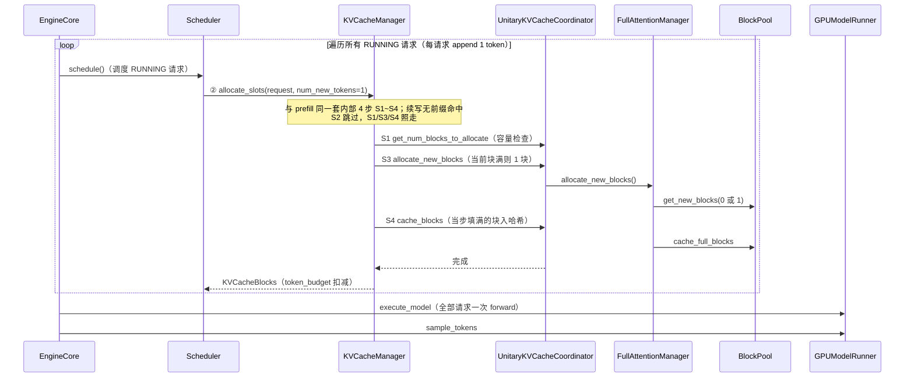
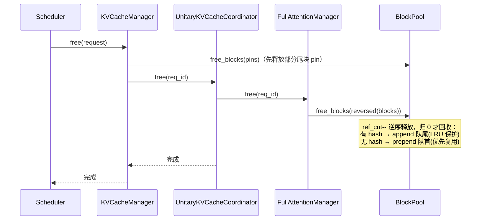

# 一条请求的KVCache管理端到端时序（Llama-3-8B pp2tp2 视角）

> 主线：**纯 Full Attention 模型 Llama-3-8B（pp2tp2，4卡环境）**，一个KVCacheGroupSpec，类型为FullAttentionSpec。用时序图串起一条请求从进入 Scheduler 到最终释放的全过程。
>
> **部署拓扑**：PP2 × TP2 = 4 卡，每个 worker 负责 16 层、4 个 KV 头（TP2 切分 8→4）。调度器视角下全模型仍为单 group（32 层），对 PP/TP 布局透明。

---

## 1. 模型配置与框架配置

下文所有阶段共用同一个请求示例，模型参数固定为 Llama-3-8B，部署于 pp2tp2（4卡）环境。

Llama-3-8B 采用 GQA（Grouped Query Attention），其模型级 KV cache 参数如下：

| 参数 | 值 | 说明 |
|---|---|---|
| `num_hidden_layers` | 32 | 全模型层数；每层各持一份 KV 张量，但**共享同一套 block_id** |
| `num_attention_heads` | 32 | 查询头数 |
| `num_key_value_heads`（=`num_kv_heads`） | 8 | KV 头数；`32/8 = 4` 个查询头共享 1 个 KV 头 |
| `head_dim`（=`head_size`） | 128 | 每 head 维度 |
| `hidden_size` | 4096 | 隐层宽度 `= num_attention_heads × head_dim` |

**pp2tp2 部署切分**：

| 切分维度 | 全模型 | 每 worker | 说明 |
|----------|--------|-----------|------|
| PP2（按层切） | 32 层 | 16 层 | `get_layers_start_end_indices()` 按 `pp_rank` 切层范围 |
| TP2（按 KV 头切） | 8 KV 头 | 4 KV 头 | `get_num_kv_heads()` 除以 `tensor_parallel_size` |

vLLM侧 KV cache 配套参数：

| 参数 | 值 | 说明 |
|---|---|---|
| `block_size` | 16 | 每块容纳 token 数（page 粒度） |
| `dtype` | `fp16` | KV 元素精度（2 字节/元素） |

基于上述参数，**每 worker** 的 KV cache 物理规模可逐级推导（`num_kv_heads=4`、`num_layers` 取 projected group 的 16，即 PP2 切分后每 worker 实际层数）：

| 派生量 | 计算式 | 值 | 说明 |
|---|---|---|---|
| `page_size_bytes` | `2 × block_size × num_kv_heads × head_dim × 2B`<br>= `2 × 16 × 4 × 128 × 2` | 32,768 B<br>（32 KB） | 单层单块字节数（TP2 后 4 头），因子 2 为 K、V 各一份 |
| `num_blocks`（示例每卡可用显存 2GB） | `2 GB ÷ page_size_bytes ÷ num_layers`<br>= `2,147,483,648 ÷ 32,768 ÷ 16` | 4096 | 跨 worker `min` 对齐后的逻辑块总数，`BlockPool` 建立 `KVCacheBlock(0..4095)`（块 0 开池即摘作 `null_block`，实际可分配 4095） |
| `kv_caches[layer]` | `(num_blocks, num_kv_heads, block_size, 2×head_dim)` | `(4096, 4, 16, 256)` | 每层 KV 张量形状（TP2 后 4 头），每 worker 16 个层张量；**形状由 `attn_backend.get_kv_cache_shape()` 决定，此处以 FlashAttention 后端（K/V 打包进最后一维）为例，换后端/布局会不同** |

---

## 2. 示例请求

示例以 **Llama-3-8B（pp2tp2）** 为主线。

**前置请求 P（先于 R 服务、已结束）**：

> 注：下文块号即真实 `block_id`。block 0 开池即被 `BlockPool` 摘作 `null_block`（不分配、不释放，实际可分配 4095 块），因此示例中所有分配从块 1 起。

```
prompt     = 共享前缀（32 token） + P 自己的追问（若干 token，与 R 不同）
            → P 服务时把共享前缀写成满块 1/2，写满即哈希入前缀缓存表
block_size = 16
```

P 结束后，块 1/2 作为**带哈希的缓存块**被保留：进 free 队列**队尾**（LRU 保护），记录在 `cached_block_hash_to_block` 映射表。

**共享前缀（32 token = 2 个满块）**：P 与 R 共同复用的开头（如同一段 system prompt 或公共开场白），前 32 token 恰好装满 2 块。

**示例请求 R**：

```
prompt     = 共享前缀（32 token） + 追加问题（38 token） = 70 token
max_tokens = 32
block_size = 16
```

R 的 prompt 前 32 token 恰与共享前缀相同 → prefill 时 `get_computed_blocks` 命中 P 缓存的块 1/2（`hit_length=32`）；后 38 token 为新内容，需新分配块 3/4/5（16+16+6）。

宏观路径：**入队（WAITING）→ 首次调度 prefill（前 32 token 复用 P 缓存的块 1/2，只算剩余 38 token，→ RUNNING）→ 每步 decode 续写 1 token（至 32 个输出）→ 结束释放**。

---

## 3. 端到端过程速览与总览时序图

`EngineCore.step()`（core.py:443）每步驱动 `schedule → execute_model → sample_tokens`。

**一条请求的端到端过程（编号速览）**（示例 R：prompt = 70 token / max_tokens = 32 token）：

<div style="font-family:ui-monospace,Consolas,'Courier New',monospace;line-height:1.55;font-size:13px">
<div style="white-space:pre;background-color:#f0f0f0">入队 → 请求进入 WAITING 队列</div>
<div style="white-space:pre">├─ 首次调度进行 prefill</div>
<div style="white-space:pre;background-color:#e8f5e9">│  ├─ <span style="color:#1565c0">KVCacheManager.get_computed_blocks</span>（①）# 前缀缓存查找，遍历70//16=4个hash 查表 → hit_length=32
│  │  └─ <span style="color:#2e7d32">UnitaryKVCacheCoordinator.find_longest_cache_hit</span>
│  │     └─ <span style="color:#e65100">FullAttentionManager.find_longest_cache_hit</span>
│  │        └─ <span style="color:#6a1b9a">BlockPool.get_cached_block</span> → 命中块 1/2（P 缓存的共享前缀块）</div>
<div style="white-space:pre;background-color:#e3f2fd">│  ├─ <span style="color:#1565c0">KVCacheManager.allocate_slots</span>（②）
│  │  ├─ <span style="color:#2e7d32">UnitaryKVCacheCoordinator.get_num_blocks_to_allocate</span> # 计算本轮实际需要分配多少新块，检查空闲块是否足够
│  │  │  └─ <span style="color:#e65100">FullAttentionManager.get_num_blocks_to_allocate</span> # 需要 3 块新块
│  │  ├─ <span style="color:#2e7d32">UnitaryKVCacheCoordinator.allocate_new_computed_blocks</span> # 处理已算 token（本地命中块 + 本轮新命中块 + 外部 connector 已算 token）
│  │  │  └─ <span style="color:#e65100">FullAttentionManager.add_local_computed_blocks</span>
│  │  │     └─ <span style="color:#6a1b9a">BlockPool.touch</span> # touch 命中块（2 命中）
│  │  ├─ <span style="color:#2e7d32">UnitaryKVCacheCoordinator.allocate_new_blocks</span> # 为待计算的 token（new + lookahead）分配新块
│  │  │  └─ <span style="color:#e65100">FullAttentionManager.allocate_new_blocks</span>
│  │  │     └─ <span style="color:#6a1b9a">BlockPool.get_new_blocks</span> # 从空闲队列弹出块 3/4/5，block_table=[命中1, 命中2, 新3, 新4, 新5]
│  │  └─ <span style="color:#2e7d32">UnitaryKVCacheCoordinator.cache_blocks</span> # 缓存新块 3, 4 入哈希表，未满块 5 不入，hash基于token ID
│  │     └─ <span style="color:#e65100">FullAttentionManager.cache_blocks</span>
│  │        └─ <span style="color:#6a1b9a">BlockPool.cache_full_blocks</span>（新满块 3, 4 入哈希表；未满块 5 不入）</div>
<div style="white-space:pre">│  ├─ SchedulerOutput # 调度输出，附清零块 id 3/4/5</div>
<div style="white-space:pre;background-color:#fff3e0">│  └─ <span style="color:#c62828">GPUModelRunner.execute_model</span>: forward 写 70 token KV → sample → 第 1 token</div>
<div style="white-space:pre;background-color:#f0f0f0">→ 请求进入 RUNNING 队列</div>
<div style="white-space:pre;background-color:#f3e5f5">├─ decode（③）# 续写 31 步：块5占6/16 → 步1~10 填满块5（0分配）；步11 申请块6，步12~26 填满块6；步27 申请块7；步28~31 块7占5/16未满）
│  ├─ <span style="color:#1565c0">KVCacheManager.allocate_slots</span> # 每步一次；情况A · 当前块未满需 0 块（token 直接续写）/ 情况B · 已满需 1 块（token 落进下一块）
│  │  ├─ <span style="color:#2e7d32">UnitaryKVCacheCoordinator.get_num_blocks_to_allocate</span> # 需新块数 = cdiv(需槽位数, 16) − 已有块数；A 算得 0 / B 算得 1
│  │  │  └─ <span style="color:#e65100">FullAttentionManager.get_num_blocks_to_allocate</span>
│  │  ├─ <span style="color:#2e7d32">UnitaryKVCacheCoordinator.allocate_new_blocks</span>
│  │  │  └─ <span style="color:#e65100">FullAttentionManager.allocate_new_blocks</span>
│  │  │     └─ <span style="color:#6a1b9a">BlockPool.get_new_blocks</span> # A: 需 0 块不调；B: 弹 1 空闲块 → block_table +1
│  │  └─ <span style="color:#2e7d32">UnitaryKVCacheCoordinator.cache_blocks</span> # 每步都调
│  │     └─ <span style="color:#e65100">FullAttentionManager.cache_blocks</span>
│  │        └─ <span style="color:#6a1b9a">BlockPool.cache_full_blocks</span> # 恰写满当前块才入表；B 的新块未满不入
│  ├─ SchedulerOutput # 调度输出，附清零块 id（新申请的块，如步11 的块6、步27 的块7）；0 分配步（情况A）无清零
│  └─ <span style="color:#c62828">GPUModelRunner.execute_model</span> # 每步一次：forward 依 block_table 读写 KV → sample → 1 个输出 token（与首次调度为同一组件）</div>
<div style="white-space:pre;background-color:#f0f0f0">→ 请求生成结束（stop/EOS 或 max_tokens 满 → FINISHED_*）→ 从 RUNNING 队列移除</div>
<div style="white-space:pre;background-color:#ffebee">└─ 结束释放（④）# 命中块 1/2 为共享块 → 仅减引用计数 · 有哈希（3/4/5/6）→ 逆序 append 队尾 · 无哈希（7）→ prepend 队首
   └─ <span style="color:#1565c0">KVCacheManager.free</span>
      └─ <span style="color:#2e7d32">UnitaryKVCacheCoordinator.free</span>
         └─ <span style="color:#e65100">FullAttentionManager.free</span>
            └─ <span style="color:#6a1b9a">BlockPool.free_blocks</span> # ref_cnt--，归 0 才回收</div>
</div>

**总览时序图**：



---

## 4. 分阶段详解

### 4.1 入队



**要点**：
- 入队即预计算：70 token → `70 // 16 = 4` 个满块有 hash（链式哈希），未满的第 5 块无 hash
- `request.block_hashes` 存的是**纯 `BlockHash`**（不含 group id），group id 到 ① 前缀查找 / ② 分配落库时才临时拼上

**结合请求 R**：R 的 4 个满块 hash 在入队时算好，存于 `request.block_hashes`；

### 4.2 首次调度（WAITING → prefill）

`schedule()`（scheduler.py:340）每步**先遍历 RUNNING（scheduler.py:378）再遍历 WAITING（scheduler.py:566）**。

> **调度顺序要点**：没有独立的 prefill / decode 全局阶段，只有一个共享 `token_budget`，按"**先 running、后 waiting**"填充：
> - RUNNING 里也可能有 chunked prefill 的中间片（`is_prefill_chunk`），同样优先于新的 waiting 请求
> - PD 分离由 KV 传输实现，P/D 实例跑同一个统一 `Scheduler`，上述"先 running、后 waiting"在每个实例内部都成立

KV 编排链固定为 `KVCacheManager → UnitaryKVCacheCoordinator → FullAttentionManager → BlockPool`，下面三个子步骤都走这条链。

#### 4.2.1 ① 前缀缓存查找（get_computed_blocks）



**要点**：
- `max_cache_hit_length = request.num_tokens - 1`：即使全命中，最后 1 个 token 的 logits 仍需重算，故最多命中 N−1
- 链式哈希从左到右**逐块比对，遇 miss 即 break**；命中的是**已满块**（未满尾块无 hash 不参与）
- 本次查找**只读不写**：临时构造查询 key（`BlockHashWithGroupId` 用完即弃），不改 `ref_cnt`；真正的 `ref_cnt++` 要等 ② 的 touch

**结合请求 R**：4 个 hash 逐块查表，假设前 2 块命中（仅标记可复用），`hit_length = 32`，剩余 `70 − 32 = 38` token 需重新计算。

#### 4.2.2 ② 分配物理块（allocate_slots）



**要点（S1-S4 为 `allocate_slots` 内部编号，区别于主流程的 ①-④）**：

- **S1 容量检查** `get_num_blocks_to_allocate`（kv_cache_manager.py:385，下钻 KVCacheCoordinator 基类 → single_type_kv_cache_manager.py:101）：
  - FullAttentionManager 侧纯计算：`num_new = max(cdiv(num_tokens, block_size) − num_local_computed, 0)`，其中 `num_local_computed = 已算块数 + 已持块数`
  - KVCacheManager 侧比较：`available_blocks = get_num_free_blocks() − reserved_blocks`（kv_cache_manager.py:395；`get_num_free_blocks` 见 block_pool.py:497，`reserved_blocks` 为调用方传入的预留值、默认 0，0.23.0 无 watermark 概念）vs `num_blocks_to_allocate`（S1 求和结果）；`num_blocks_to_allocate > available_blocks`（kv_cache_manager.py:396）→ `return None` → 等待下轮调度
- **S2 处理命中块** `allocate_new_computed_blocks`（kv_cache_manager.py:406，KVCacheCoordinator 两阶段）：仅当存在已命中块或 `num_external_computed_tokens > 0` 时调用；**先**逐组 `add_local_computed_blocks`（touch 命中块：从 free 队列摘出、`ref_cnt++`），**再**逐组 `allocate_external_computed_blocks`（主线 `num_external_computed_tokens=0`，跳过）
- **S3 分配待计算块** `allocate_new_blocks`（kv_cache_manager.py:413 → single_type_kv_cache_manager.py:259）：`num_new = cdiv(num_tokens, block_size) − len(req_to_blocks[req_id])`
- **S4 缓存满块** `cache_blocks`（kv_cache_manager.py:434 → single_type_kv_cache_manager.py:298 → `BlockPool.cache_full_blocks`）：`num_tokens_to_cache = min(total_computed + num_new, request.num_tokens)`，新块记入 `new_block_ids`，由 `take_new_block_ids` 取走清零

**结合请求 R**：S1 容量检查通过后，S2 touch 前缀查找命中的前 2 块（即 P 缓存的共享前缀块 1/2，ref_cnt 0→1）；S3 剩余 38 token 按 16 切块需 3 块（16+16+6），`get_new_blocks(3)` → block_table 变 `[命中1, 命中2, 新3, 新4, 新5]`；S4 命中块 1/2 幂等早退，真正入表的是新满块 3、4，未满块 5 不入表。

#### 4.2.3 组装 SchedulerOutput

② 分配完物理块后，Scheduler 还需把"后处理指令"打包进 `SchedulerOutput`，交给 Worker 在 GPU forward 之前执行：

 **清零新块** `new_block_ids_to_zero`：新分配的物理块在 GPU 内存里可能残留上一请求的旧数据，必须先清零再写入

**结合请求 R**：R 是首次 prefill，3 个新块 id（3/4/5）进 `new_block_ids_to_zero`。Worker 收到后先清零这 3 个块，再执行 forward 写入 KV。

#### 4.2.4 附：BlockHash 的三级演变

入队 → ① 前缀查找 → ② 分配落库，三个阶段中哈希形态逐步"升级"，但 `request.block_hashes` 始终是纯 `BlockHash`：

| 阶段 | 动作 | 哈希形态 | 位置 |
|---|---|---|---|
| 入队 | `update_block_hashes` 预计算链式哈希（request.py:233） | **纯 `BlockHash`** | `request.block_hashes`，只在此处生成 |
| ① 查表 | `make_block_hash_with_group_id(hash, group_id)` **临时构造**查询 key | `BlockHashWithGroupId`（临时） | 仅作 `get_one_block(key)` 的查询 key，用完即弃，不回写 |
| ② 落库 | `set_block_hash(key)` 存入块字段 + `insert(key, block)` 写映射表 | `BlockHashWithGroupId`（持久） | `KVCacheBlock.block_hash` 与 `cached_block_hash_to_block` 映射表 |

记忆口诀：**入队造纯哈希 → ① 拼临时 key 查 → ② 真正落库带 group id**。

### 4.3 GPU 写 KV（GPUModelRunner forward）



**要点**：
- `_zero_block_ids` 只清零**本轮新分配**的块，避免读到上一请求残留的旧 KV
- `block_table`（`req_to_blocks` 的 block_id 列表）作 fancy index，kernel 从 `kv_caches[layer][block_id]` 第 0 维 gather 对应行；同一 `block_id` 在全模型 32 层（每 worker 16 层）对应同一逻辑块，全套层共用一份 block_table
- `sample_tokens` 由 **EngineCore** 调用（core.py:463），仅在 `execute_model` 未产出采样时补跑

**结合请求 R**：3 个新块先清零；一次 forward 写 70 token 的 K/V 到 5 块（命中块 1/2 复用 P 的缓存、不重算）；`slot_mapping` 记录每个 token 落到哪个块的哪个 slot。

### 4.4 ③ decode 续写（RUNNING）

`schedule()` 每步**先遍历所有 RUNNING 请求**（scheduler.py:378，外层是 `while req_index < len(running) and budget > 0` 的请求遍历，而非单请求），每请求 append 1 token，全部处理完后**一次性** `execute_model + sample_tokens`（多请求共享同一 batch）。与 prefill 走**同一套** `allocate_slots`（内部 4 步 S1~S4），差异仅在量级：无前缀命中（S2 跳过），当前块未满则 0 块、写满则 1 块。



**要点**：
- 外层是请求遍历：每步调度**所有** RUNNING 请求（`while req_index < len(running)`），而非单请求
- 每请求每轮只 append 1 token：当前块未满 → 0 块；写满 → 1 块
- 所有请求分配完成后才一次性 `execute_model` + `sample_tokens`（共享同一 batch）
- **新满块同样入缓存**：decode 每步的 `allocate_slots` 与 prefill 一样调 `cache_blocks`，某块当步填满即入哈希表，变为可命中的前缀缓存条目

**结合请求 R**（块号 1 起始，块 0 为 null_block，与总览一致）：prefill 后块 5 装 6 token，decode 步 1~10 填满并入表（0 分配）；步 11 申请块 6、步 26 填满入表；步 27 申请块 7，至步 31 装 5 slot（未满不入表）。31 步共落 31 个输出 KV：块 5 补 10、块 6 装 16、块 7 装 5；第 32 个输出达到 max_tokens 仅采样、不再落 KV。填满的块同样入缓存——这是前缀缓存持续增长的方式。

#### prefill 与 decode 的统一

> 首次 prefill（4.2）与 ③ decode 续写共用同一套 **`allocate_slots` 分配块 → forward 写 KV → 满块 `cache_blocks` 入哈希** 骨架，只是规模不同。**唯一的阶段差异**在前置：前缀查找 `get_computed_blocks` 是 prefill 独有的（首次带着整段 prompt 查可复用前缀），decode 跳过它（续写的是全新 token，无前缀可查）。

| 维度 | prefill（WAITING 首次） | decode（RUNNING 续写） |
|---|---|---|
| 处理 token 数 | 一次整个 prompt（70 个） | 每步 1 个 |
| 前缀查找 | 是（`get_computed_blocks`） | 否（续写无新命中） |
| 分配块数 | 一次多块（3 新块） | 0 或 1 块 |
| 内部 4 步 | S1~S4 全走（S2 touch 命中块） | S2 跳过，S1/S3/S4 照走 |
| 状态机 | `WAITING → RUNNING` | 保持 `RUNNING` 直到完成 |

### 4.5 ④ 请求结束 → 释放



**要点**：
- `free`（kv_cache_manager.py:438）内部顺序：`KVCacheCoordinator.free`（kv_cache_manager.py:446）逐组下放
- FullAttentionManager 侧在 `free(req_id)`（single_type_kv_cache_manager.py:363）内一次完成两步：`req_to_blocks.pop` 取出按分配顺序的块列表 + `free_blocks(reversed(blocks))`（新版本将取块拆成独立的 `pop_blocks_for_free`，0.23.0 未拆）
- **逆序释放**（`reversed`）：尾块先归还，利用 free 队列特性让最近用的块最先被重新分配
- `ref_cnt > 0` 的共享块仅减计数不回收；归 0 才进 free 队列
- 有哈希块 append 队尾（保护前缀缓存），无哈希块 prepend 队首（优先复用）

**结合请求 R**：R 生成满 32 个输出（或命中 EOS）后结束，按释放顺序块 7→6→5→4→3→2→1：块 7 未满无哈希 → prepend 队首（优先复用）；块 6/5/4/3 填满带哈希 → append 队尾（LRU 保护）；命中块 1/2 为 P 缓存的共享前缀，仅 `ref_cnt--`，归零后带哈希进队尾（哈希条目保留），复用同一前缀的请求仍可命中。

---

## 5. 小结：一条请求的 KVCache 全生命周期

全文以一条请求 R（Llama-3-8B pp2tp2，prompt 70 token / max_tokens 32）为主线，串起 KVCache 管理的端到端时序，可收拢为三个视角。

**流程视角——五个阶段一气呵成**：

| 阶段 | 章节 | 调度侧 | KVCache 侧（下钻到 BlockPool） | 产物 |
|---|---|---|---|---|
| 入队 | 4.1 | `add_request` 入 WAITING | 预计算链式哈希 `block_hashes` | 4 个满块 hash 备查 |
| 首次调度 prefill（①②） | 4.2 | ① 前缀查找 → ② 分配物理块 → 组装 SchedulerOutput | 命中块 1/2；`allocate_slots` 四步 S1~S4：容量检查 → touch 命中块 → 新分配块 3/4/5 → 满块 3/4 入哈希 | block_table 就绪，新块待清零 |
| GPU 写 KV | 4.3 | `execute_model` + `sample_tokens` | 清零新块 → attention 按 `block_table` 写 70 token KV | 第 1 个输出 token，→ RUNNING |
| ③ decode 续写 | 4.4 | 每步 1 token 循环调度 | 同一套 `allocate_slots`：未满 0 块、满则 1 块（块 6、7），满块持续入哈希 | 32 个输出全部生成 |
| ④ 结束释放 | 4.5 | 移出 RUNNING | `free` 逆序 7→1：`ref_cnt--` 归零才回收，带哈希进队尾、无哈希进队首 | 块归池，前缀缓存留存 |

状态机全路径：`WAITING →(首次调度) RUNNING →(持续 decode) → 完成 → 释放`，与入队、释放两节无缝衔接。

**结构视角——固定的四层下钻链**：

调度器对 KV 的每一次操作（查、分、存、放）都走同一条链 `KVCacheManager → UnitaryKVCacheCoordinator → FullAttentionManager → BlockPool`：上层管编排时机，中层按 KVCacheSpec 分派，底层 `BlockPool` 管逻辑块记账（free 队列 + 哈希表 + `ref_cnt`）。**整条链都在逻辑侧**——调度全程只认 `block_id`、零显存拷贝；物理存储是初始化时绑在各 worker 上的 `kv_caches[layer]` 张量，靠 `block_id == 张量行号` 的两端约定桥接。记住这条链的职责切分，各阶段时序图只是它的重演。

**数据视角——R 的 7 个块走完一生**（块 0 开池即摘作 `null_block`，实际分配从块 1 起）：

```
块 1/2   P 服务时写入并带哈希入缓存 → R 前缀查找命中 → touch(ref_cnt++) → 释放仅减计数归零
块 3/4/5 prefill 新分配承载 70 token → 满块 3/4 即入哈希 → 释放回收进队尾
块 6/7   decode 步 11 / 步 27 申请 → 满块入哈希 → 释放：7 无哈希进队首、6 带哈希进队尾
```

释放逆序 7→6→5→4→3→2→1——"最近使用的块最先回到可复用位置"；满块持续入哈希、带哈希块 LRU 保护，共同构成前缀缓存被下一个请求命中的机制闭环。
