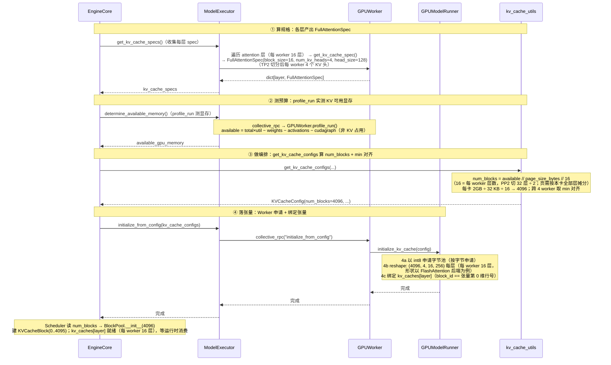

# vLLM V1 物理显存层（Full Attention 主线）

> 源文件（GPU 上游）：`vllm/vllm/v1/kv_cache_interface.py`、`vllm/vllm/v1/core/kv_cache_utils.py`、`vllm/vllm/v1/engine/core.py`、`vllm/vllm/v1/worker/gpu_worker.py`、`vllm/vllm/v1/worker/gpu_model_runner.py`、`vllm/vllm/v1/worker/utils.py`
>
> 源文件（NPU 插件，§2.1.2 / §2.2.2 / §2.4.2）：`vllm-ascend/vllm_ascend/worker/worker.py`、`vllm-ascend/vllm_ascend/worker/model_runner_v1.py`、`vllm-ascend/vllm_ascend/attention/attention_v1.py`、`vllm-ascend/vllm_ascend/utils.py`
>
> 主线：纯 Full Attention 模型 Llama-3-8B（pp2tp2，4卡环境），每 worker 16 层 / 4 KV 头。

**章节顺序**：§1 物理显存申请流程总览 → §2 初始化流程详解（算规格 → 测预算 → 做编排 → 落张量）→ §3 PP/TP 物理分布 → §4 关键公式速查 → §5 物理-逻辑桥接（`block_id == 张量行号`）→ §6 设计要点小结。

---

## 1. 物理显存申请流程总览

物理显存层的核心职责是：将每层 KV cache 的抽象规格说明书（`KVCacheSpec`）物化为**真正驻留在 NPU/GPU 设备上的 `torch.Tensor`**——先经容量规划算出块总数 `num_blocks`，再按其申请 int8 字节池、零拷贝 reshape 为后端逻辑 shape。
此后物理层与逻辑层（`BlockPool`）之间没有任何对象引用：同一份 `KVCacheConfig` 保证两侧 `num_blocks` 容量对齐，靠"`block_id` 即物理行号"的编号约定，逻辑链凭整数 `block_id` 直接索引物理行——这正是上层零拷贝调度的物理基座。

### 1.1 初始化流水线

从 `EngineCore._initialize_kv_caches()`（core.py:236）起步，物理显存初始化沿**四阶段单向管线**推进，将 KV cache 抽象规格逐级物化为设备张量：

```
模型层配置 ──①──▶ KVCacheSpec ──②──▶ available_memory ──③──▶ KVCacheConfig ──④──▶ kv_caches[layer]
                 (每层规格)             (显存预算)              (编排结果)              (物理张量)
```

前三步（①②③）统属**规格推导**——产出 `KVCacheConfig`（含 `num_blocks`、分组方案、张量尺寸），此时尚未触及设备显存；第四步（④）完成**物理分配**（int8 字节池申请 → reshape 为后端逻辑 shape）与**桥接绑定**（`block_id ↔ 张量行号`），并触发编译预热。

| 阶段 | 职责 | 入口调用 | 输入 → 产出 |
|------|----------|----------|-------------|
| ① 算规格 | 遍历全模型 Attention 层，采集 `FullAttentionSpec`，推导单页字节量 `page_size_bytes`；同类层合并为 `KVCacheGroupSpec` | `ModelRunner.get_kv_cache_spec()`（dense 层 GPU/NPU 产出同一 spec） | `vllm_config` → `dict[layer, FullAttentionSpec]` |
| ② 测预算 | profile dummy forward，量出 KV cache 可用显存（总显存 × 利用率 − 权重 − 激活 − 图预留；GPU 末项 env 控制，NPU 推迟到 ④） | `ModelRunner.profile_run()` | 设备显存快照 → `available_memory: int` |
| ③ 做编排 | 合并全 worker spec → 分组 → 导出 `num_blocks`（`available // page_size // num_layers`）→ 预算校验 → 跨 worker `min(num_blocks)` 对齐 | `get_kv_cache_configs()` | specs + budget → `KVCacheConfig` |
| ④ 落张量 | `torch.int8` 字节池申请 → `view (+permute)` 零拷贝 reshape → bind 绑定 `block_id == block_dim 维索引` → `_dummy_run` 编译 + 图 capture（GPU CUDAGraph / NPU NPUGraph） | `ModelRunner.initialize_kv_cache()` | `KVCacheConfig` → `kv_caches[layer]` |

> ①②④ 均有 GPU（上游 vLLM）与 NPU（vllm-ascend）两套实现，分别见 §2.1.1/§2.1.2、§2.2.1/§2.2.2、§2.4.1/§2.4.2，各节末尾 `.3` 为逐项对比；③ 编排平台无关，产出同一份 `KVCacheConfig`。

> **零拷贝调度的物理基础**：物理张量就绪后，上层 `BlockPool` 只持有 `block_id`，所有调度决策（分配/释放/共享/驱逐）均不触碰物理显存——调度层与物理层完全解耦，`block_id` 是唯一的交互接口。

### 1.2 交付物与消费方

| 交付物 | 消费方 | 用途 |
|--------|--------|------|
| `num_blocks` | `BlockPool` | 即逻辑层初始化创建的 `KVCacheBlock` 数：`BlockPool` 据此建出 `KVCacheBlock(0 .. num_blocks-1)`（块 0 开池即留作 `null_block` 占位，实际可分配 `num_blocks-1`） |
| `kv_caches[layer_name]` | Attention 算子 + ModelRunner | Llama-3-8B 每层一张`(num_blocks, num_kv_heads, block_size, 2*head_size)`的物理张量：forward 时算子以 `block_table` 为 fancy index 沿 `block_dim` 轴 gather 物理行，读旧 K/V、写本步新 K/V；ModelRunner 侧引用用于清零本轮新块 |
| `KVCacheConfig` | Worker（物理侧）+ BlockPool（逻辑侧） | 引擎下发两侧的衔接配置：Worker 遍历 `kv_cache_tensors`，按 `size` 申请字节池、按 `shared_by` 绑定到层；BlockPool 凭 `num_blocks` 建 `KVCacheBlock`|

---

## 2. 初始化流程详解

物理显存初始化启动期**一次性**执行 `EngineCore._initialize_kv_caches`（core.py:236），通过 profile_run 实测可用显存后算出 `num_blocks`，然后每 worker 一次性申请 16 个张量（大小 num_blocks × page_size_bytes）。产出两样供运行时消费：
1. `num_blocks`（4096，跨 worker 对齐）→ `BlockPool.__init__` 建 `KVCacheBlock(0..4095)`，`block_id` 为 0-4095，运行时 `KVCacheManager` 的分配/释放只操作 `block_id` 和 `ref_cnt`
2. `kv_caches[layer]` 物理张量 → 每 worker 的 `GPUModelRunner` 申请 16 层，`block_id` 即物理张量第 0 维行号，运行时按 `block_id` 读写

该物理显存初始化时序图如下：



### 2.0 调用链总览

以纯 Full Attention 模型（Llama-3-8B pp2tp2，每 worker 16 层 / 4 KV 头，合并后全模型 32 层**单 group**）为例。

```text
EngineCore._initialize_kv_caches()                        # engine/core.py:236  启动期唯一入口
│
├─ ※  register_all_kvcache_specs(vllm_config)            # FullAttentionSpec ↔ FullAttentionManager 注册表
│
├─ √ ① §2.1 算规格  model_executor.get_kv_cache_specs()   〔GPU 详见 §2.1.1 / NPU 详见 §2.1.2 / 对比 §2.1.3〕
│     ├─ RPC 到 worker.get_kv_cache_spec() → ModelRunner.get_kv_cache_spec()（GPU/NPU Worker 均为一行转发）
│     └─ 返回 -> list[dict[str, KVCacheSpec]]，每个worker上每层Attention KV cache类型，dict[layer name, FullAttentionSpec]
│
├─ ※  扫描 spec.non_causal                                # 非因果层，关闭 chunked prefill / 前缀缓存（平台无关）
│
├─ √ ② §2.2 测预算  model_executor.determine_available_memory()   〔GPU 详见 §2.2.1 / NPU 详见 §2.2.2 / 对比 §2.2.3〕
│     ├─ RPC 到 worker.determine_available_memory() → ModelRunner.profile_run()
│     └─ 返回每个worker的 available_kv_cache_memory_bytes 字节数-> list[int]（NPU 图内存推迟到 4d 事后记账）
│
├─ √ ③ §2.3 做编排  get_kv_cache_configs(...)
│     ├─ 合并各worker的spec → 生成 global groups（32层）→ _project 到每 worker 的 projected groups（16层）
│     ├─ 基于 projected groups 算 num_blocks → 对齐 min num_blocks
│     └─ 返回 -> list[KVCacheConfig]，每个worker上的KVCacheConfig（统一num_blocks）
│
└─ √ ④ §2.4 落张量  model_executor.initialize_from_config(...)   〔GPU 详见 §2.4.1 / NPU 详见 §2.4.2 / 对比 §2.4.3〕
      ├─ RPC 到各worker.initialize_from_config() → GPUModelRunner.initialize_kv_cache()
      │     ├─ 4a _allocate_kv_cache_tensors  以 torch.int8 申请字节池
      │     ├─ 4b _reshape_kv_cache_tensors   view+permute 成后端逻辑 shape
      │     └─ 4c bind_kv_cache               block_id == 物理张量行号
      └─ 4d RPC 到各worker.compile_or_warm_up_model() → GPUModelRunner._dummy_run()
            └─ 编译 + CUDAGraph capture
```

**※ 前置 · 注册 spec ↔ manager 映射**

进入正题前，`EngineCore` 进程内先执行 `register_all_kvcache_specs(vllm_config)`，把 `FullAttentionSpec` 注册到 `FullAttentionManager`：

```python
# single_type_kv_cache_manager.py:1349
def register_all_kvcache_specs(vllm_config):
    """Built-in spec registration"""
    KVCacheSpecRegistry.register(
        FullAttentionSpec,
        FullAttentionManager,
        uniform_type_base_spec=FullAttentionSpec,
    )
```

> 这是一张"spec 类型 → 管理类"的查表：§2.3 分组完成后，按 `KVCacheGroupSpec.kv_cache_spec` 的类型查表实例化对应 manager；FullAttention 主线只用到 `FullAttentionManager`。

### 2.1 第 1 步 · 算规格：各层产出 KVCacheSpec

这一步遍历本 worker 模型里的每个 Attention 层，问出"你需要什么形状的 KV cache"。RPC 骨架平台无关（同一个 `ModelExecutor.get_kv_cache_specs()`，core.py:243），但 Worker / ModelRunner 的实现分 GPU、NPU 两套（§2.1.1 / §2.1.2）；对纯 Full Attention 模型，两套最终产出的是**同一个上游 `FullAttentionSpec`**（对比见 §2.1.3）。

#### 2.1.1 GPU（上游 vLLM）

**调用链**：`EngineCore` → `ModelExecutor.get_kv_cache_specs()`（core.py:243）→ RPC 到各 worker → `GPUWorker.get_kv_cache_spec()`（gpu_worker.py:547，仅一行转发）→ **`GPUModelRunner.get_kv_cache_spec()`（gpu_model_runner.py:7440）**。

```python
# gpu_model_runner.py:7440 GPUModelRunner 实例方法（用 self）
def get_kv_cache_spec(self) -> dict[str, KVCacheSpec]:
    kv_cache_spec: dict[str, KVCacheSpec] = {}
    layer_type = cast(type[Any], AttentionLayerBase)
    attn_layers = get_layers_from_vllm_config(self.vllm_config, layer_type)
    for layer_name, attn_module in attn_layers.items():
        if isinstance(attn_module, Attention) and (
            kv_tgt_layer := attn_module.kv_sharing_target_layer_name
        ):
            self.shared_kv_cache_layers[layer_name] = kv_tgt_layer  # kv_sharing 复用目标层 KV，跳过
            continue
        if spec := attn_module.get_kv_cache_spec(self.vllm_config):  # 跳过无 KV 的 encoder-only
            if isinstance(spec, AttentionSpec):
                backend = attn_module.get_attn_backend()
                with set_current_vllm_config(self.vllm_config):
                    indexes = backend.indexes_kv_by_block_stride()
                spec = replace(spec, indexes_kv_by_block_stride=indexes)
            kv_cache_spec[layer_name] = spec
    return kv_cache_spec
```

纯 Full Attention 模型产出 `FullAttentionSpec`（`kv_cache_interface.py`）——注意 spec 是**模型层自己产出的**（`Attention.get_kv_cache_spec()`，attention.py:603），与跑在 GPU 还是 NPU 无关：

```python
# model_executor/layers/attention/attention.py:603（decoder 普通分支）
return FullAttentionSpec(block_size=block_size, num_kv_heads=self.num_kv_heads,
                         head_size=self.head_size, head_size_v=self.head_size_v,
                         dtype=self.kv_cache_torch_dtype, kv_quant_mode=quant_mode)
```

#### 2.1.2 NPU（vllm-ascend）：Worker 直接转发，Runner 有重写但 dense 层原样收 spec

**调用链**：RPC 方法名相同，平台插件选到 `NPUWorker`：

1. `NPUWorker.get_kv_cache_spec()`（vllm_ascend/worker/worker.py:891）——**与 GPUWorker 同款的一行转发**，自身零逻辑：

```python
# worker.py:891
def get_kv_cache_spec(self) -> dict[str, KVCacheSpec]:
    return self.model_runner.get_kv_cache_spec()
```

2. `NPUModelRunner.get_kv_cache_spec()`（model_runner_v1.py:4909）**重写**了 GPU Runner 的同名方法。遍历骨架（AttentionLayerBase → 逐层问 spec → kv_sharing 跳过）与 GPU 一致，多出的是 NPU 特有 spec 类型的分流：

| 层类型 | NPU 分支（model_runner_v1.py） | 产出 spec |
|---|---|---|
| decoder 普通 `Attention`（**Llama 走此路**） | :4943-4946 `if spec := attn_module.get_kv_cache_spec(...)` 后**原样存入** | 上游 **`FullAttentionSpec`**（attention.py:603，与 GPU 完全相同） |
| `MLAAttention`（DeepSeek 系） | :4948-5000 | **`AscendMLAAttentionSpec`**（nope/rope 维度拆分、sparse SFA/LI C8、indexer 等 NPU 字段） |
| `MambaBase` | :5002-5003 先收集、:5027 后统一处理 | 各 Mamba 自身 spec；并把同模型 attn 层的 `page_size_padded` 对齐到 mamba 页（:5034-5036） |
| `CacheOnlyAttentionLayer`（extract_hidden_states） | :5005-5025 | **`HiddenStateCacheSpec`**（重建为可 pickle 的新对象，单独成组） |
| `use_compress` 压缩 KV | :4939-4942 | 模块自身 spec 原样收 |

另有两个与 GPU 对齐的边界行为：EC 传输 producer 直接返回 `{}`（:4918-4919，GPU 是"非 consumer 返回空"，gpu_model_runner.py:7448）；`kv_sharing_target_layer_name` 同样登记后跳过（:4928-4938）。

> **对 Llama 主线的结论**：NPU 这层重写对 dense 模型是"透明"的——每层拿到的仍是 attention 模块自产的 `FullAttentionSpec(block_size=128, num_kv_heads=4, head_size=128, dtype=bf16)`，所以 §2.3 的合并/分组/`page_size_bytes` 推导在两个平台上逐字节相同；NPU 与 GPU 的物理差异（K/V 双池等）要到 §2.4 落张量时才出现。

#### 2.1.3 GPU 与 NPU 对比

| 维度 | GPU（上游 vLLM） | NPU（vllm-ascend） |
|---|---|---|
| Worker 方法 | `GPUWorker.get_kv_cache_spec()`（gpu_worker.py:547），一行转发 | `NPUWorker.get_kv_cache_spec()`（worker.py:891），**同样一行转发** |
| Runner 方法 | `GPUModelRunner.get_kv_cache_spec()`（gpu_model_runner.py:7440） | `NPUModelRunner.get_kv_cache_spec()`（model_runner_v1.py:4909），**重写** |
| dense decoder 层产出 | `FullAttentionSpec` | **同一个 `FullAttentionSpec`**（模型层自产，runner 原样收，:4943-4946） |
| 特有 spec 类型 | 由各模型/后端自行返回（SlidingWindow、TQ、MLA 等） | 额外分流 `AscendMLAAttentionSpec` / `HiddenStateCacheSpec` / mamba 页对齐 |
| kv_sharing 跳过、encoder-only 跳过 | 有 | 有（相同语义） |
| EC 传输空返回 | 非 consumer → `{}` | producer → `{}` |

**※ 边注 · 扫描 `non_causal`（平台无关）**——specs 收集齐后，EngineCore 检查是否有层标记 `non_causal=True`（如 Prefix LM attention），这段在 EngineCore 进程内、GPU/NPU 都生效：

```python
# core.py:263（vllm-study 主线；releases/v0.23.0 尚无此检查）
if any(getattr(spec, "non_causal", False)
       for worker_specs in kv_cache_specs
       for spec in worker_specs.values()):
    vllm_config.scheduler_config.enable_chunked_prefill = False  # 非因果层：关闭 chunked prefill
    vllm_config.cache_config.enable_prefix_caching = False       # 前缀缓存一并关闭
```

> 非因果层与 chunked prefill / 前缀缓存依赖的"因果注意力"假设冲突，会破坏 prefill 正确性；纯 Full Attention 全因果，此分支不触发。

### 2.2 第 2 步 · 测预算：profile 量出可用显存

这一步在每个 worker 上跑一次 dummy forward，量出权重+激活之外还剩多少字节给 KV cache。RPC 骨架相同（`ModelExecutor.determine_available_memory()`，core.py:257），但 Worker 实现分 GPU（§2.2.1）/ NPU（§2.2.2）两套，核心差异在**图内存何时记账**（对比见 §2.2.3）。

#### 2.2.1 GPU（上游 vLLM）

**调用链**：`EngineCore` → `ModelExecutor.determine_available_memory()`（core.py:257）→ RPC 到各 worker → `GPUWorker.determine_available_memory()`（gpu_worker.py:372）→ **内部 `self.model_runner.profile_run()`**（dummy forward 量峰值）→ 写回 `self.available_kv_cache_memory_bytes`（gpu_worker.py:461）→ 返回每个 worker 的 `available_memory` 字节数 `list[int]`。

**核心公式**：

```
requested_memory = total_memory × gpu_memory_utilization        (request_memory, utils.py:405)

available_kv_cache_memory = requested_memory
                           − non_kv_cache_memory                (权重 + 激活 + 其他)
                           − cudagraph_memory_estimate_applied  (CUDA graph 预留, 见下注)
```

其中 `non_kv_cache_memory = non_torch_increase + torch_peak_increase + weights_memory`（gpu_worker.py:431-435）。

**执行过程**：`request_memory()`（校验 `free ≥ requested`）→ `memory_profiling()`（记录前后显存快照）→ `model_runner.profile_run()`（dummy forward 量峰值）→ `profile_cudagraph_memory()`（若启用 CUDA graph）→ 返回 `available`。

图内存记账的两个细节（releases/v0.23.0 实测源码）：① `profile_cudagraph_memory()` 只在 `current_platform.is_cuda()` 且 cudagraph_mode ≠ NONE 时测量（gpu_worker.py:420-425），ROCm/HIP/XPU 恒为 0；② 测到的预估值**仅当环境变量 `VLLM_MEMORY_PROFILER_ESTIMATE_CUDAGRAPHS` 打开才真的从预算里扣**（:439-443），默认 `applied=0`。torch 峰值特意取图捕获**之前**的采样值（:428-430），避免把图池重复计成激活。

> 若显式设置 `cache_config.kv_cache_memory_bytes`（`--kv-cache-memory`），仍会跑一次 `profile_run()`（触发编译），但跳过整个记账计算，直接返回用户指定字节数（gpu_worker.py:384-402）。

#### 2.2.2 NPU（vllm-ascend）：复用上游 profiling 工具，图内存推迟到 4d 记账

`NPUWorker.determine_available_memory()`（vllm_ascend/worker/worker.py:527）整体结构与 GPU 平行，多处直接复用上游：

1. **同公式算 requested**（worker.py:469）：`requested_memory = init_snapshot.total_memory × gpu_memory_utilization`，free 不足同样报错（:470-480）；
2. **同一套快照/上下文工具**：`MemorySnapshot` 与 `memory_profiling` 直接从上游 `vllm.utils.mem_utils` 导入（worker.py:47）——快照内部走 `current_platform` 平台抽象，NPU 下即 torch.npu 的设备统计，无需自己重写；
3. **同一次 dummy forward**：`NPUModelRunner.profile_run()`（model_runner_v1.py:3684）只在前后加 NPU 专属预热（EPLB 专家负载均衡 warmup、MC2 MoE 通信容量试跑、PCP 切分序列），核心调用 **`super().profile_run()`**（:3696）即 GPU 那套 max-token dummy forward；Llama 无 MoE，实际走的就是 `super()` 路径；
4. **torch 峰值改走 npu API**：`torch.npu.memory_stats(self.device)["allocated_bytes.all.peak"]`（worker.py:567，GPU 对应 `torch.accelerator.memory_stats`），同样取图捕获前的预捕获值并覆写 `torch_peak_increase`（:571）。

关键差异——**公式里没有图内存项**（worker.py:590）：

```
available_kv_cache_memory = requested_memory
                           − (non_torch_increase + torch_peak_increase + weights_memory)
```

NPUGraph 此刻还没 capture（它发生在 4d `compile_or_warm_up_model()`，worker.py:732），自然无法在这一步预留。图内存改为**事后记账**：4d capture 拿到 `npugraph_memory_bytes` 后，worker.py:734-771 打印一条建议日志，把 `权重 + 峰值激活 + non-torch + NPUGraph + 150 MiB 余量`重算一遍，给出两种 `--kv-cache-memory` 建议值（贴 requested / 贴整机 free），供下次启动直接指定——这正是 NPU 上推荐用 `--kv-cache-memory` 而非只调利用率的原因。

其余差异：快照一致性断言 NPU 用严格大于（`init.free > profile 后 free`，worker.py:581），GPU 是 `≥`（gpu_worker.py:452）；结果日志 NPU 用 `logger.info_once("Available KV cache memory: %.2f GiB", ...)`（worker.py:593-595）——本仓库实验启动日志里的 `[worker.py:593] Available KV cache memory: 51.96 GiB` 即此行。

`--kv-cache-memory` 快路径与 GPU 相同：仍跑 `profile_run()` 编译，但跳过记账直接返回指定字节（worker.py:540-553），并明确提示该值不受 gpu_memory_utilization 约束。

#### 2.2.3 GPU 与 NPU 对比

| 维度 | GPU（上游 vLLM） | NPU（vllm-ascend） |
|---|---|---|
| Worker 方法 | `GPUWorker.determine_available_memory()`（gpu_worker.py:372） | `NPUWorker.determine_available_memory()`（worker.py:527），结构平行 |
| requested 公式 | `total × gpu_memory_utilization`（utils.py:405） | 相同（worker.py:469） |
| 显存快照/上下文 | `MemorySnapshot` + `memory_profiling`（vllm.utils.mem_utils） | **直接 import 复用同一工具**（worker.py:47，经 current_platform 落到 npu 统计） |
| 峰值统计 API | `torch.accelerator.memory_stats` | `torch.npu.memory_stats`（worker.py:567） |
| dummy forward | `GPUModelRunner.profile_run()` | `NPUModelRunner.profile_run()` 包一层 EPLB/MC2/PCP 预热后调 `super()`（model_runner_v1.py:3696） |
| 图内存何时扣 | profile 阶段测量 CUDAGraph 预估（env `VLLM_MEMORY_PROFILER_ESTIMATE_CUDAGRAPHS` 打开才扣，默认不扣） | **本步不扣**；NPUGraph 在 4d capture 后实测，经"建议 --kv-cache-memory"日志事后记账（worker.py:741-771） |
| `--kv-cache-memory` 快路径 | profile_run 编译后直接返回指定值 | 相同（worker.py:540） |
| 快照一致性断言 | `init.free ≥ 后 free`（:452） | `init.free > 后 free`（worker.py:581） |
| 结果日志 | `Available KV cache memory ...`（info/debug） | `info_once` 每进程一次（worker.py:593，实验实测 51.96 GiB） |

### 2.3 第 3 步 · 做编排：合并 / 分组 / num_blocks / 对齐

**调用链**：`EngineCore` → `get_kv_cache_configs()`（kv_cache_utils.py:1956），顶层入口，依次五步（PP 下含投影）：

**① 合并全 worker spec**

```python
# kv_cache_utils.py:1994（节选）
merged_kv_cache_specs: dict[str, KVCacheSpec] = {}
for kv_cache_spec_one_worker in kv_cache_specs:
    for layer_name, layer_spec in kv_cache_spec_one_worker.items():
        merged_kv_cache_specs[layer_name] = layer_spec  # 跨 worker 合并
```

> 不同 PP stage 层名不同，合并天然不覆盖；同 PP stage 的不同 TP rank 提交同层 spec，断言检查必须等值（原因：TP 切分后 `num_kv_heads` 相同 → spec 字段全等，详见 §3）。

**② 分组 `get_kv_cache_groups()`**—— 纯 FullAttention 走 `is_kv_cache_spec_uniform()` → `_get_kv_cache_groups_uniform_spec()` → 全模型**单 group**。

```python
# kv_cache_utils.py:874
def is_kv_cache_spec_uniform(kv_cache_spec) -> bool:
    if not kv_cache_spec:
        return True  # encoder-only 模型
    try:
        kv_cache_spec_values = list(kv_cache_spec.values())
        _ = kv_cache_spec_values[0].merge(kv_cache_spec_values)  # 尝试合并
    except AssertionError:
        return False
    return True
```

> `merge()` 检查所有层 spec 字段（block_size / num_kv_heads / head_size / dtype 等）是否一致；**FullAttentionSpec 带不带 sliding window 视为同一类型**。

**③ 投影到各 worker：按 projected groups 计算 num_blocks**

`num_blocks` 是 **per-worker 容量**——每个 worker 只物化本 rank 负责的层（PP 切层；TP 切头已折进各 worker spec 的 `page_size_bytes`），可用显存必须按 worker 实际承载的层数折算，不能以全局合并层数为除数。`get_kv_cache_configs()` 先执行 `_project_kv_cache_groups_to_worker()`，把 global groups（32 层）投影为各 worker 的 **projected groups**（16 层），再传入 `get_kv_cache_config_from_groups()`（kv_cache_utils.py:1247，单组 `FullAttentionSpec` 走通用 else 路径）：

```python
# kv_cache_utils.py:1309-1326（节选）
group_size = max(len(group.layer_names) for group in kv_cache_groups)  # = 16（projected 后每 worker 层数）
num_blocks = available_memory // page_size // group_size
# group_size = projected group 的层数（pp2tp2 下每 worker 16，不是合并的 32）
# page_size = get_uniform_page_size() = FullAttentionSpec.page_size_bytes（单层每页字节，TP2 后 = 32KB）
# 生成 group_size 个张量（每 worker 16 个），每个 size = page_size × num_blocks，shared_by 为单层
```

**对照 · UniformType 单组路径**（同类型异页大小，不除层数）：

```python
# kv_cache_utils.py:1279-1290（节选）
num_blocks = available_memory // kv_cache_groups[0].kv_cache_spec.page_size_bytes
# 每层张量 size = per_layer_specs[layer].page_size_bytes × num_blocks（按各层实际页大小分配）
```

**④ 校验 `_check_enough_kv_cache_memory()`**

```python
# kv_cache_utils.py:713（节选）
needed_memory = get_needed_memory()  # max_model_len 下需要的 KV cache
if needed_memory > available_memory:
    estimated_max_len = estimate_max_model_len(available_memory)
    raise ValueError(...)  # 建议调大 util 或调小 max_model_len
```

**⑤ 多 worker 对齐**——集中式调度下，同一请求的 `block_table` 由所有 worker 共用：PP 各 stage 按段索引本 rank 的层，TP 各 rank 只读写本 rank 的 KV 头子集，因此 `block_id` 必须在任意 rank 上都对应有效物理行。对齐策略：取各 worker `num_blocks` 的最小值作为全局统一值（以 KV 预算最小的 worker 为基准），确保任一 `block_id` 在所有 worker 上均有效：

```python
# kv_cache_utils.py:2074（节选）
min_num_blocks = min(cfg.num_blocks for cfg in kv_cache_configs)
for kv_cache_config in kv_cache_configs:
    num_blocks_old = kv_cache_config.num_blocks
    kv_cache_config.num_blocks = min_num_blocks
    for tensor in kv_cache_config.kv_cache_tensors:   # 等比例缩小 tensor，避免浪费
        tensor.size = tensor.size // num_blocks_old * min_num_blocks
        # page_size_bytes * num_blocks_old -> page_size_bytes * min_num_blocks
```

**产出数据结构**

```python
# kv_cache_interface.py:854（节选）
@dataclass
class KVCacheConfig:
    num_blocks: int                        # 对齐后的 block 总数
    kv_cache_tensors: list[KVCacheTensor]  # 每层如何初始化
    kv_cache_groups: list[KVCacheGroupSpec]  # 分组信息

@dataclass
class KVCacheTensor:
    size: int              # 字节大小
    shared_by: list[str]   # 哪些层共享（packed layout 下多个）
    offset: int = 0        # packed 下的字节偏移
    block_stride: int = 0  # packed 下每块字节数（0 = 非 packed）

@dataclass
class KVCacheGroupSpec:
    layer_names: list[str]       # 该组包含哪些层
    kv_cache_spec: KVCacheSpec   # 该组的 spec
```

### 2.4 第 4 步 · 落张量：申请 int8 池 / reshape / 绑定 + 编译预热

四步中 ① 算规格、② 测预算、④ 落张量都有 GPU / NPU 两套 Worker / ModelRunner 实现（已分别在 §2.1、§2.2、本节展开），只有 ③ 做编排跑在 EngineCore 进程内、平台无关——它汇总各 worker 上报的 spec 与预算，产出**同一份 `KVCacheConfig`** 下发各卡。第 ④ 步与前两步一样分平台实现，但 RPC 骨架相同——`ModelExecutor.initialize_from_config()`（core.py:290 / abstract.py:118）内部**连续两个 `collective_rpc`**：先 `initialize_from_config` 完成 4a/4b/4c 落张量，再 `compile_or_warm_up_model` 完成 4d 编译预热。GPU（上游 vLLM）实现见 §2.4.1，NPU（vllm-ascend 插件）实现见 §2.4.2，逐项对比见 §2.4.3。

#### 2.4.1 GPU（上游 vLLM）：单层单池，K/V 落在同一张量

**调用链**：`EngineCore` → `ModelExecutor.initialize_from_config()`（core.py:290 / abstract.py:118）——内部**连续两个 RPC**：

1. `collective_rpc("initialize_from_config")` → `GPUWorker.initialize_from_config()`（gpu_worker.py:563）→ `GPUModelRunner.initialize_kv_cache()`（gpu_model_runner.py:7284），完成 4a/4b/4c 落张量；
2. `collective_rpc("compile_or_warm_up_model")` → `GPUWorker.compile_or_warm_up_model()`（gpu_worker.py:592），完成 4d 编译预热。

这一步**每卡并行各自执行**：`collective_rpc` 广播 `list[KVCacheConfig]`，各卡按 `global_rank` 取本 rank 的配置（worker_base.py:315-319）；`GPUWorker.initialize_from_config()`（gpu_worker.py:563）先把对齐后的 `num_blocks` 写回本卡 `cache_config.num_gpu_blocks`（供 warmup RPC 读取），再委托本卡 `model_runner.initialize_kv_cache()`（gpu_model_runner.py:7284）完成三件事：

**4a. 分配 int8 字节池 `_allocate_kv_cache_tensors()`**

```python
# gpu_model_runner.py:6999（节选）
for kv_cache_tensor in kv_cache_config.kv_cache_tensors:
    if kv_cache_tensor.block_stride > 0:
        ...
    else:
        # 普通 layout：每层单独一个 int8 缓冲区，大小 page_size_bytes × num_blocks
        tensor = torch.zeros(kv_cache_tensor.size,
                             dtype=torch.int8, device=self.device)
    for layer_name in kv_cache_tensor.shared_by:
        kv_cache_raw_tensors[layer_name] = tensor
```

> **为什么用 int8？** 与 dtype 解耦——先按字节量申请，后续 reshape 时再 `view(dtype)` 转换，同一分配逻辑适用于 fp16 / bf16 / fp8 等所有 dtype。

**4b. reshape 为后端逻辑 shape `_reshape_kv_cache_tensors()`**

```python
# gpu_model_runner.py:7040（节选）
# 获取后端期望的逻辑 shape
kv_cache_shape = attn_backend.get_kv_cache_shape(
    kernel_num_blocks, shape_block_size,
    kv_cache_spec.num_kv_heads, kv_cache_spec.head_size, ...)
# int8 → dtype → permute（零拷贝 view）
kv_caches = _reshape_kv_cache(
    attn_groups, kv_cache_raw_tensors, cache_dtype, kernel_block_sizes, ...)
# _reshape_kv_cache 内部（attn_utils.py:169 起逐 group 逐层）：
#   kv_cache_shape = attn_backend.get_kv_cache_shape(...)  # 后端期望的逻辑 shape
#   int8 → dtype → permute（零拷贝 view）填入 kv_caches[layer_name]
```

`_reshape_kv_cache()` 有两种路径（attn_utils.py:169）：

| 场景 | 条件 | 方式 |
|------|------|------|
| **有 padding** | `page_size_padded is not None` | `torch.as_strided()` 跳过物理页间 padding |
| **普通** | 默认 | `raw.view(dtype).view(shape)` 连续 view |

> vllm-study 新版本将该函数拆出 `_reshape_attention_kv_cache` 并增加第三种 packed layout 路径（`view(-1, block_stride)[:, offset:offset+page_bytes]` 切片），releases/v0.23.0 尚无。

最终 `permute(*inv_order)` 把物理布局转成逻辑布局。

> **两种 reshape 目标形状**（详见 §5 表格）：① K/V packed in content dim（FlashAttn/FlashInfer/CPU），`block_dim=0`；② K/V as separate dim（ROCm），`block_dim=1`。

**block_dim 探测**——不同后端 `num_blocks` 所在轴不同（dim 0 或 dim 1），通过向 `get_kv_cache_shape` 传哨兵值 `_S=1234567` 再 `shape.index(_S)` 定位：

```python
# backend.py:99（节选）
@classmethod
def get_kv_cache_block_dim(cls, block_size, num_kv_heads, head_size, ...):
    _S = 1234567
    shape = cls.get_kv_cache_shape(_S, block_size, num_kv_heads, head_size, ...)
    return shape.index(_S)  # 0 或 1
```

**4c. 绑定 `bind_kv_cache()`**

```python
# utils.py:462（节选）
def bind_kv_cache(kv_caches, forward_context, runner_kv_caches, num_attn_module=1):
    # 1. 按层号排序，填入 ModelRunner.kv_caches
    for layer_index in sorted(index2name.keys()):
        for layer_name in index2name[layer_index]:
            runner_kv_caches.append(kv_caches[layer_name])
    # 2. 每层 attention 绑定自己的 KV cache
    for layer_name, kv_cache in kv_caches.items():
        forward_context[layer_name].bind_kv_cache(kv_cache)
```

绑定后，forward 时 attention layer 从 `forward_context` 取自己的 KV cache；ModelRunner 侧 `self.kv_caches` 用于清零等调度操作。

**4d. 编译与预热 `compile_or_warm_up_model()`**

KV 张量就绪后，`ModelExecutor.initialize_from_config()` 发起第二个 RPC，让各 worker 编译并预热执行路径：

```python
# gpu_worker.py:592
def compile_or_warm_up_model(self) -> CompilationTimes:
    for size in sorted(warmup_sizes, reverse=True):
        self.model_runner._dummy_run(size, skip_eplb=True, remove_lora=False)  # 各 batch size 各跑一次 dummy forward
    kernel_warmup(self)                                     # 调优推理内核
    if not self.model_config.enforce_eager:
        cuda_graph_memory_bytes = self.model_runner.capture_model()  # CUDAGraph capture
```

`_dummy_run()`（gpu_model_runner.py:5599）用 `num_tokens` 个 dummy token 跑一次真实前向，触发 torch.compile 编译与内核 warmup。至此物理层全部就绪，可进入第 2 层 `BlockPool` 建块。

#### 2.4.2 NPU（vllm-ascend）：K/V 双独立池，开传输时 2MiB 对齐

NPU 侧由 vllm-ascend 插件实现：`NPUWorker(WorkerBase)`（vllm_ascend/worker/worker.py:89）与 `NPUModelRunner(GPUModelRunner)`（vllm_ascend/worker/model_runner_v1.py:268）——**重写张量分配/reshape，但复用上游 RPC 框架、`KVCacheConfig` 编排与 `bind_kv_cache` 绑定**。

**调用链**：RPC 方法名与 GPU 完全相同（平台插件选到 NPUWorker）：

1. `collective_rpc("initialize_from_config")` → `NPUWorker.initialize_from_config()`（worker.py:907）→ `NPUModelRunner.initialize_kv_cache()`（model_runner_v1.py:3843），完成 4a/4b/4c 落张量；
2. `collective_rpc("compile_or_warm_up_model")` → `NPUWorker.compile_or_warm_up_model()`（worker.py:706），完成 4d 编译预热。

Worker 入口与 GPU 有两处差异（worker.py:907-918）：① 先 `ensure_kv_transfer_initialized()`（:909）拉起 KV 传输组（prefill/decode 分离）；② 开 sleep mode 时在 `CaMemAllocator` 的 `kv_cache` 内存池上下文内分配（:910-912），便于休眠换出。注意 config 路径下 NPUWorker **不回写** `cache_config.num_gpu_blocks`（旧 profile 路径的回写在 `initialize_cache()`，worker.py:391）。

`NPUModelRunner.initialize_kv_cache()`（model_runner_v1.py:3843）本体：`deepcopy(KVCacheConfig)`（:3850）→ `initialize_attn_backend()`（:3857）→ **`initialize_kv_cache_tensors()`（:3917，内部 = 4a 分配 + 4b reshape + 4c 绑定）** → 存在 KV 传输组时 `register_kv_caches(kv_caches)`（:3883-3884）把双池登记给传输层。

**4a. 每层分配 K、V 两张独立 int8 池 `_allocate_kv_cache_tensors()`（model_runner_v1.py:4082）**

```python
# model_runner_v1.py:4087-4088 函数头注释（原文）
# NOTE: To support prefill disaggregation, we need to split kvcache tensor into
# k cache and v cache, and the addr of both are aligned by 2M

alignment = 2 * 1024 * 1024                                   # :4101
# dense attention 分支（:4147 起，Llama 走此路）：
k_dim, v_dim = self._get_attention_kv_cache_dims(layer_name, spec)     # :4213，Llama: (128, 128)
k_factor, v_factor = calc_split_factor([k_dim, v_dim])       # vllm_ascend/utils.py:1611 → bf16 等维: (2.0, 2.0)
k_tensor_size = int(kv_cache_tensor.size // k_factor)        # :4227 整池字节量对半拆
v_tensor_size = int(kv_cache_tensor.size // v_factor)        # :4228
k_tensor = self._allocate_int8_cache_tensor(k_tensor_size, alignment)  # :4249 第一次独立 torch.zeros
v_tensor = self._allocate_int8_cache_tensor(v_tensor_size, alignment)  # :4254 第二次独立 torch.zeros
kv_cache_raw_tensors[layer_name] = (k_tensor, v_tensor)      # :4309 登记为二元组（GPU 是单 tensor）
```

> **为什么 NPU 要拆两张？** prefill/decode 分离（Mooncake / ADXL 传输）要求注册给传输层的每张 buffer **第 0 维必须是 `num_blocks`**、地址 **2MiB 对齐**；GPU 那种 `(num_blocks, 2, …)` 或 K/V packed 末维的单张量无法直接注册。因此 dense attention 的 K/V 被拆成两次**不连续**的独立分配。对齐是条件性的（开传输才做，多申请 2MiB 后切片），但拆分对所有 dense 层无条件生效：

```python
# model_runner_v1.py:4004（对齐切片助手 _align_memory 在 :3911）
def _allocate_int8_cache_tensor(self, numel, alignment):
    if self.vllm_config.kv_transfer_config is None:
        return torch.zeros(numel, dtype=torch.int8, device=self.device)          # :4018 无传输：普通 int8 申请
    raw = torch.zeros(numel + alignment, dtype=torch.int8, device=self.device)   # :4020 预留 2MiB
    return self._align_memory(raw, alignment)[:numel]                            # :4025 data_ptr 向上取整对齐后切片
```

同样先按 int8 字节申请、reshape 时再 `view(dtype)`，与 GPU 的"dtype 解耦"动机一致。例外：Mamba / linear_attn / attn-mamba hybrid / cache_only 层（:4118-4134）与 use_compress 压缩注意力（:4135-4146）仍走**单张量**分支；sparse MLA 还会额外分配 indexer/scale 张量（:4027 起的 `_allocate_sparse_c8_indexer_tensors`）——Llama dense 主线不涉及。

**4b. 描述符里的"2"被拆成两张 4 维张量 `_reshape_kv_cache_tensors()`（:4353）**

```python
# model_runner_v1.py:4592 起（dense 非 MLA 分支）
kv_cache_shape = attn_backend.get_kv_cache_shape(           # Ascend 后端: attention_v1.py:104-111
    num_blocks, block_size, num_kv_heads, head_size)         #   :111 返回 (2, num_blocks, block_size, num_kv_heads, head_size)
k_shape = kv_cache_shape[1:]                                # :4599 丢掉 dim0 的"2"
v_shape = k_shape                                           # head_size_v 不同时只换最后一维（:4600-4603）
k_cache = raw_k_tensor.view(k_cache_dtype).view(k_shape)    # :4638 (num_blocks,128,4,128) bf16
v_cache = raw_v_tensor.view(v_cache_dtype).view(v_shape)    # :4643 同形
kv_caches[layer_name] = (k_cache, v_cache)                  # :4681 每层绑定对象 = (K, V) 二元组
```

要点：

- Ascend dense 后端描述符 `(2, num_blocks, block_size, heads, head_dim)` 里的 **"2" 在 dim0、且不落成物理维**——它被拆成两张独立的 4 维张量，每张的 dim0 即 `num_blocks`；
- 全程只有 `view`（int8 → bf16 → 4D），**没有 GPU 的 `permute` 布局翻转**；
- MLA 分支（:4604-4628）两张不等维：k_cache = nope_cache（`kv_lora_rank`）、v_cache = rope_cache（`qk_rope_head_dim`），仍是双池。

**4c. 绑定：直接复用上游 `bind_kv_cache`**

NPU 没有自己的绑定函数——绑定发生在 `initialize_kv_cache_tensors()` 内部：:3950 `from vllm.v1.worker.utils import bind_kv_cache`、:3953 以同一上游函数（utils.py:462）把 `(k_cache, v_cache)` 按层序填入 `self.kv_caches`（list[层序 → (K, V)]）并绑进 `static_forward_context`。forward 时 attention 实现拿到的是二元组，[AscendAttentionBackendImpl.reshape_and_cache](file:///c:/Users/89517/Desktop/github/vllm-npu/vllm-ascend/vllm_ascend/attention/attention_v1.py#L1430-L1454)（attention_v1.py:1430）取下标分发给 NPU 算子：

```python
# attention_v1.py:1439-1452（reshape_and_cache 方法始于 :1430，节选）
if len(kv_cache) > 1:                                        # :1439
    if self.key_cache is None:
        self.key_cache, self.value_cache = kv_cache[0], kv_cache[1]   # :1441
    DeviceOperator.reshape_and_cache(                        # :1444
        key=key, value=value,
        key_cache=self.key_cache, value_cache=self.value_cache,   # 两张池分别 scatter
        slot_mapping=slots)
```

**4d. 编译与预热：NPUGraph 替代 CUDAGraph `NPUWorker.compile_or_warm_up_model()`（worker.py:706）**

```python
# worker.py:706（节选）
for size in sorted(warmup_sizes, reverse=True):
    self.model_runner._dummy_run(size)                  # :728 各 batch size dummy forward，触发 torch.compile / 算子 warmup
if not self.model_config.enforce_eager:
    npugraph_memory_bytes = self.model_runner.capture_model()   # :732 NPUGraph capture（GPU 对应物是 CUDAGraph）
```

至此 NPU 物理层就绪。以本仓库 Llama-3-8B 实验为例：每 worker 16 层 → **32 张张量（16 个 K 池 + 16 个 V 池）**，每张 `(13291, 128, 4, 128) bf16`，KVS 归档 .pt 即按 `"K"/"V"` 双独立张量池原样落盘（见 `kvc/docs/0_kvcache_e2e_record.md` §4.3）。

#### 2.4.3 GPU 与 NPU 对比

| 维度 | GPU（上游 vLLM） | NPU（vllm-ascend） |
|---|---|---|
| Worker / Runner | `GPUWorker` / `GPUModelRunner`（gpu_worker.py、gpu_model_runner.py） | `NPUWorker(WorkerBase)` / `NPUModelRunner(GPUModelRunner)`（vllm_ascend/worker/worker.py、model_runner_v1.py） |
| ①②③ 编排与 RPC | `KVCacheConfig`、`collective_rpc` 双 RPC（initialize_from_config + compile_or_warm_up_model） | **完全相同**（插件只换 Worker 实现，方法名/RPC 骨架不变） |
| 每层 int8 池数量 | **1 张**（K/V 共用一块原始内存） | **2 张**（K、V 两次独立、不连续的 `torch.zeros`） |
| raw 登记形态 | `kv_cache_raw_tensors[layer] = tensor` | `= (k_tensor, v_tensor)` 二元组（model_runner_v1.py:4309） |
| 地址对齐 | 无特殊要求 | KV 传输开启时每张池 **2MiB 对齐**（多申请 2MiB + 切片，:4004/:3911） |
| 后端 shape 描述符 | FlashAttn/FlashInfer `(N, 2, B, H, D)`（2 在 dim1）；ROCm `(2, N, B, H, D)` | Ascend dense `(2, N, B, H, D)`（2 在 dim0，attention_v1.py:104-111） |
| reshape 方式 | int8→dtype 后 **`permute`** 翻成后端逻辑布局，每层**一张**张量 | int8→dtype 后纯 **`view`，无 permute**；"2"被拆，每层**两张** `(N, B, H, D)` 4 维张量 |
| 层绑定对象 | `kv_caches[layer]`: 一张 Tensor | `kv_caches[layer]`: `(k_cache, v_cache)`（:4681） |
| `block_dim` | 随后端在 dim0 / dim1，哨兵值 `_S=1234567` 运行时探测 | 恒为每张 K/V 张量的 **dim0**（传输约束），无需探测 |
| 写 KV 算子 | 单张量入参（K/V 维或 packed 末维在内） | `reshape_and_cache(key, value, key_cache, value_cache, slots)` 双池入参（attention_v1.py:1444） |
| 分叉动机 | — | prefill/decode 分离要求注册 buffer dim0 = num_blocks、2MiB 对齐；`swap_blocks`/`copy_blocks` 也按 `[0]`/`[1]` 双池操作（attention_v1.py:113-139） |
| 图编译预热 | `capture_model()` = CUDAGraph capture | `capture_model()` = NPUGraph capture（worker.py:732） |
| 每 worker 张量数（Llama 16 层） | 16 张 | 32 张（16 K + 16 V） |

**不变的平台契约**（所以上层零改动）：同一份 `KVCacheConfig` 与跨 worker `min(num_blocks)` 对齐；都是 int8 字节池起步、与 dtype 解耦；都用同一个 `bind_kv_cache` 绑定；逻辑侧 `block_id == 物理张量 dim0 行号`的约定在两个平台都成立（NPU 上 K 池/V 池各有一套同序号的行空间）——`BlockPool`、`KVCacheManager` 的分配/释放/哈希/驱逐逻辑对此完全无感。

## 3. Llama-3-8B PP / TP 下 KV cache 的物理分布

- **PP 按层切分**：`config/model.py:1307-1320` `get_layers_start_end_indices()` 按 `pp_rank` 切层范围，`get_kv_cache_spec()` 只返回本 worker 负责的层。
- **TP 按 KV 头切分**：`config/model.py:1284-1295` `get_num_kv_heads()` 除以 `tensor_parallel_size`，同一 PP stage 的不同 TP rank 存同层但不同头子集。

**关键推论**：同一 PP stage 的不同 TP rank `num_kv_heads` 相同（都是切分后的值）→ `FullAttentionSpec` 相等 → §2.3 合并断言通过。但 **spec 相等 ≠ 物理相同**：每个 TP rank 独立分配自己的 `1/tensor_parallel_size` 份 KV 张量；调度器只管 `block_id`，对 TP 内部头分布透明。

**主线部署 · PP2 × TP2 = 4 卡**（Llama-3-8B：32 层，GQA 8 个 KV 头，全模型单 group）

4 个 worker 的职责划分：

| worker | PP rank | TP rank | 负责层 | 每层 KV 头数（8 ÷ TP2） |
|--------|---------|---------|--------|--------------------------|
| W0 | 0 | 0 | L0–L15（16 层） | 4 |
| W1 | 0 | 1 | L0–L15（16 层） | 4 |
| W2 | 1 | 0 | L16–L31（16 层） | 4 |
| W3 | 1 | 1 | L16–L31（16 层） | 4 |

沿着 §2 流程走一遍（主线数字贯穿：TP2 后 `page_size=32KB`，各卡 KV 可用 2GiB → `num_blocks=4096`）：

- **※ 前置**：`register_all_kvcache_specs` 注册 spec↔manager 映射；扫描 `non_causal`——纯 Full Attention 全因果，不触发。
- **① 算规格**：每个 worker 各产出 16 个 `FullAttentionSpec`，`num_kv_heads=4`（TP 已切）。
- **② 测预算**：各卡 `profile_run` 实测 KV 可用显存 = 总显存 × 利用率 − 权重 − 激活 − CUDAGraph 预留（主线如 2GiB）。
- **③ 做编排·合并**：`merged_kv_cache_specs` 合并出 32 个层名不同的 spec——W0/W1 层名同为 `layers.0`~`layers.15` 且字段全等 → 合并断言通过；W2/W3 同理。PP0 与 PP1 层名不同，合并结果天然分层、互不覆盖。
- **③ 做编排·分组**：32 层 `FullAttentionSpec` 字段一致 → `is_kv_cache_spec_uniform=True` → 全模型 1 个 group（32 层）。
- **③ 做编排·投影**：`_project_kv_cache_groups_to_worker()` 把 global group（32 层）投影到每 worker 实际层 → projected group（16 层）。
- **③ 做编排·num_blocks + 对齐**：每卡基于 projected group（16 层）独立算 `num_blocks = 2GiB // 32KB // 16 = 4096`，再取 4 个 worker 的 `min_num_blocks` 统一（§2.3⑤）。
- **④ 落张量**：每卡遍历 16 个 `KVCacheTensor`（各 32KB × 4096 = 128MiB，合计 2GiB）→ int8 字节池申请 → view+permute 成后端逻辑 shape → bind 到各 attention 层；随后第二个 RPC 完成编译预热（4d）。

**物理分布（关键）**：4 张卡各存 16 层 KV 物理张量；同一 PP stage 的两个 TP rank 存**同层、不同 KV 头子集**（各 4 头，占各自卡 `1/2` 头维）。同一请求的 KV 被切成多段：`block_table` 跨 PP 按阶段分段索引，跨 TP 各 rank 只读自己的头子集。调度器仍只认 `block_id`，对 PP/TP 布局完全透明。

---

## 4. 关键公式汇总（速查）

沿管线顺序排列，主线示例贯穿（Llama-3-8B pp2tp2：block_size=16、num_kv_heads=4、head_size=128、bf16）。

| 公式 | 含义 | 主线示例 | 出处 |
|------|------|----------|------|
| `page_size_bytes = block_size × num_kv_heads × head_size × dtype_size × 2` | 一层一块（一页）的字节数；系数 2 对应 K/V 两份 | `16 × 4 × 128 × 2 × 2 = 32KB`（TP2 后） | §2.1 |
| `available = total × util − weights − activations − cudagraph` | 单卡 KV 显存预算（profile_run 实测）；GPU 末项仅 env 打开时扣，NPU 本步无图项（NPUGraph 4d 后事后记账，见 §2.2.2/§2.2.3） | 如 `2GiB` | §2.2 |
| `num_blocks = available // page_size // group_size` | per-worker 容量：除数是 **projected 后每 worker 层数**，非全局合并层数 | `2GiB // 32KB // 16 = 4096` | §2.3③ |
| `KVCacheTensor.size = page_size_bytes × num_blocks` | 每层一张张量的字节数（主线 `shared_by` 单层） | `32KB × 4096 = 128MiB` | §2.3③ |
| `min(num_blocks)` + 等比缩 `KVCacheTensor.size` | 多 worker 对齐：以 KV 预算最小的 worker 为基准，统一 `block_id` 空间 | 4 卡统一为最小值 | §2.3⑤ |

---

## 5. 物理-逻辑桥接：`block_id == 张量行号`

桥接不依赖任何对象引用，由**两端约定**共同保证：逻辑侧 `BlockPool.__init__` 一次性建出 `num_blocks` 个 `KVCacheBlock`，`block_id` 取序号 `0 .. n-1`；物理侧 reshape 后 `block_dim` 轴大小恰为同一 `num_blocks`（同一份 `KVCacheConfig` 定容量，§2.3）。两侧在 `block_dim` 轴上"位置等同"——`block_id` 即张量行号，fancy index 直接取行，无查表、无拷贝。唯一需要区分的是**不同后端 `block_dim` 所在轴不同**：

| 形式 | layout | 逻辑 shape | `block_dim` | 索引方式 |
|---|---|---|---|---|
| 形式 A（GPU 主线） | K/V packed in content dim（FlashAttn / FlashInfer / CPU） | `(num_blocks, num_kv_heads, block_size, 2*head_size)` | 0 | `kv_caches[layer][block_ids]` |
| 形式 B（GPU） | K/V as separate dim（ROCm） | `(2, num_blocks, block_size, num_kv_heads, head_size)` | 1 | `kv_caches[layer][:, block_ids]` |
| 形式 C（NPU） | K/V 双独立池（vllm-ascend，详 §2.4.2） | K、V 各一张 `(num_blocks, block_size, num_kv_heads, head_size)` | 每张张量 0 | `kv_caches[layer][0][block_ids]`（K）/ `[1][block_ids]`（V） |

`block_dim` 无需硬编码：`AttentionBackend.get_kv_cache_block_dim()`（backend.py:99-116）向 `get_kv_cache_shape` 传哨兵值 `_S=1234567`，再 `shape.index(_S)` 运行时探测（返回 0 或 1）。

forward 伪代码（以形式 A 为例，`block_ids` 即该请求的 `block_table`）：

```python
# GPU forward 前，Worker 已通过 get_block_ids() 拿到该请求的 block_id 列表
block_ids = get_block_ids(request_id)             # 形如 [1, 7, 512, ...]，来自 req_to_blocks
kv = kv_caches[layer][block_ids]                  # 形式A：dim0 fancy indexing
# kv = kv_caches[layer][:, block_ids]             # 形式B：dim1 索引，保留 dim0 的 K/V
# k, v = kv_caches[layer][0][block_ids], kv_caches[layer][1][block_ids]  # 形式C(NPU)：K/V 双池各取 dim0
```

> `block_table`（即 `block_ids`）不是 `Request` 的字段，而是 `FullAttentionManager.req_to_blocks[request_id]` 里的块号列表。`null_block`（`block_id=0`）在 `BlockPool.__init__` 立即摘走作占位，实际可分配数为 `num_blocks-1`。

---

## 6. 设计要点小结

1. **规格先行**：所有显存计算源自 spec 的 `page_size_bytes`；同 PP stage 的 TP rank spec 必须等值——这是跨 rank 合并断言成立的根基（§2.1/§3）。
2. **四步流水线、每卡并行**：`spec → profile → 编排 → 落张量`，collective RPC 广播、各卡只处理本 rank 的配置；张量就绪后逻辑层 `BlockPool` 才建块（§2.4）。
3. **单 group 是 FullAttention 核心特征**：`is_kv_cache_spec_uniform=true`，全模型 1 个 KV group（§2.3②）。
4. **容量是 per-worker 的**：`num_blocks = available // page_size // group_size`，除数是 projected 后每 worker 层数，不是全局合并层数（§2.3③）。
5. **min 对齐**：以 KV 预算最小的 worker 为基准统一 `num_blocks`，并等比缩 `KVCacheTensor.size`，保证任一 `block_id` 在所有 rank 上都对应有效物理行（§2.3⑤）。
6. **int8 字节池 + 零拷贝 reshape**：按字节申请与 dtype 解耦，`view + permute` 成后端逻辑 shape；`block_dim` 用哨兵值运行时探测（§2.4/§5）。
7. **`block_id == 行号` 桥接、物理-逻辑分离**：逻辑块与物理行"位置等同"，调度决策零显存拷贝，只落在引用计数与空闲队列上，对 PP/TP 布局完全透明（§3/§5）。

---

## 扩展：其他注意力类型

- **四种 group 划分**（`_get_kv_cache_groups_*`）：`uniform_spec`（主线：所有层 spec 可 merge，全模型 1 组，kv_cache_utils.py:981）/ `uniform_type`（按 KV 类型分组，同类型各层合成 `UniformTypeKVCacheSpecs`、保留各自页大小，:998）/ `uniform_page_size`（跨类型对齐到统一页大小，:1074）/ `uniform_groups`（MLA 主组 + 层元组切分，:1504）。
- **num_blocks 三条配置路径**（`get_kv_cache_config_from_groups`，kv_cache_utils.py:1247）：① 单组 `UniformTypeKVCacheSpecs`（同类型异页大小）——不除层数，每层张量按自身页大小定尺寸；② DeepSeek V4 打包（全部组均为 `UniformTypeKVCacheSpecs` 时走 `_get_kv_cache_config_deepseek_v4()`，kv_cache_utils.py:1221）——各 group 同 slot 层共享一张张量，按 `(slot_idx, page_size)` 桶划分（新版本改由 `_use_packed_kv_cache_config` 判定并按 `offset/block_stride` 切片，0.23.0 尚无）；③ 通用路径（主线）——除以 projected 层数，组内第 i 层共享第 i 张张量，层数不足的组补 padding 槽位。
- **三种 block_size**：纯 FullAttention 下 `scheduler_block_size = hash_block_size = block_size`；混合模型由 `resolve_kv_cache_block_sizes()`（kv_cache_utils.py:593）经 LCM/GCD 统一。
- **Mamba/混合布局协调**：`_update_hybrid_attention_mamba_layout()`（gpu_model_runner.py:7167）把 `block_dim==1` 的层 `as_strided_` 成 `block_dim==0`，纯 FullAttention 不触发。