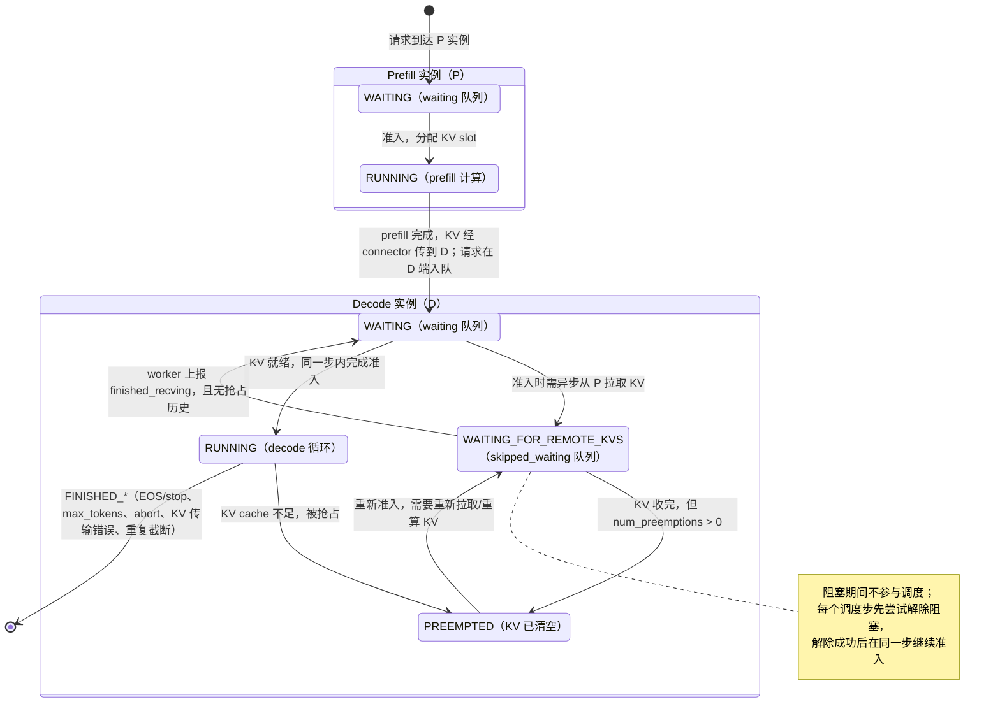

# `request.py` 源码详解：调度器操作的请求对象与请求状态机

> 本文对 `vllm/v1/request.py`（共 362 行）做逐块注释讲解：先给出**注释版源码**（源码原样保留、中文注释穿插），再补充关键机制专题。与 [`sched_arch.md`](sched_arch.md)（调度机制总览）、[`request_queue_annotated.md`](request_queue_annotated.md)（等待队列精读）和 [`scheduler_annotated.md`](scheduler_annotated.md)（Scheduler 主类精读）配套阅读。

**这个文件回答一个问题**：Scheduler 的队列里装的那个"请求"到底是什么？答案是 `Request` 类——它是**一个推理请求在 vLLM v1 内部的全部运行时状态的唯一载体**：身份信息（id/priority/到达时间）、输入输出 token 列表、调度进度（已计算 token 数、抢占次数）、状态机（等待/运行/抢占/完成）、投机解码草稿、多模态特征、流式会话数据等全部挂在这一个对象上。Scheduler、KVCacheManager、ModelRunner 之间不直接传零散数据，而是传递/查改同一个 `Request` 实例。

**为什么学调度要先学它**：Scheduler 的每一步决策都是在读写 `Request` 的字段——判断 `status` 能不能准入、看 `num_computed_tokens` 判断 prefill 是否完成、根据 `num_tokens` 估算 KV 需求、抢占时重置 `num_computed_tokens`、完成时检查 `status`。看不懂这些字段，调度代码里的条件判断就无从理解。

**目录**：

1. [模块导入层（1-29 行）](#1-模块导入层1-29-行)
2. [StreamingUpdate：流式会话的续传数据（32-56 行）](#2-streamingupdate流式会话的续传数据32-56-行)
3. [Request 类总览（59 行）](#3-request-类总览59-行)
4. [构造参数清单（60-80 行）](#4-构造参数清单60-80-行)
5. [身份与排序键字段（81-95 行）](#5-身份与排序键字段81-95-行)
6. [状态初始化与参数分支（97-119 行）](#6-状态初始化与参数分支97-119-行)
7. [Token 存储区（121-162 行）](#7-token-存储区121-162-行)
8. [调度与执行辅助字段（163-191 行）](#8-调度与执行辅助字段163-191-行)
9. [from_engine_core_request 工厂方法（193-218 行）](#9-from_engine_core_request-工厂方法193-218-行)
10. [输出 token 追加与 Block 哈希（220-236 行）](#10-输出-token-追加与-block-哈希220-236-行)
11. [只读属性群（238-273 行）](#11-只读属性群238-273-行)
12. [状态、事件与 Prefill 统计方法（275-303 行）](#12-状态事件与-prefill-统计方法275-303-行)
13. [`__lt__` 排序规则（305-316 行）](#13-__lt__-排序规则305-316-行)
14. [RequestStatus 状态枚举与状态机（319-346 行）](#14-requeststatus-状态枚举与状态机319-346-行)
15. [结束原因映射表（349-361 行）](#15-结束原因映射表349-361-行)
16. [关键机制专题](#16-关键机制专题)

---

## 1. 模块导入层（1-29 行）

```python
# SPDX-License-Identifier: Apache-2.0                          # 第 1 行：仓库统一 license
# SPDX-FileCopyrightText: Copyright contributors to the vLLM project  # 第 2 行

import enum                                                    # 第 4 行：RequestStatus 继承 IntEnum
import time                                                    # 第 5 行：arrival_time 默认值用 time.time()
from collections import deque                                  # 第 6 行：streaming_queue 的容器
from collections.abc import Callable, Mapping                  # 第 7 行：可调用对象/映射类型，用于类型标注
from dataclasses import dataclass                              # 第 8 行：StreamingUpdate 用 @dataclass 简化定义
from typing import TYPE_CHECKING, Any                          # 第 9 行：仅类型检查期导入/任意类型

import torch                                                   # 第 11 行：prompt_embeds 是 torch.Tensor

from vllm.multimodal.inputs import MultiModalFeatureSpec       # 第 13 行：多模态特征（图片/音频等预处理产物）
from vllm.pooling_params import PoolingParams                  # 第 14 行：池化模型（embedding/分类）参数
from vllm.sampling_params import SamplingParams                # 第 15 行：生成模型的采样参数（temperature/max_tokens 等）
from vllm.utils import length_from_prompt_token_ids_or_embeds  # 第 16 行：兼容 token id / embedding 两种输入求 prompt 长度
from vllm.v1.engine import (                                   # 第 17 行：引擎层公共类型
    EngineCoreEvent,                                           #   调度事件时间点（排队/开始/PREEMPTED 等）
    EngineCoreEventType,                                       #   事件类型枚举
    EngineCoreRequest,                                         #   API 层→EngineCore 的请求信封（序列化传输用）
    FinishReason,                                              #   请求结束原因枚举（stop/length/abort/error/...）
)
from vllm.v1.metrics.stats import PrefillStats                 # 第 23 行：一次 prefill 的缓存命中分解统计
from vllm.v1.structured_output.request import StructuredOutputRequest  # 第 24 行：结构化输出（grammar/JSON schema）状态
from vllm.v1.utils import ConstantList                         # 第 25 行：只读 list 包装器，禁止外部 append/extend

if TYPE_CHECKING:                                              # 第 27 行：以下导入仅静态检查期生效，避免运行时循环依赖
    from vllm.lora.request import LoRARequest                  # 第 28 行：LoRA 适配器请求
    from vllm.v1.core.kv_cache_utils import BlockHash          # 第 29 行：KV cache 块哈希（前缀缓存/块复用的 key）
```

**讲解**：

- 第 13-25 行的依赖勾勒出了一个请求能带的全部"附加能力"：多模态、LoRA、结构化输出、外部 KV 传输、前缀缓存。
- 第 27-29 行 `TYPE_CHECKING` 分支下 `LoRARequest`、`BlockHash` 只用于类型标注（如第 71、75 行的字符串注解），运行时不真正 import，切断 `request ↔ kv_cache_utils ↔ ...` 之间潜在的循环引用。

---

## 2. StreamingUpdate：流式会话的续传数据（32-56 行）

```python
@dataclass                                                     # 第 32 行：数据类，自动生成 __init__
class StreamingUpdate:
    """Lightweight data for streaming session continuation.

    Contains only the fields needed to update an existing streaming session
    with new input data.                                       # 第 34-37 行：只装"给已有会话续上新输入"所需字段
    """

    mm_features: list[MultiModalFeatureSpec] | None            # 第 40 行：新一轮输入的多模态特征
    prompt_token_ids: list[int] | None                         # 第 41 行：新一轮输入的 token id
    max_tokens: int                                            # 第 42 行：本轮允许生成的最大 token 数
    arrival_time: float                                       # 第 43 行：本轮更新到达的时间
    sampling_params: SamplingParams | None                    # 第 44 行：本轮采样参数（可空）

    @classmethod
    def from_request(cls, request: "Request") -> "StreamingUpdate | None":  # 第 46-47 行：从 Request 抽取续传数据
        if not request.resumable:                              # 第 48 行：非可恢复（普通一次性）请求返回 None
            return None
        return cls(                                            # 第 50-56 行：拷贝 5 个字段，原 Request 的其他状态不带
            mm_features=request.mm_features,
            prompt_token_ids=request.prompt_token_ids,
            max_tokens=request.max_tokens,
            arrival_time=request.arrival_time,
            sampling_params=request.sampling_params,
        )
```

**讲解**：

- **用途**：支持"会话保持/流式续传"（resumable streaming）场景——同一个 `request_id` 下，客户端可以多次追加输入（多轮对话式的服务端会话，不是普通的 SSE 流式返回）。每次追加的输入被打包成一个轻量 `StreamingUpdate`，放入 `Request.streaming_queue` 排队。
- **为什么单独定义一个类**：续传只需要输入侧字段，不应复制 `Request` 上几十个运行时状态（已计算 token、block 哈希等）。`@dataclass` 让这个纯数据容器无需手写 `__init__`。
- 第 48 行 `resumable` 是开关：只有创建时标记为可恢复的请求才会产生 `StreamingUpdate`。

---

## 3. Request 类总览（59 行）

```python
class Request:                                                 # 第 59 行：普通类（非 dataclass），自定义 __init__
```

`Request` 没有用 `@dataclass`，因为它字段多、且大量字段有复杂的初始化逻辑（分支判断、list 拷贝、哈希计算），手写构造函数更清晰。

一个 `Request` 实例的字段按用途可分为 **7 组**（下文逐组讲解）：

| 分组 | 字段 | 行号 |
|---|---|---|
| ① 身份与排序键 | `request_id` / `client_index` / `priority` / `arrival_time` | 81-95 |
| ② 生成参数 | `sampling_params` / `pooling_params` / `max_tokens` / `lora_request` / `structured_output_request` / `kv_transfer_params` | 84-117 |
| ③ 状态机 | `status` / `events` / `stop_reason` | 97-99 |
| ④ Token 存储 | `prompt_token_ids` / `prompt_embeds` / `_output_token_ids` / `_all_token_ids` 及只读视图、`num_computed_tokens` 等 | 121-159 |
| ⑤ KV/缓存相关 | `cache_salt` / `block_hashes` / `_block_hasher` / `skip_reading_prefix_cache` | 150、175-182 |
| ⑥ 调度/执行辅助 | `spec_token_ids` / `num_preemptions` / `is_prefill_chunk` / `num_nans_in_logits` / 异步调度两字段 / PP 字段 / 多模态字段 | 141-173 |
| ⑦ 流式/收尾 | `resumable` / `streaming_queue` / `abort_immediately` | 185-191 |

---

## 4. 构造参数清单（60-80 行）

```python
    def __init__(
        self,
        request_id: str,                                       # 第 62 行：请求唯一标识（在线=16位随机hex，离线=递增整数）
        prompt_token_ids: list[int] | None,                    # 第 63 行：输入 token id 列表；纯 embedding 输入时为 None
        sampling_params: SamplingParams | None,                # 第 64 行：生成模型参数；池化模型传 None
        pooling_params: PoolingParams | None,                  # 第 65 行：池化模型参数；生成模型传 None（二者恰有一个非空）
        client_index: int = 0,                                 # 第 66 行：前端多实例扩缩时，输出路由回同一客户端的编号
        arrival_time: float | None = None,                     # 第 67 行：到达时间戳；None 时在第 95 行取 time.time()
        prompt_embeds: torch.Tensor | None = None,             # 第 68 行：预先计算好的输入 embedding（绕过 tokenizer 的输入方式）
        prompt_is_token_ids: list[bool] | None = None,         # 第 69 行：混合输入的逐位置掩码，True=该位置是 token，False=embedding
        mm_features: list[MultiModalFeatureSpec] | None = None,  # 第 70 行：多模态特征（图像/音频张量及位置信息）
        lora_request: "LoRARequest | None" = None,             # 第 71 行：本次请求使用的 LoRA 适配器
        cache_salt: str | None = None,                         # 第 72 行：前缀缓存哈希盐值，用于隔离不同命名空间的缓存
        priority: int = 0,                                     # 第 73 行：调度优先级，数值越小越优先；仅 priority 策略生效
        trace_headers: Mapping[str, str] | None = None,        # 第 74 行：分布式追踪（OpenTelemetry）上下文
        block_hasher: Callable[["Request"], list["BlockHash"]] | None = None,  # 第 75 行：由 KVCacheManager 注入的块哈希函数
        resumable: bool = False,                               # 第 76 行：是否为可续传的流式会话请求
        reasoning_ended: bool | None = None,                   # 第 77 行：推理模型的思考段是否已结束（指导 grammar 何时生效）
        reasoning_parser_kwargs: dict[str, Any] | None = None, # 第 78 行：思考过程解析器的额外参数
        abort_immediately: bool = False,                       # 第 79 行：入队后立即中止（用于触发 connector 的 request_finished 钩子）
    ) -> None:
```

**讲解**：

- 第 63-65 行：vLLM v1 同时服务两类模型——生成式（LLM，吃 `SamplingParams`）和池化式（embedding/reward/classifier，吃 `PoolingParams`），第 104-119 行据此分支初始化。
- 第 75 行 `block_hasher` 是一个**依赖注入**：`Request` 自身不知道哈希算法，由 EngineCore 启动时通过 `get_request_block_hasher()`（`kv_cache_utils.py:659`）构造后传入。这样 `Request` 与具体 KV cache 实现解耦。
- 第 79 行 `abort_immediately` 的特殊语义：某些 P/D connector 需要在请求"登记过又立刻结束"时收到生命周期回调，因此请求先正常入队、紧接着被中止，保证钩子被执行。

---

## 5. 身份与排序键字段（81-95 行）

```python
        self.request_id = request_id                           # 第 81 行：唯一 id，Scheduler 的 requests 字典以此为 key
        self.client_index = client_index                       # 第 82 行：输出回传路由用
        self.priority = priority                               # 第 83 行：优先级排序键（__lt__ 第一级）
        self.sampling_params = sampling_params                 # 第 84 行
        self.pooling_params = pooling_params                   # 第 85 行
        self.lora_request = lora_request                       # 第 86 行
        self.structured_output_request = StructuredOutputRequest.from_sampling_params(
            sampling_params                                    # 第 87-89 行：若采样参数中带 guided/grammar 配置则创建包装对象，否则 None
        )
        if self.structured_output_request is not None:         # 第 90 行：结构化输出需要额外准备
            self.structured_output_request.reasoning_ended = reasoning_ended   # 第 91 行
            self.structured_output_request.reasoning_parser_kwargs = (
                reasoning_parser_kwargs                        # 第 92-94 行
            )
        self.arrival_time = arrival_time if arrival_time is not None else time.time()  # 第 95 行：排序键第二级
```

**讲解**：

- 第 81-83、95 行四个字段是调度器最关心的：`request_id` 定位请求，`priority` + `arrival_time` 决定排队顺序（详见 [`request_queue_annotated.md`](request_queue_annotated.md) 专题 7.1）。
- 第 87-89 行：`StructuredOutputRequest` 不是每次都有——只有请求通过采样参数请求了 guided decoding（JSON schema/正则/grammar）时才创建；它的 grammar 编译是异步的，编译完成前请求处于 `WAITING_FOR_STRUCTURED_OUTPUT_GRAMMAR` 状态（见第 111-112 行）。
- 第 95 行：`arrival_time` 允许调用方显式传入（离线批量、测试复现），不传则用当前墙钟时间，浮点秒。

---

## 6. 状态初始化与参数分支（97-119 行）

```python
        self.status = RequestStatus.WAITING                    # 第 97 行：出生状态固定为 WAITING
        self.events: list[EngineCoreEvent] = []                # 第 98 行：生命周期事件时间点（排队/首 token/抢占…），用于指标统计
        self.stop_reason: int | str | None = None             # 第 99 行：停止原因（兼容字符串形式的 stop）

        # P/D: Connector-specific KV transfer parameters.
        self.kv_transfer_params: dict[str, Any] | None = None  # 第 102 行：P/D 分离时 KV 传输连接器的参数

        if self.pooling_params is not None:                    # 第 104 行：分支一——池化模型
            # Pooling models.
            self.max_tokens = 1                                # 第 106 行：池化只有一次前向，不需要自回归生成，max_tokens 固定为 1
        elif self.sampling_params is not None:                 # 第 107 行：分支二——生成模型
            # Generative models.
            assert sampling_params.max_tokens is not None      # 第 109 行：生成请求必须已确定 max_tokens
            self.max_tokens = sampling_params.max_tokens       # 第 110 行：本次生成允许输出的 token 上限（长度截断判断用）
            if self.structured_output_request is not None:     # 第 111 行：需要 grammar 的请求
                self.status = RequestStatus.WAITING_FOR_STRUCTURED_OUTPUT_GRAMMAR  # 第 112 行：出生即阻塞，等 grammar 就绪
            if sampling_params.extra_args is not None:         # 第 114 行：采样参数中的扩展参数
                self.kv_transfer_params = sampling_params.extra_args.get(
                    "kv_transfer_params"                       # 第 115-117 行：提取 KV 传输配置
                )
        else:                                                  # 第 118 行：分支三——两类参数都没给，属于非法调用
            raise ValueError("sampling_params and pooling_params can't both be unset")  # 第 119 行
```

**讲解**：

- **第 97 行是状态机的起点**。除第 112 行的 grammar 特例，所有请求都以 `WAITING` 出生，进 `waiting` 队列等待准入。
- 第 106 行池化模型 `max_tokens = 1` 的含义：池化模型一次前向直接输出向量，不存在 decode 循环，调度器按"只跑一步"处理。
- 第 112 行解释了 `skipped_waiting` 队列的第一类居民：grammar 没编译好的请求出生即进阻塞等待状态，编译完成后由 `_try_promote_blocked_waiting_request` 提升回 `WAITING`。

---

## 7. Token 存储区（121-162 行）

这是 `Request` 中最核心的一组字段，调度器的 KV 分配、chunked prefill、长度判断都围绕它们。

### 7.1 输入侧（121-132 行）

```python
        self.prompt_token_ids = prompt_token_ids               # 第 121 行：输入 token id（可能为 None）
        self.prompt_embeds = prompt_embeds                     # 第 122 行：输入 embedding（可能为 None）
        # Per-position mask used in mixed-mode (chat completion with
        # prompt_embeds). `None` except when both `prompt_token_ids` and
        # `prompt_embeds` are set and their positions are interleaved.
        self.prompt_is_token_ids = prompt_is_token_ids         # 第 126 行：混合输入逐位置标记，见上方注释
        # Cache per-block prompt-embed hashes to avoid rehashing the same
        # tensor slices when generating extra keys.
        self._prompt_embeds_per_block_hashes: dict[tuple[int, int], bytes] = {}  # 第 129 行：embedding 按块哈希缓存，避免重复算
        self.num_prompt_tokens = length_from_prompt_token_ids_or_embeds(
            prompt_token_ids, prompt_embeds                    # 第 130-132 行：prompt 长度（token 数），两种输入方式统一处理
        )
```

- 第 126 行：一个请求可以是"文本 token 与预计算 embedding 交错"的混合输入（如多轮 chat 中部分内容已被外部算成 embedding），这个布尔列表逐位置说明每个位置走哪条路径。
- 第 130-132 行：`num_prompt_tokens` 在构造时**固定不变**，是 prefill 的总工作量。

### 7.2 输出侧与全量列表（133-138 行）

```python
        self._output_token_ids: list[int] = []                 # 第 133 行：已生成的输出 token（decode 一个 append 一个）
        self._all_token_ids: list[int] = (                     # 第 134 行：prompt + 已生成输出的完整序列
            self.prompt_token_ids.copy()                       # 第 135 行：正常情况：拷贝 prompt 作为初始序列
            if self.prompt_token_ids is not None
            else [0] * self.num_prompt_tokens                  # 第 137 行：纯 embedding 输入：没有真实 id，用 0 占位凑够长度
        )
```

**三个 token 列表的关系**：

- `prompt_token_ids`：不可变的**输入**；
- `_output_token_ids`：不断增长的**输出**；
- `_all_token_ids`：两者的拼接（前缀是 prompt，后缀是输出），即"到目前为止这个请求的完整 token 序列"，KV cache 块哈希、`num_tokens` 都基于它。
- 第 137 行的占位很关键：纯 embedding 输入没有 token id，但调度/哈希逻辑统一按"位置数"运作，所以用 `[0] * num_prompt_tokens` 补齐等长序列。

### 7.3 异步调度与流水线并行字段（140-146 行）

```python
        # Used in async scheduling.
        self.num_output_placeholders = 0                       # 第 141 行：异步调度下已"预支"但输出 token 尚未返回的位置数
        self.async_tokens_to_discard = 0                       # 第 142 行：异步结果确认后需要丢弃的 token 数

        # V2+PP+async: Enforces `pp_size` cadence between same-request decode steps
        # so the worker's broadcast slot ring stays consistent.
        self.next_decode_eligible_step = 0                     # 第 146 行：PP 异步模式下，本请求下一次获准 decode 的调度步编号
```

- 第 141 行：异步调度（调度与模型执行重叠）时，调度器可能先按"将产出 N 个 token"安排了位置，实际 token 稍后才由 worker 回填，这些位置就是 placeholder。
- 第 146 行：流水线并行（PP）中同一个请求的 decode 步必须每隔 `pp_size` 个调度步才能出现一次，否则 worker 的广播槽位对不齐；该字段记录它最早可在第几步再被调度。

### 7.4 投机解码与计算进度（148-150 行）

```python
        self.spec_token_ids: list[int] = []                    # 第 148 行：投机解码中草稿模型提议、等待主模型验证的 token
        self.num_computed_tokens = 0                           # 第 149 行：★已完成前向计算（KV 已就绪）的 token 数
        self.cache_salt: str | None = cache_salt               # 第 150 行：前缀缓存哈希盐
```

**`num_computed_tokens` 是调度器最核心的进度字段**，重点理解：

- 值域 `[0, num_tokens]`，表示从序列开头数，前多少个 token 的 KV 已经算好存在 cache 中；
- 准入时若为 0，需要查前缀缓存/外部 KV（`scheduler.py:609`）；
- 每步调度后 `_update_after_schedule` 立即累加（`scheduler.py:1010` `request.num_computed_tokens += num_scheduled_token`），这样下一步就能立刻判断还剩多少 prefill；
- `num_computed_tokens < num_tokens` 表示仍在 prefill（可能是 chunked prefill 的某个中间块）；等于 `num_tokens` 表示进入 decode 阶段；
- 请求被抢占且 KV 被清空时重置为 0（`scheduler.py:987`）；
- 投机 token 若被主模型拒绝，会在 `update_from_output` 中回退修正。

### 7.5 多模态与只读视图（152-161 行）

```python
        # Multi-modal related
        self.mm_features = mm_features or []                   # 第 153 行：None 归一化为空列表
        # Read-only views
        # Prevent directly appending to these lists since
        # they should also be updated simultaneously.
        self.output_token_ids = ConstantList(self._output_token_ids)  # 第 158 行：对外只读视图
        self.all_token_ids = ConstantList(self._all_token_ids)        # 第 159 行：对外只读视图
        # trace_headers
        self.trace_headers = trace_headers                     # 第 161 行：链路追踪上下文透传给下游
```

- 第 155-159 行注释说明了 `ConstantList` 的设计意图：**外部代码（输出处理器、指标等）只能读这两个列表，不能改**。所有修改必须走 `append_output_token_ids`（第 220 行），因为输出 token 必须同时写进 `_output_token_ids` 和 `_all_token_ids` 两个列表，开放直接 append 会导致两者不一致。`ConstantList` 的 `append/extend/insert/pop/remove/clear` 全部抛 `TypeError`。

---

## 8. 调度与执行辅助字段（163-191 行）

```python
        # True if this request is scheduled as a non-final prefill chunk.
        self.is_prefill_chunk = False                          # 第 164 行：本步调度的是"非最后一块 prefill"
        # The number of NaNs in logits. A value greater than 0
        # indicates that the output is corrupted
        self.num_nans_in_logits = 0                            # 第 168 行：logits 中 NaN 计数，>0 表示数值损坏
        # The number of times this request has been preempted by the scheduler.
        self.num_preemptions = 0                               # 第 171 行：★被抢占次数；0 表示从未被抢占

        self.prefill_stats: PrefillStats | None = PrefillStats()  # 第 173 行：首次 prefill 的缓存命中分解统计

        self.block_hashes: list[BlockHash] = []                # 第 175 行：★每个已成形 KV 块的哈希（前缀缓存匹配用）
        # Store the hasher without binding self to avoid creating a
        # reference cycle (Request -> partial -> Request) that prevents
        # immediate garbage collection via reference counting.
        self._block_hasher: Callable[[Request], list[BlockHash]] | None = block_hasher  # 第 179 行：注入的哈希函数
        self.update_block_hashes()                             # 第 180 行：构造时立即为初始完整块算一次哈希

        self.skip_reading_prefix_cache = self.get_skip_reading_prefix_cache()  # 第 182 行：跳过读前缀缓存的开关

        # Used for streaming
        self.resumable = resumable                             # 第 185 行：是否可续传会话
        # None entry in the queue means finished.
        self.streaming_queue: deque[StreamingUpdate | None] | None = None  # 第 187 行：续传输入队列；None 元素表示会话结束

        # If True, request should be aborted immediately after being added to
        # the scheduler so the connector's request_finished hook runs.
        self.abort_immediately = abort_immediately             # 第 191 行：见第 79 行说明
```

**重点字段**：

- **第 164 行 `is_prefill_chunk`**：chunked prefill 允许把长 prompt 切成多块跨多个调度步计算。每步调度后重新计算（`scheduler.py:1011`）：`num_computed_tokens < num_tokens + num_output_placeholders` 时为 True，表示"prefill 还没算完，当前只是中间块"。最后一块算完变 False，请求正式转入 running decode。
- **第 171 行 `num_preemptions`**：每次抢占 +1（`scheduler.py:990`）。它影响前缀缓存统计口径（区分首次 prefill 与抢占后重算）以及远程 KV 加载后的状态恢复（有抢占历史时恢复为 `PREEMPTED` 而非 `WAITING`）。
- **第 175-180 行 `block_hashes`**：KV cache 按固定 token 数分块，每凑满一个块就算一个内容哈希追加到这里。其他请求的块哈希若与已有块相同，即可直接复用 KV（前缀缓存）。
- **第 176-179 行注释**是一个值得注意的工程细节：注入的 hasher 若是绑定了 self 的闭包/partial，会形成 `Request → hasher → Request` 引用环，使对象无法靠引用计数即时回收；因此约定传入**不绑定 self** 的可调用对象（调用时由 `self._block_hasher(self)` 显式传参）。
- 第 187 行：续传队列约定"放入 `None` 代表整个会话结束"，调度器在 `_handle_stopped_request` 中据此区分"本轮结束但会话继续"和"彻底结束"。

---

## 9. from_engine_core_request 工厂方法（193-218 行）

```python
    @classmethod
    def from_engine_core_request(
        cls,
        request: EngineCoreRequest,                            # 第 196 行：跨进程传输来的请求信封（msgspec 结构体）
        block_hasher: Callable[["Request"], list["BlockHash"]] | None,  # 第 197 行：EngineCore 持有的块哈希函数
    ) -> "Request":
        return cls(                                            # 第 199-218 行：逐字段搬运，构造真正的调度对象
            request_id=request.request_id,
            client_index=request.client_index,
            prompt_token_ids=request.prompt_token_ids,
            prompt_embeds=request.prompt_embeds,
            prompt_is_token_ids=request.prompt_is_token_ids,
            mm_features=request.mm_features,
            sampling_params=request.sampling_params,
            pooling_params=request.pooling_params,
            arrival_time=request.arrival_time,
            lora_request=request.lora_request,
            cache_salt=request.cache_salt,
            priority=request.priority,                         # 第 211 行：客户端指定的优先级原样带入
            trace_headers=request.trace_headers,
            block_hasher=block_hasher,
            resumable=request.resumable,
            reasoning_ended=request.reasoning_ended,
            reasoning_parser_kwargs=request.reasoning_parser_kwargs,
            abort_immediately=request.abort_immediately,
        )
```

**讲解**：

- 这是**在线服务路径上创建 Request 的唯一入口**。API 层（async_llm/input_processor）构造的是可序列化的 `EngineCoreRequest`（`msgspec.Struct`，用于跨进程 ZMQ 传输）；EngineCore 收到后调用本方法转成调度器使用的富对象 `Request`。
- 注意 `EngineCoreRequest` 中有些传输字段（如 `data_parallel_rank`、`current_wave`、`external_req_id`）**不进入 Request**，它们属于路由层信息，在进入调度器前已被消费。
- `block_hasher` 不从信封里来，而是 EngineCore 启动时建好的本地对象，在转换时注入。

---

## 10. 输出 token 追加与 Block 哈希（220-236 行）

```python
    def append_output_token_ids(
        self,
        token_ids: int | list[int],                            # 第 222 行：单个 token（int）或一批 token（list，投机解码场景）
    ) -> None:
        if isinstance(token_ids, int):                         # 第 224 行：单个
            self._output_token_ids.append(token_ids)           # 第 225 行：输出列表 +1
            self._all_token_ids.append(token_ids)              # 第 226 行：全量列表同步 +1
        else:                                                  # 第 227 行：一批
            self._output_token_ids.extend(token_ids)           # 第 228 行
            self._all_token_ids.extend(token_ids)              # 第 229 行：两个列表必须同步更新
        self.update_block_hashes()                             # 第 231 行：★新 token 可能凑满新的 KV 块，追加哈希

    def update_block_hashes(self) -> None:
        """Compute block hashes for any new full blocks and append them."""
        if self._block_hasher is not None:                     # 第 235 行：未注入哈希函数（测试/特殊环境）则跳过
            self.block_hashes.extend(self._block_hasher(self)) # 第 236 行：hasher 内部只返回"新成形"的块哈希，可重复调用
```

**讲解**：

- 第 220-231 行是唯一合法的输出 token 写入入口，保证两个列表永远一致。每步模型执行后由输出处理流程调用。
- 第 231 行把"token 增长"与"块哈希增长"绑定：每追加输出 token，就增量计算新满块的哈希，使该请求后续生成的 KV 块也能被其他请求复用。
- 第 236 行设计成可重复安全调用（构造时第 180 行已调过一次）：hasher 依据已生成哈希数做增量计算，不会重复追加。

---

## 11. 只读属性群（238-273 行）

```python
    @property
    def use_structured_output(self) -> bool:                   # 第 238-240 行：是否带结构化输出请求
        return self.structured_output_request is not None

    @property
    def num_tokens(self) -> int:                               # 第 242-244 行：★当前全序列长度（prompt + 已输出）
        return len(self._all_token_ids)

    @property
    def num_tokens_with_spec(self) -> int:                     # 第 246-248 行：含投机草稿 token 的序列长度
        return len(self._all_token_ids) + len(self.spec_token_ids)

    @property
    def num_output_tokens(self) -> int:                        # 第 250-252 行：已输出 token 数（不含 prompt）
        return len(self._output_token_ids)

    @property
    def num_encoder_inputs(self) -> int:                       # 第 254-256 行：多模态输入个数（几张图/几段音频）
        return len(self.mm_features)

    @property
    def has_encoder_inputs(self) -> bool:                      # 第 258-260 行：是否含多模态输入
        return self.num_encoder_inputs > 0

    def get_skip_reading_prefix_cache(self) -> bool:           # 第 262 行：从采样/池化参数解析"跳过读缓存"开关
        if (
            self.sampling_params is not None
            and self.sampling_params.skip_reading_prefix_cache is not None
        ):
            return self.sampling_params.skip_reading_prefix_cache  # 第 267 行：生成参数显式指定则用它
        elif (
            self.pooling_params is not None
            and self.pooling_params.skip_reading_prefix_cache is not None
        ):
            return self.pooling_params.skip_reading_prefix_cache   # 第 272 行：池化参数显式指定则用它
        return False                                           # 第 273 行：默认不跳过（正常查前缀缓存）
```

**长度体系速记**（调度中频繁出现）：

| 属性/字段 | 含义 |
|---|---|
| `num_prompt_tokens`（字段，构造时固定） | 输入 prompt 的 token 数 |
| `num_tokens`（动态属性） | 当前全序列长度 = prompt + 已生成输出，每步增长 |
| `num_output_tokens` | 仅输出部分长度 |
| `num_computed_tokens`（字段） | 其中 KV 已计算完成的长度，追赶 `num_tokens` |
| `num_tokens_with_spec` | 再加上草稿模型提议、尚未验证的投机 token 数 |

---

## 12. 状态、事件与 Prefill 统计方法（275-303 行）

```python
    def is_finished(self) -> bool:                             # 第 275 行：是否处于任何一种完成状态
        return RequestStatus.is_finished(self.status)

    def get_finished_reason(self) -> FinishReason | None:      # 第 278 行：把内部状态翻译成对外的结束原因
        return RequestStatus.get_finished_reason(self.status)

    def get_num_encoder_embeds(self, input_id: int) -> int:    # 第 281 行：第 input_id 个多模态输入含多少个 embedding
        assert input_id < len(self.mm_features)
        return self.mm_features[input_id].mm_position.get_num_embeds()

    def record_event(
        self,
        event_type: EngineCoreEventType,
        timestamp: float | None = None,
    ) -> None:
        self.events.append(EngineCoreEvent.new_event(event_type, timestamp))  # 第 290 行：记录一个带时间戳的生命周期事件

    def take_events(self) -> list[EngineCoreEvent] | None:     # 第 292 行：取出全部事件并清空（一次性消费）
        if not self.events:
            return None
        events, self.events = self.events, []
        return events

    def take_prefill_stats(self) -> PrefillStats | None:       # 第 298 行：取出 prefill 统计并清空（只报一次）
        if self.prefill_stats is None:
            return None
        prefill_stats = self.prefill_stats
        self.prefill_stats = None                              # 第 302 行：置 None 作为"已上报"标记
        return prefill_stats
```

**讲解**：

- 第 285-296 行的事件机制服务于**指标与延迟统计**（TTFT、排队时间、prefill/decode 时间等）。`record_event` 在调度关键点被调用（如入队、首次调度、抢占 `scheduler.py:992`）；`take_events` 由输出路径取走并附加到响应，取完即清，不重复上报。
- 第 298-303 行同理：`prefill_stats` 记录首次 prefill 中本地缓存/外部 KV 各命中多少 token，只在首次准入时填充一次（`scheduler.py:657-663`），上报后置 None；抢占导致的重算 prefill 不再重复统计。
- 第 281-283 行：多模态输入在 encoder 侧占用的 embedding 数由各特征自己的位置信息决定，调度器分配 encoder cache 预算时需要逐输入查询。

---

## 13. `__lt__` 排序规则（305-316 行）

```python
    def __lt__(self, other: "Request") -> bool:
        """
        Compare two requests based on priority, arrival time, and request ID.
        Used in priority scheduling.
        """
        if self.priority != other.priority:                    # 第 310 行：第 1 级——priority 数值小者优先
            return self.priority < other.priority
        if self.arrival_time != other.arrival_time:            # 第 312 行：第 2 级——同优先级，到达时间早者优先
            return self.arrival_time < other.arrival_time
        if self.request_id != other.request_id:                # 第 314 行：第 3 级——时间戳也相同，id 字符串字典序小者优先
            return self.request_id < other.request_id
        return id(self) < id(other)                            # 第 316 行：第 4 级兜底——内存地址比较，保证比较总有确定结果
```

**讲解**：

- 该方法定义 `<` 运算，被 `PriorityRequestQueue` 的 `heapq` 和调度器的队首比较调用；FCFS 队列不使用它。
- 四级键构成严格全序：业务优先级 → 同优先级内的 FCFS → 确定性的 id 决胜 → 进程内地址兜底。前三级保证排序结果**可复现**（不依赖对象内存布局），第 316 行保证极端情况下堆也不会遇到"两个元素无法比较"的错误。
- 注意 `Request` **没有定义 `__eq__`**：`<` 走业务排序键，而 `==`/`in set`/`in list` 仍用默认对象身份。队列删除请求按身份精确定位，与排序互不干扰。

---

## 14. RequestStatus 状态枚举与状态机（319-346 行）

### 14.1 枚举定义（319-335 行）

```python
class RequestStatus(enum.IntEnum):                            # 第 319 行：IntEnum——成员即整数，可直接做大小比较/序列化
    """Status of a request."""

    WAITING = enum.auto()                                     # 第 322 行：等待准入（waiting 队列）
    WAITING_FOR_STRUCTURED_OUTPUT_GRAMMAR = enum.auto()       # 第 323 行：阻塞：结构化输出 grammar 编译中
    WAITING_FOR_REMOTE_KVS = enum.auto()                      # 第 324 行：阻塞：等待远端 KV 传输完成（skipped_waiting 队列）
    WAITING_FOR_STREAMING_REQ = enum.auto()                   # 第 325 行：阻塞：可续传会话等待下一轮输入
    RUNNING = enum.auto()                                     # 第 326 行：已准入，正在 running 列表中迭代
    PREEMPTED = enum.auto()                                   # 第 327 行：被抢占，KV 已失效，等待重新 prefill
    # Note: anything after PREEMPTED will be considered
    # as a finished status.                                   # 第 328-329 行：★边界约定——PREEMPTED 之后的全部算"已完成"
    FINISHED_STOPPED = enum.auto()                            # 第 330 行：正常结束（EOS/stop 串）
    FINISHED_LENGTH_CAPPED = enum.auto()                      # 第 331 行：达到 max_tokens 或 max_model_len
    FINISHED_ABORTED = enum.auto()                            # 第 332 行：客户端中止
    FINISHED_IGNORED = enum.auto()                            # 第 333 行：因输入超长等原因被直接忽略
    FINISHED_ERROR = enum.auto()                              # 第 334 行：请求级内部错误（如 KV 加载失败）
    FINISHED_REPETITION = enum.auto()                         # 第 335 行：检测到重复 token 模式（幻觉保护）

    def __str__(self) -> str:                                 # 第 337 行：日志/输出中显示名字而非数字
        return self.name
```

**状态分组**：

| 分组 | 成员 | 所在容器 |
|---|---|---|
| 可调度等待 | `WAITING` | `waiting` |
| 阻塞等待 | 三个 `WAITING_FOR_*` | `skipped_waiting` |
| 运行中 | `RUNNING` | `running`（普通 list） |
| 抢占 | `PREEMPTED` | 被 `prepend_request` 放回 `waiting` |
| 终态（6 种） | `FINISHED_*` | 从各容器移除 |

### 14.2 状态判定（340-346 行）

```python
    @staticmethod
    def is_finished(status: "RequestStatus") -> bool:         # 第 341 行：终态判定
        return status > RequestStatus.PREEMPTED               # 第 342 行：★靠枚举数值大小——严格排在 PREEMPTED 之后才算完成

    @staticmethod
    def get_finished_reason(status: "RequestStatus") -> FinishReason | None:
        return _FINISHED_REASON_MAP.get(status)               # 第 346 行：查映射表；非终态返回 None
```

- 第 342 行是第 328-329 行那条注释的落地实现：因为成员用 `enum.auto()` 按声明顺序递增，`PREEMPTED` 与所有 `FINISHED_*` 的数值次序就是声明次序，一个整数比较就区分了"未完成/已完成"。新增终态只要加在 `PREEMPTED` 之后即自动生效。
- 注意 `PREEMPTED` **不是终态**：被抢占的请求还会被重新调度。

### 14.3 状态流转主线（PD 分离场景）

下图按 **Prefill/Decode 分离**部署绘制：请求先在 P 实例完成 prefill，KV 经 connector 传到 D 实例，之后在 D 实例上进入 decode 循环。本图不含结构化输出（`WAITING_FOR_STRUCTURED_OUTPUT_GRAMMAR` 仅在请求带 grammar 时出现，见第 111-112 行），也不含可续传会话分支。



**读图要点**：

- P 实例上若启用了外部前缀 KV 异步加载，准入时也可能短暂经过 `WAITING_FOR_REMOTE_KVS`（`scheduler.py:803-808`），收完后回 `RUNNING`，主干路径与上图一致。
- D 实例第一次收到请求时 KV 必然还在 P 上，所以**几乎必然先进入 `WAITING_FOR_REMOTE_KVS`**，这是它在 PD 场景下最常出现的阻塞状态。
- 解除阻塞后的状态取决于 `num_preemptions`（`scheduler.py:2199-2202`）：从未被抢占回 `WAITING`；有抢占历史则回 `PREEMPTED`——两种情况下请求都在**当前调度步内**继续完成准入，不会多等一个调度步。
- `PREEMPTED` 请求被放回 waiting 后重新准入；若 KV 需要重新从远端拉取，会再次进入 `WAITING_FOR_REMOTE_KVS`；由本地重算恢复时则直接准入。
- 单机（非 PD）场景就是去掉中间的 KV 传输段：`WAITING → RUNNING → FINISHED_*`，抢占时才出现 `PREEMPTED` 回环。
- 可续传会话额外分支：一轮输出结束且 `resumable=True` → `WAITING_FOR_STREAMING_REQ` → 收到新的 `StreamingUpdate` → `WAITING`（该状态对本轮调用方映射为 `FinishReason.STOP`，见第 359 行）。

---

## 15. 结束原因映射表（349-361 行）

```python
# Mapping of finished statuses to their finish reasons.
# NOTE: The ignored requests are the requests whose prompt lengths
# are longer than the model's length cap. Therefore, the stop
# reason should also be "length" as in OpenAI API.
_FINISHED_REASON_MAP = {
    RequestStatus.FINISHED_STOPPED: FinishReason.STOP,              # 第 354 行：正常停止
    RequestStatus.FINISHED_LENGTH_CAPPED: FinishReason.LENGTH,      # 第 355 行：撞长度上限
    RequestStatus.FINISHED_ABORTED: FinishReason.ABORT,             # 第 356 行：被中止
    RequestStatus.FINISHED_IGNORED: FinishReason.LENGTH,            # 第 357 行：★超长被忽略，对外也报 length（OpenAI 兼容）
    RequestStatus.FINISHED_ERROR: FinishReason.ERROR,               # 第 358 行：内部错误
    RequestStatus.WAITING_FOR_STREAMING_REQ: FinishReason.STOP,     # 第 359 行：★非终态却在表中——见下
    RequestStatus.FINISHED_REPETITION: FinishReason.REPETITION,     # 第 360 行：重复模式截断
}
```

**两个值得注意的映射**：

- 第 357 行：`FINISHED_IGNORED`（prompt 超模型长度上限直接丢弃）对外不暴露"ignored"这个原因，而是映射为 OpenAI 语义的 `length`，与注释（350-352 行）呼应。
- 第 359 行：`WAITING_FOR_STREAMING_REQ` 不是终态，但也映射到 `STOP`。语义是：**可续传会话的某一轮输出结束时，对这一轮的调用方要表现为一次正常的 stop 响应**；与此同时请求对象本身不销毁，转入等待下一轮输入的阻塞状态。`get_finished_reason` 在这个时机被调用取到 STOP，而 `is_finished()` 对该状态仍返回 False，两个判定各司其职。

`FinishReason` 本身是 `IntEnum`（`vllm/v1/engine/__init__.py:42`，STOP=0、LENGTH=1、ABORT=2、ERROR=3、REPETITION=4），用整数是为了序列化更紧凑。

---

## 16. 关键机制专题

### 16.1 一个 Request 的字段在调度各阶段被谁读写

| 调度阶段（scheduler.py） | 读取的字段 | 写入的字段 |
|---|---|---|
| 入队分流 `_enqueue_waiting_request`（1659-1663） | `status` | —（进 waiting 或 skipped_waiting） |
| 选择队列/队首比较（1665-1675） | `priority`、`arrival_time`、`request_id`（经 `__lt__`） | — |
| waiting 准入：前缀缓存查询（609-641） | `num_computed_tokens`、`num_tokens`、`mm_features` | `prefill_stats` |
| KV slot 分配（462 起） | `num_tokens`、`num_tokens_with_spec` | — |
| 调度后更新（1008-1019） | `num_tokens`、`num_output_placeholders` | `num_computed_tokens +=`、`is_prefill_chunk` |
| 抢占（985-995） | — | `status=PREEMPTED`、`num_computed_tokens=0`、`spec_token_ids=[]`、`num_preemptions += 1`、事件记录 |
| 远程 KV 就绪提升（2192-2203） | `request_id`、`num_preemptions` | `status=WAITING/PREEMPTED` |
| 完成/中止清理（1848-1871） | `status`、`request_id` | 从 running/waiting/skipped_waiting 移除 |
| 结果回填 | 输出 token、`spec_token_ids` | `_output/_all_token_ids`、`block_hashes`、`status=FINISHED_*` |

读这张表的方式：调度器本质上是一个"**按规则扫描 Request 集合、读字段做判断、改字段推进状态**"的状态机，Request 就是它唯一的工作内存。

### 16.2 num_computed_tokens 与请求生命周期的数值变化

以 prompt 长度 10、每步算 6 token（chunked prefill）、之后 decode 为例：

| 时刻 | num_tokens | num_computed_tokens | is_prefill_chunk | 说明 |
|---|---|---|---|---|
| 入队 | 10 | 0 | False | 尚未调度 |
| 第 1 步后 | 10 | 6 | True | prefill 第一块，还没算完 |
| 第 2 步后 | 10 | 10 | False | prefill 完成，转入 running decode |
| 第 3 步后 | 11 | 11 | False | 产出第 1 个输出 token |
| 第 4 步（被抢占） | 11 | **0** | False | KV 清空，从头重算 |
| 重算完成后 | 11 | 11 | False | 凭前缀缓存可能跳过部分计算，重算更快 |

### 16.3 Request 的两种创建路径

| 路径 | 触发方式 | 创建点 | request_id |
|---|---|---|---|
| 在线服务 | HTTP API → InputProcessor 生成 `EngineCoreRequest` → 跨进程到 EngineCore | `Request.from_engine_core_request`（第 193 行） | 默认 16 位随机 hex，可客户端指定 |
| 离线批处理 | `LLM.generate()` → `LLMEngine.add_request()` | 直接 `Request(...)` | 进程内递增整数 `"0"、"1"、…` |

两条路径汇合后，Scheduler 看到的都是同一个 `Request` 类型，后续逻辑无差别。

### 16.4 Request 与三个队列容器的关系

- `waiting` / `skipped_waiting`（`RequestQueue`）：持有**未准入**请求的引用；
- `running`（`list[Request]`）：持有**已准入**请求的引用；
- `self.requests`（`dict[str, Request]`）：持有**全部在途请求**的总登记表，以 `request_id` 为 key。

同一个 `Request` 对象同时被"总登记表 + 恰好一个队列/列表"引用（抢占瞬间在容器间转移）。因此队列里存的是引用而非拷贝，调度循环中对 `request.status` 等字段的修改即时生效，无需回写。

### 16.5 设计要点回顾

1. **单对象承载全部运行时状态**：调度、KV、执行、指标、流式各子系统共享同一个 Request 实例，靠字段分区和命名（`_` 私有 + ConstantList 只读视图）约束访问方式。
2. **状态机用 IntEnum + 数值边界表达**：`is_finished` 只是一个大小比较，新增终态零成本。
3. **进度用单调计数器表达**：`num_computed_tokens` 单向追赶 `num_tokens`，使"prefill 到哪了""还差多少 KV""是否在 decode"全部退化为整数比较；抢占是唯一的回退点。
4. **排序键与身份分离**：`__lt__` 管排队顺序（业务键），默认身份相等管删除定位，互不影响。
5. **外部依赖靠注入**：block_hasher 由 KV cache 层注入，Request 不依赖任何具体缓存实现。
